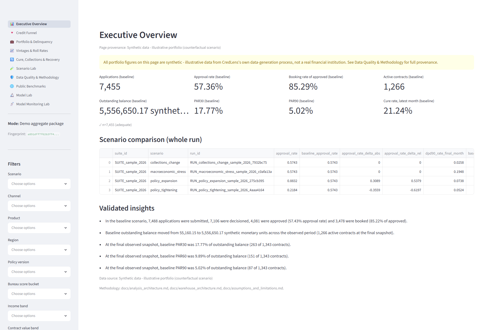
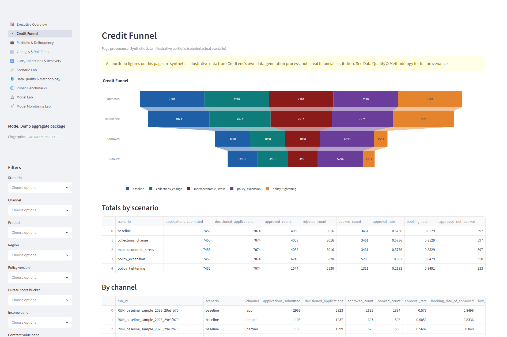
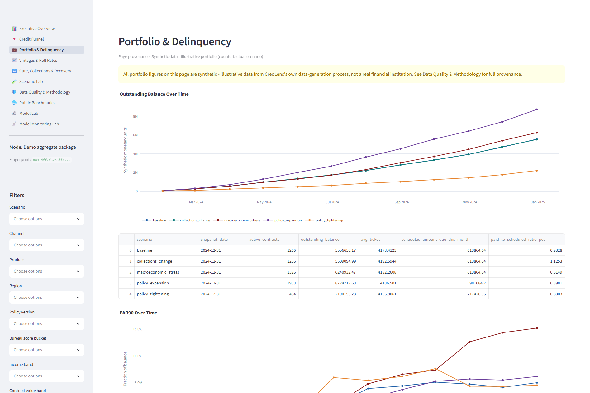
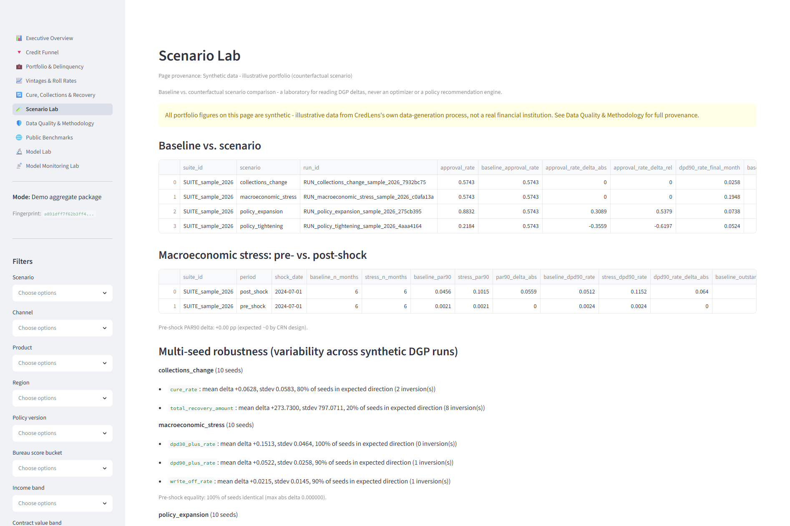
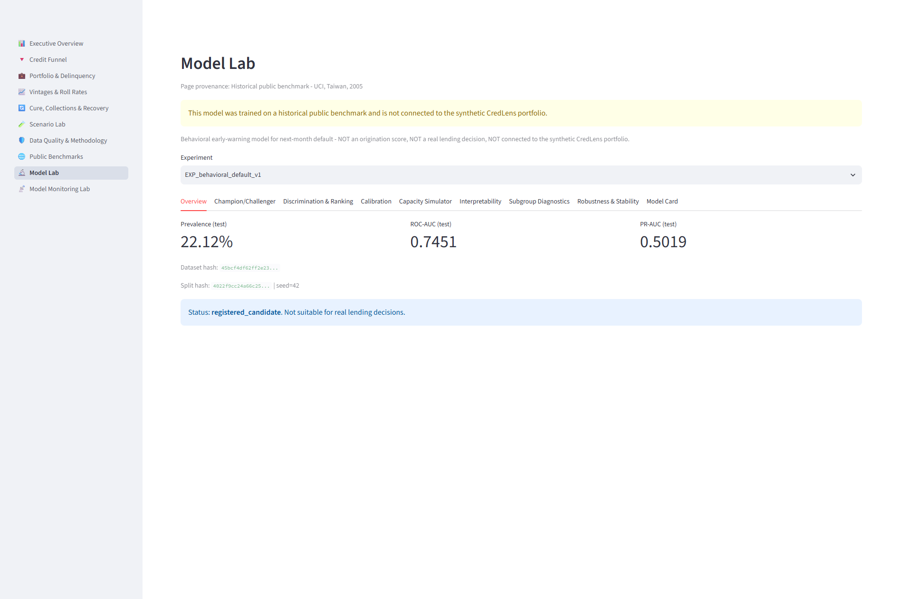
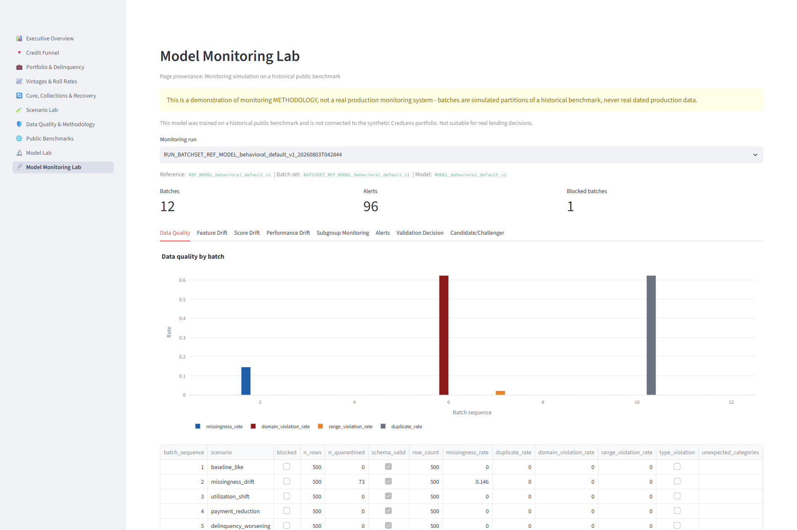
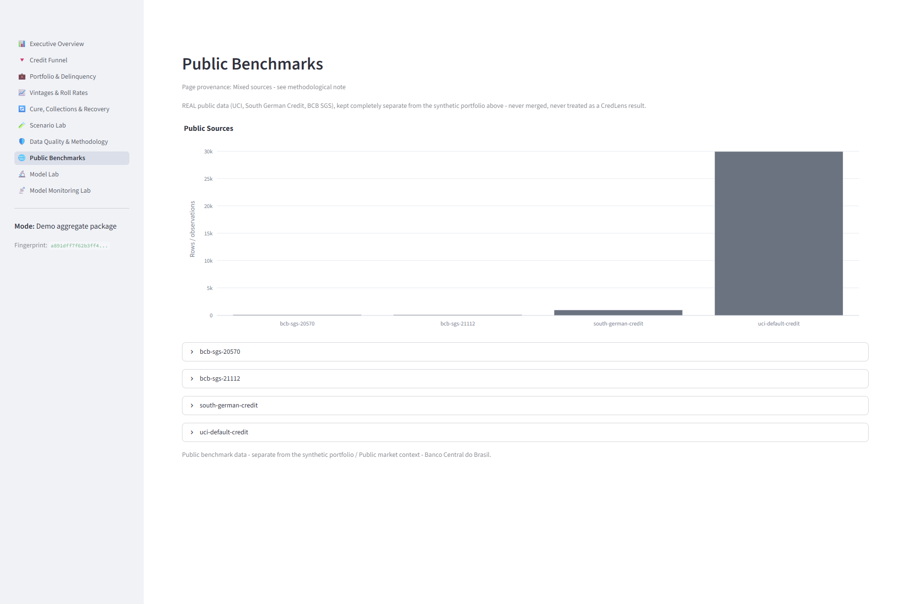
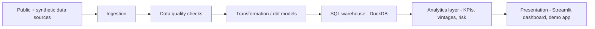

[Leia em português (pt-BR)](README.pt-BR.md) · [2-minute portfolio summary](PORTFOLIO.md)

# CredLens — Credit Risk & Portfolio Analytics

[](https://github.com/FilipePessoa30/CredLens/actions/workflows/ci.yml)
[](pyproject.toml)
[](LICENSE)
[](https://github.com/FilipePessoa30/CredLens/releases/tag/v1.0.0rc2)
[](docs/release_checklist.md)

**CredLens turns a digital lender's credit portfolio into a reproducible, tested analytics product — from business question to KPI to decision.**


*Executive Overview — synthetic demo data, captured from a real running dashboard (Selenium, headless Edge). More pages below.*

**Status: `v1.0.0rc2`, published as a [GitHub Pre-Release](https://github.com/FilipePessoa30/CredLens/releases/tag/v1.0.0rc2)** (a release candidate, not a stable/production version). This repository contains business framing, architecture, project scaffolding, reproducibly acquired and audited public benchmark datasets (Phase 2), a conceptual data model/temporal semantics/formal data contracts (Phase 3), a real, deterministic, performance-optimized synthetic-portfolio generator with five executable scenarios (Phase 4A/4B), a DuckDB + dbt analytical warehouse with three hardened integrity gates (Phase 5-6), a reproducible portfolio-analysis layer answering a versioned business-question registry with bilingual reports, professional charts, and a case-study notebook (Phase 6), a multipage Streamlit **Decision Intelligence Dashboard** with a verifiable insights registry, a completed four-scenario multi-seed robustness sweep, and a small, versioned demo package (Phase 7), an **interpretable behavioral early-warning default model** trained and validated on the real, public UCI benchmark, with full leakage/calibration/uncertainty/subgroup/robustness rigor and a 9th dashboard page, **Model Lab** (Phase 8), an **independent model-validation layer** that recomputes that evidence from frozen artifacts (never copying the Phase 8 report), a formally registered `challenger` model, and a clearly labeled **monitoring simulation** with a 10th dashboard page, **Model Monitoring Lab** (Phase 9) — and, as of Phase 10, a *re-audit* of that same validation/monitoring layer that found and fixed two real methodological problems (a ~60% false-alert rate from an uncorrected multiple-comparisons issue in monitoring; a ~0.012 ROC-AUC optimism bias in the performance reference), a **post-validation remediated model variant** registered separately from the original, a reason-code governance policy, a signal→alert→incident monitoring hierarchy, real headless-browser dashboard verification, and release-engineering tooling (license inventory, SBOM, deterministic release manifest) — see [Decision Intelligence Dashboard](#decision-intelligence-dashboard), [Model Lab](#model-lab--behavioral-early-warning-model), and [Model Monitoring Lab](#model-monitoring-lab--independent-validation-and-monitoring-simulation) below. Neither the model nor its monitoring simulation is a production credit decision or monitoring system — see [Current capabilities](#current-capabilities), [`reports/modeling/model_card.md`](reports/modeling/model_card.md), [`reports/model_validation/validation_report.md`](reports/model_validation/validation_report.md), and [`docs/roadmap.md`](docs/roadmap.md) for what happens next.

## Project tour

No install required — every link below is already-generated, already-committed evidence.

| What | Where |
|---|---|
| Business problem this solves | [`docs/business_problem.md`](docs/business_problem.md) |
| Architecture (as-built, not aspirational) | [`docs/architecture.md`](docs/architecture.md) |
| KPI dictionary | [`docs/kpi_dictionary.md`](docs/kpi_dictionary.md) |
| Analytical case study (SQL-first KPIs, scenarios) | [Case study](#case-study-credit-portfolio-intelligence) |
| Modeling report (behavioral early-warning model) | [`reports/modeling/technical_report.md`](reports/modeling/technical_report.md) |
| Independent validation report | [`reports/model_validation/validation_report.md`](reports/model_validation/validation_report.md) |
| Monitoring simulation report | [`reports/monitoring/monitoring_report.md`](reports/monitoring/monitoring_report.md) |
| Dashboard screenshots | [Decision Intelligence Dashboard](#decision-intelligence-dashboard) |
| Published Pre-Release (evidence, checksums, SBOM) | [v1.0.0rc2 on GitHub](https://github.com/FilipePessoa30/CredLens/releases/tag/v1.0.0rc2) |

## The business scenario

CredLens is built around a fictional digital credit company that originates unsecured consumer loans. Like any lender, it has to manage tension between four levers at once: **how many applicants to approve, how much risk to carry, how much to charge, and how much to recover when payments slip.** Optimizing any one lever in isolation (e.g., approving more people) tends to damage another (e.g., delinquency). The company's leadership needs a shared, defensible view of the portfolio to make that trade-off deliberately instead of by accident.

The central executive question this project is organized around:

> **How do we grow or protect credit portfolio profitability while balancing approval, delinquency, expected loss, and recovery?**

Full context — situation, symptoms, executive questions, and the diagnostic tree connecting them — is in [`docs/business_problem.md`](docs/business_problem.md). None of it is presented as answered yet; see that document's explicit separation of description, diagnosis, forecast, and decision.

## Decision Intelligence Dashboard

A multipage Streamlit app (`dashboard/`, backed by the installable, tested `src/credlens/dashboard/` package) turns the warehouse/analysis outputs above into an interactive, filterable view — **a presentation layer only**: every KPI it shows comes from an already-tested dbt mart or the insights registry, nothing is recomputed in the UI.

**Try it in under a minute, no warehouse required:**

```bash
uv sync --extra warehouse --extra analysis --extra dashboard
uv run credlens dashboard run --demo
```

**Pages:** Executive Overview · Credit Funnel · Portfolio & Delinquency · Vintages & Roll Rates · Cure, Collections & Recovery · Scenario Lab · Data Quality & Methodology · Public Benchmarks — see [`dashboard/README.md`](dashboard/README.md) for the full page/filter dictionary.

<table>
<tr>
<td width="33%"><a href="docs/assets/dashboard/credit_funnel.png"></a><br><sub>Credit Funnel</sub></td>
<td width="33%"><a href="docs/assets/dashboard/portfolio_delinquency.png"></a><br><sub>Portfolio & Delinquency</sub></td>
<td width="33%"><a href="docs/assets/dashboard/scenario_lab.png"></a><br><sub>Scenario Lab</sub></td>
</tr>
<tr>
<td width="33%"><a href="docs/assets/dashboard/model_lab.png"></a><br><sub>Model Lab</sub></td>
<td width="33%"><a href="docs/assets/dashboard/model_monitoring_lab.png"></a><br><sub>Model Monitoring Lab</sub></td>
<td width="33%"><a href="docs/assets/dashboard/public_benchmarks.png"></a><br><sub>Public Benchmarks</sub></td>
</tr>
</table>

*All screenshots above use synthetic demo data (or, for Model Lab/Public Benchmarks, the real public UCI/BCB benchmarks — clearly labeled on each page); see [Data Quality & Methodology](docs/assets/dashboard/data_quality.png) for full provenance.*

**Key capabilities:**
- Two explicit modes, always shown: a **validated-warehouse** mode (re-validates dbt tests/raw-source integrity before showing anything) and a **demo aggregate** mode (a ~190 KB, tamper-checked Parquet package with no customer/contract-level rows, versioned in this repo).
- Ten interactive filters (scenario, channel, product, region, policy version, bureau score bucket, income band, contract value band, cohort, DPD bucket) that never raise on an empty selection or an irrelevant table.
- A three-tier sample-size policy (insufficient / limited / adequate — never a flat, too-low cutoff) gating what may be ranked or called "best/worst".
- An explicit five-category data-provenance system (`synthetic_operational`, `synthetic_scenario`, `public_benchmark`, `public_market_context`, `mixed_context`) so a real public dataset can never be mislabeled synthetic (or vice versa).
- CSV/PNG exports carrying their own build/analysis/provenance/sample-size metadata.

**Architecture, reproduction with a real warehouse build, and every limitation are in [`dashboard/README.md`](dashboard/README.md).**

## Model Lab — Behavioral Early-Warning Model

**Historical public benchmark — UCI, Taiwan, 2005. Not connected to the synthetic CredLens portfolio above, and not suitable for real lending decisions.**

Phase 8 adds an interpretable **behavioral early-warning model for next-month default**, trained and validated on the real, public [Default of Credit Card Clients](https://archive.ics.uci.edu/dataset/350/default+of+credit+card+clients) dataset — never on the synthetic portfolio, never mixed with it. It answers a structurally different question than an origination/credit-granting score: given six months of an *existing* account's repayment behavior, does it look like it is about to default? See [`docs/target_and_leakage_audit.md`](docs/target_and_leakage_audit.md) (Phase 3) for why this framing, not origination, is the only one this dataset's own structure supports.

**Try it:**

```bash
uv sync --extra analysis --extra modeling
uv run credlens model data-audit
uv run credlens model create-split --experiment-id EXP_demo --seed 42
uv run credlens model train --experiment-id EXP_demo --seed 42
uv run credlens model evaluate --experiment-id EXP_demo
uv run credlens dashboard run --demo   # then open the "Model Lab" page
```

**What it is:** 18 interpretable behavioral features (delinquency/bill/payment aggregates — no raw demographic column ever reaches training), a Dummy baseline, a transparent single-feature isotonic rule, a tuned logistic regression (the main interpretable candidate — coefficients/odds ratios), and a HistGradientBoosting challenger. Full leakage controls (static allowlist + 5 functional negative controls: shuffled-target, near-perfect-leak detection, ID-only, direct-target/target-copy rejection), a locked 60/20/20 stratified split, calibration comparison (kept uncalibrated when no method helped), a stratified bootstrap and 5-seed split-stability sweep, post-hoc subgroup diagnostics (SEX/EDUCATION/MARRIAGE/AGE — audit only, never a training feature), and 9 controlled robustness perturbations.

**What it is not:** an origination/credit-granting score, a regulatory PD/LGD/EAD model, a fairness certification, a profit/cutoff optimizer, or anything connected to a real lending decision — see [`reports/modeling/model_card.md`](reports/modeling/model_card.md) / [`model_card.pt-BR.md`](reports/modeling/model_card.pt-BR.md) for the full, mandatory disclosure.

**Full methodology, real numbers, and every gate result:** [`reports/modeling/technical_report.md`](reports/modeling/technical_report.md).

## Model Monitoring Lab — Independent Validation and Monitoring Simulation

**Monitoring simulation on a historical public benchmark — never a real production monitoring system.**

Phase 9 independently re-validates the Phase 8 model (`credlens.model_validation` — a separate package that recomputes evidence from frozen artifacts, never copies the Phase 8 report) and simulates monitoring over it (`credlens.monitoring` — 12+ simulated batches built by partitioning the locked test set, never real dated production data). Phase 10 then re-audited that same validation/monitoring layer for remaining methodological gaps, added a governed reason-code policy, a signal→alert→incident escalation hierarchy, and a separately-registered remediated model variant. **Frozen evaluation holdout reused across documented validation phases** — not "untouched": the split and test predictions never changed, but the same test set has been repeatedly consulted across Phases 8-10 (see [`reports/model_validation/validation_report.md`](reports/model_validation/validation_report.md) section 6 for the full disclosure and the indirect-adaptation risk this carries for any remediated model).

**Try it:**

```bash
uv run credlens model validate-independent --model-id MODEL_behavioral_default_v1
uv run credlens model register-challenger --experiment-id EXP_behavioral_default_v1
uv run credlens model compare-candidates --experiment-id EXP_behavioral_default_v1
uv run credlens model remediate --experiment-id EXP_behavioral_default_v1
uv run credlens monitor create-reference --model-id MODEL_behavioral_default_v1
uv run credlens monitor simulate-batches --reference-id REF_MODEL_behavioral_default_v1
uv run credlens monitor calibrate-reference --reference-id REF_MODEL_behavioral_default_v1
uv run credlens monitor run --reference-id REF_MODEL_behavioral_default_v1 \
  --batch-set BATCHSET_REF_MODEL_behavioral_default_v1
uv run credlens monitor evaluate-false-alerts --reference-id REF_MODEL_behavioral_default_v1
uv run credlens dashboard run --demo   # then open the "Model Monitoring Lab" page
```

**What it found (Phase 9):** a 100-permutation negative control replacing Phase 8's fragile fixed-band shuffle check; a multicollinearity audit flagging `months_delinquent_count`/`consecutive_months_delinquent` (VIF ~57/53) and two perfectly collinear amount/average pairs as `redundant`; a correction to Phase 8's reported "max TPR gap = 0.3323" (it was one group's own true positive rate, picked as the maximum only because the minimum came from a 56-row `limited` group — the corrected, adequate-groups-only gap is 0.0657); HistGradientBoosting formally registered as a `challenger` (never `candidate`/`production`) with a real Pareto trade-off against the interpretable candidate; a 14-gate independent decision — **`validation_passed_with_limitations`**.

**What Phase 10's re-audit found:** the model's own per-feature drift threshold, while correctly calibrated for one feature in isolation, produced a **~60% family-wise false-alert rate** across 18 features once applied jointly (an uncorrected multiple-comparisons problem) — measured directly against 100 real unperturbed batches, then fixed with a family-wise, max-statistic-calibrated threshold that brought the same measurement down to **~4% (review) / ~1% (material)**; the monitoring performance reference combined train+validation data, overstating true holdout generalization by **~0.012 ROC-AUC** (0.7571 vs. the real holdout's 0.7451) — fixed by adding a validation-only performance reference; a masked near-perfect collinearity (`utilization_ratio` vs. `limit_exposure_distance`, correlation -0.99997) that only became visible after removing the dominant collinear pair — found, documented, and excluded in a separately-registered `remediation_candidate` model (`MODEL_behavioral_default_v2_reduced`) that never overwrites the original; a governed reason-code policy (`config/model_validation/reason_codes.yml`) that caught a redundant, counter-intuitively-signed feature surfacing as a top-3 "reason" in the officially committed local explanations — fixed and regenerated.

**What it is not:** a fairness certification, a legal/compliance assessment, or a real production monitoring system — alerts are local and structured only, with no email/Slack/webhook transport anywhere in this codebase, and no automated remediation or promotion.

**Full methodology, real numbers, and every gate result:** [`reports/model_validation/validation_report.md`](reports/model_validation/validation_report.md), [`reports/model_validation/remediation_report.md`](reports/model_validation/remediation_report.md), [`reports/monitoring/monitoring_report.md`](reports/monitoring/monitoring_report.md).

## Questions this project helps answer today

- Is delinquency rising because of new customers, specific vintages, or a shift in portfolio mix? — see the funnel/vintage marts and [Case study](#case-study-credit-portfolio-intelligence).
- Which segments concentrate the most exposure and loss? — see the portfolio-analysis subgroup breakdowns.
- Which loan vintages are deteriorating fastest, and how fast? — see the vintage/cohort marts and roll-rate KPIs.
- How do customers move between "current" and different delinquency buckets over time? — see the delinquency transition/roll-rate analysis.
- How effective are the collections strategies in use, in this synthetic portfolio? — see the collections/cure-rate marts.
- If a review-capacity threshold moved, what would happen to review volume and case mix in an *illustrative* scenario? — see [Model Lab](#model-lab--behavioral-early-warning-model)'s scenario simulation (never a profit/cutoff optimizer).
- Can a behavioral early-warning signal be built, validated independently, and monitored for drift on a real (if historical, non-Brazilian) dataset? — see [Model Lab](#model-lab--behavioral-early-warning-model) and [Model Monitoring Lab](#model-monitoring-lab--independent-validation-and-monitoring-simulation).

All of the above are answered against a **synthetic portfolio** (funnel/vintage/collections) or a **real historical UCI benchmark** (the model) — never a real institution's data. See [`docs/business_problem.md`](docs/business_problem.md) and [`docs/kpi_dictionary.md`](docs/kpi_dictionary.md) for the full question registry, and [Limitations](#limitations-what-this-project-is-not) for what none of this can answer.

## What is out of scope by design

This project deliberately does **not** implement, and Phase 10 explicitly excludes adding: a real-time scoring API, cloud deployment, automated/online decisioning, automated model retraining or promotion, a Power BI dashboard, or a new model trained on the synthetic portfolio (a synthetic default label would be circular). These are scope boundaries, not a roadmap of things still to build — see [`docs/roadmap.md`](docs/roadmap.md) for what genuinely is still planned (mostly deeper analysis on top of the existing warehouse).

## Architecture (summary)



This reflects what is actually implemented today, not an aspirational target (Phase 10 dropped the originally-planned Power BI layer in favor of the Streamlit dashboard already built in Phase 7 — see [What is out of scope by design](#what-is-out-of-scope-by-design)). Layer responsibilities and technology rationale are documented in [`docs/architecture.md`](docs/architecture.md).

## Current capabilities

What exists in the repository right now:

- Project scaffolding: source layout, dependency management, lint/type/test configuration.
- A tested CLI (`credlens --help`, `credlens version`, `credlens doctor`, plus `credlens data sources|fetch|verify|audit`).
- Centralized configuration loading (`config/base.yaml`) with validation and clear error messages.
- Structured logging setup.
- **Reproducible public-dataset acquisition and audit** (Phase 2): a source registry with license/DOI/citation per source (`data/metadata/source_registry.yaml`), an idempotent downloader (retries, atomic writes, path-traversal protection, checksum-verified), a Banco Central do Brasil SGS time-series client, and a structural data-quality audit that categorizes findings without ever modifying raw data. Four sources acquired and audited this phase: [Default of Credit Card Clients](https://archive.ics.uci.edu/dataset/350/default+of+credit+card+clients) (UCI, CC BY 4.0), [South German Credit](https://archive.ics.uci.edu/dataset/522/south+german+credit) (UCI, CC BY 4.0), and two BCB SGS series (portfolio balance and delinquency, ODbL). A fifth (Home Credit Default Risk, Kaggle) is registered but blocked — `BLOCKED_REQUIRES_USER_ACCESS`, with evidence — see [`docs/data_licensing.md`](docs/data_licensing.md).
- **Conceptual data model and data contracts** (Phase 3): a 17-entity conceptual model (events/state/snapshots, never one undifferentiated table) across 4 Mermaid ER diagrams, formal temporal semantics, reviewed state machines, and 20 typed data contracts (4 raw + 16 operational) enforced by `credlens contracts validate` in either `audit` (diagnostic) or `strict` (gating) mode — 22 named relational/temporal/financial business rules, all vectorized pandas, no `eval()`. Automated two pieces of Phase 2 technical debt (UCI EDUCATION/MARRIAGE domain detection, BCB date uniqueness/ordering) that were previously manual, each with a permanent regression test. See [`docs/data_contracts.md`](docs/data_contracts.md) and [`docs/conceptual_data_model.md`](docs/conceptual_data_model.md).
- **A real, deterministic, performance-optimized synthetic-portfolio generator with 5 counterfactual scenarios** (Phase 4A/4B): `credlens synthetic generate --scenario {baseline,policy_expansion,policy_tightening,macroeconomic_stress,collections_change,contract_coverage} --scale {smoke,sample,portfolio} --seed N` produces customers, applications, contracts, payments, snapshots, collections, write-offs, recoveries, and real-BCB-context tables, all validated in strict mode before being written to `data/synthetic/<run_id>/`. Reproducible (same seed → identical canonical content hash, proven in `tests/test_generation_orchestrator.py`), with a physically isolated synthetic-truth layer (`data/synthetic_truth/`, never used as a model feature) and a versioned feature allowlist enforcing that isolation as an interface, not just convention. `policy_expansion`/`policy_tightening`/`macroeconomic_stress`/`collections_change` share common random numbers with `baseline` for the same seed — see [`docs/common_random_numbers.md`](docs/common_random_numbers.md) — and can be generated together (`synthetic generate-suite`), compared (`synthetic compare`), validated together (`synthetic validate-suite`), and tested across seeds (`synthetic monte-carlo`). A ~2.27x `sample`-scale speedup was measured with the canonical content hash preserved exactly — see [`docs/performance_optimization.md`](docs/performance_optimization.md). Every parameter is an explicit synthetic assumption, classified in [`docs/synthetic_calibration.md`](docs/synthetic_calibration.md) — see [`docs/synthetic_generation_implementation.md`](docs/synthetic_generation_implementation.md) and [`docs/counterfactual_scenarios.md`](docs/counterfactual_scenarios.md). `data_quality_incident` remains without an executable generation config — see [`docs/data_quality_incident.md`](docs/data_quality_incident.md) for its quarantine-based alternative.
- **A DuckDB + dbt analytical warehouse with a corrected delinquency DGP** (Phase 5): the generator's cure mechanism was corrected so curing arrears pays only the overdue backlog (not the full contract), future installments continue normally, and delinquency **relapse is now genuinely producible and tested** — see [`docs/adr/0010-cure-semantics-and-relapse.md`](docs/adr/0010-cure-semantics-and-relapse.md). On top of that: a 64-model (63 SQL + 1 seed) dbt-core 1.12 + dbt-duckdb 1.10 project (raw → staging → intermediate → dimensions/facts → marts), safe source selection that never loads a quarantined or unvalidated run, cross-run key isolation (proven collision-free across CRN runs), 10 analytical marts, a versioned KPI catalog (`warehouse/kpi_catalog.yml`, 59 entries, 0 still `proposed`), 13 singular dbt tests plus independent Python reconciliation of 8 critical KPIs read straight from source parquet at **exact-integer-cents** tolerance, and a `credlens warehouse {prepare,build,test,status,query,docs,reconcile}` CLI with a build manifest + analytical fingerprint (idempotency proven: two builds from the same inputs produce byte-identical fingerprints). See [`docs/warehouse_architecture.md`](docs/warehouse_architecture.md). Install with `uv sync --extra warehouse`.
- **A reproducible portfolio-analysis layer** (Phase 6, `credlens.analysis`): hardened three warehouse gaps found by re-reading Phase 5's own documentation against its code — exact-cents monetary reconciliation (was a wide percentage band), structural test-root isolation so a test can never touch an official demonstration run/suite/build, and mandatory raw-source integrity re-verification at query/analysis time (a mutated parquet file is detected and blocks every downstream query). On top of that: SQL-first metrics/scenario-comparison/multi-seed-robustness/public-benchmark functions, 12 colorblind-accessible charts, a bilingual (EN/PT-BR) executive summary and technical report built from "decision cards," a full provenance manifest, a versioned 20-question business-question registry (`analysis/questions.yml`), a `credlens analysis {validate,run,scenarios,benchmark,status,reproduce}` CLI, and a thin case-study notebook. See [Case study: Credit Portfolio Intelligence](#case-study-credit-portfolio-intelligence) and [`docs/analysis_architecture.md`](docs/analysis_architecture.md). Install with `uv sync --extra warehouse --extra analysis`.
- Business documentation: charter, business problem framing, stakeholder map, KPI dictionary (definitions only, no computed values), data strategy, architecture, assumptions & limitations, glossary, roadmap — plus Phase 2's dataset selection matrix, data dictionary, data-quality audit, target/leakage audit, sensitive-attributes audit, Phase 3's conceptual model, temporal semantics, state machines, metric semantics, business rules, data contracts, fairness-data design, Phase 4A's implementation record, Phase 5's warehouse architecture, and Phase 6's analysis architecture, for 10 ADRs total (see [Repository structure](#repository-structure)).
- **A Streamlit Decision Intelligence Dashboard and supporting analytical hardening** (Phase 7): completed multi-seed robustness for all four comparable scenarios (Phase 6 only ever ran `macroeconomic_stress`), a three-tier sample-size policy (`credlens.analysis.sample_policy`, replacing a flat, too-low cutoff), a five-category data-provenance system (`credlens.analysis.data_provenance`) that fixed a real mislabeling bug (a public-benchmark chart was watermarked "Synthetic data"), a generated, versioned insights registry (`reports/portfolio_analysis/insights.yml`), a reproducibility fingerprint extended to reports/insights (proven via `credlens analysis reproduce`), a real Jupyter-kernel-executed case-study notebook, and the dashboard itself — see [Decision Intelligence Dashboard](#decision-intelligence-dashboard) and [`dashboard/README.md`](dashboard/README.md). Install with `uv sync --extra warehouse --extra analysis --extra dashboard`.
- **An interpretable behavioral early-warning default model** (Phase 8, `credlens.modeling`): trained and validated on the real, public UCI benchmark, never the synthetic portfolio — a versioned target contract and feature registry (18 engineered behavioral features, 4 sensitive attributes excluded from training by construction), a static leakage allowlist plus 5 functional negative controls, a locked 60/20/20 stratified split, four model levels (Dummy, a transparent isotonic single-feature rule, a tuned logistic regression, a HistGradientBoosting challenger), calibration comparison, a stratified bootstrap and 5-seed split-stability sweep, global/local interpretability (coefficients/odds ratios, permutation importance, partial dependence, pseudonymized reason codes), post-hoc subgroup diagnostics, 9 controlled robustness perturbations, an experiment/candidate registry with explicit promotion gates, batch scoring, and a 9th dashboard page (**Model Lab**) — see [Model Lab](#model-lab--behavioral-early-warning-model) and [`reports/modeling/technical_report.md`](reports/modeling/technical_report.md). Install with `uv sync --extra analysis --extra modeling`.
- **An independent model-validation layer and monitoring simulation** (Phase 9, `credlens.model_validation` + `credlens.monitoring`): re-derives Phase 8's evidence from frozen artifacts under a separate package (never importing back into `credlens.modeling`), two independent permutation-based negative controls, a formally registered `challenger`, and a simulated batch-monitoring pipeline with a 10th dashboard page (**Model Monitoring Lab**) — see [Model Monitoring Lab](#model-monitoring-lab--independent-validation-and-monitoring-simulation).
- **1.0 release-candidate remediation, governance, and packaging** (Phase 10): a re-audit of Phase 9's own validation/monitoring layer that found and fixed a ~60% family-wise false-alert rate and a ~0.012 ROC-AUC performance-reference optimism bias (both documented above), a separately-registered remediated model variant (`credlens model remediate`/`compare-remediation`), a reason-code governance policy enforced across explanations and the dashboard (`config/model_validation/reason_codes.yml`), a signal→alert→incident monitoring hierarchy (`credlens.monitoring.incidents`) that preserves every raw signal while cutting executive-facing duplication, a 12-scenario detection-evaluation matrix, real headless-browser dashboard verification, and offline release-engineering tooling — dependency license inventory, CycloneDX SBOM, and a deterministic release manifest with a programmatic readiness decision (`credlens release {validate,licenses,sbom,manifest,status}`). See [PORTFOLIO.md](PORTFOLIO.md) for the full Phase 10 summary.
- CI (GitHub Actions, 8 parallel jobs): `quality` (lint/format/type-check), matrixed `unit-tests` (Python 3.11/3.12), `warehouse-integration`, `analytics-dashboard`, `modeling-validation`, `monitoring` (depends on `modeling-validation` via artifact hand-off, adds calibration + detection-evaluation), `release-integrity` (lockfile check + every `credlens release` command), and a `ci-summary` aggregation job — with a dedicated test (`tests/test_ci_workflow_integrity.py`) that fails the build if any step reintroduces a tolerance-masking pattern (`|| true`, `continue-on-error: true`).

## Planned capabilities (not yet implemented)

- The remaining synthetic scenario (`data_quality_incident`) - specified but not calibrated as an executable generation config (its quarantine-based alternative is implemented).
- Wiring `strict`-mode contract validation into a real ingestion pipeline as an enforcement gate — today `credlens synthetic generate` gates its own output before promoting it, and `credlens warehouse` gates which runs it will load, but nothing outside those two entry points reads from `data/synthetic/` yet.
- A trained model on the SYNTHETIC portfolio (deliberately scoped to the real UCI benchmark only — see [What is out of scope by design](#what-is-out-of-scope-by-design)), regulatory PD/LGD/EAD, and expected-loss calculation.
- A cutoff/profit optimizer (the "Scenario Lab"/"Model Lab" pages are explicitly never framed as an optimizer).
- A production container deployment: `Dockerfile.dashboard` exists and was assessed for this release (local Docker daemon unavailable in this environment → `not_executed`, no Docker Desktop changes attempted — see [`reports/release/release_manifest.json`](reports/release/release_manifest.json)), so it remains built-but-unverified rather than untested.

See [`docs/roadmap.md`](docs/roadmap.md) for the full phase sequence and dependencies between phases.

## Case study: Credit Portfolio Intelligence

**Everything below describes a fully synthetic data-generation process (DGP) - not a real financial institution, not a real customer.** It exists to demonstrate the analytics engineering: SQL-first KPI modeling, scenario/counterfactual comparison, reproducibility, and bilingual reporting - not to make a claim about real credit risk.

**Problem.** A digital lender needs a shared, reproducible view of its credit portfolio to reason about approval, delinquency, and recovery trade-offs (see [The business scenario](#the-business-scenario)) - not a one-off notebook, a versioned analytical product with tests.

**Stack.** DuckDB + dbt-core (warehouse) → `credlens.analysis` (SQL-first Python: metrics, scenario pairing, multi-seed robustness, charts, bilingual reporting) → a CLI and a thin case-study notebook. No BI tool, no trained model - see [Explicitly not included](#planned-capabilities-not-yet-implemented).

**Architecture.** `docs/warehouse_architecture.md` (raw → staging → intermediate → dimensions/facts → marts) and `docs/analysis_architecture.md` (the reproducible analysis layer on top) are the as-built references.

**Questions answered.** A versioned registry of 20 business questions across 7 categories - credit funnel, portfolio composition, delinquency, vintages, cure/relapse, collections/recovery, scenarios - each with its stakeholder, the decision it could support, and the exact function/table/figure that answers it: [`analysis/questions.yml`](analysis/questions.yml).

**Visualizations.** 12 colorblind-accessible (Okabe-Ito palette), watermarked charts - credit funnel, outstanding balance over time, PAR30/60/90 curves, a roll-rate heatmap, vintage curves, cure/relapse, write-off/recovery, a policy-scenario comparison, a pre/post macro-shock comparison, multi-seed stability, a quality/provenance scorecard, and a public-benchmark overview - see [`reports/portfolio_analysis/figures/`](reports/portfolio_analysis/figures/) once generated (git-ignored by default; regenerate with the commands below).

**Reproduction:**

```bash
uv sync --extra warehouse --extra analysis
uv run credlens warehouse build --suite-id SUITE_sample_2026
uv run credlens analysis validate --build-id <build_id>
uv run credlens analysis run --build-id <build_id>          # writes reports/portfolio_analysis/
uv run credlens analysis reproduce --output-dir reports/portfolio_analysis   # proves it's deterministic
jupyter notebook notebooks/credit_portfolio_case_study.ipynb  # a thin, narrated viewer over the same output
```

**What's next.** This case study itself (the synthetic portfolio, Phase 6-7) still has no trained risk model or cutoff simulator scoped to it, and never will get a BI-tool dashboard (dropped for good — see [What is out of scope by design](#what-is-out-of-scope-by-design)). An interpretable risk model DOES exist elsewhere in this repository, trained on the real UCI benchmark instead — see [Model Lab](#model-lab--behavioral-early-warning-model) — deliberately never on this synthetic portfolio, since a synthetic default label would be circular. See [Planned capabilities](#planned-capabilities-not-yet-implemented) and [`docs/roadmap.md`](docs/roadmap.md).

## Quick start

Requires Python 3.11+ and, ideally, [`uv`](https://docs.astral.sh/uv/).

```bash
git clone <this-repository>
cd credlens-credit-analytics

# Install (uv resolves and locks dependencies automatically)
uv sync --all-groups

# Verify the installation
uv run credlens --help
uv run credlens version
uv run credlens doctor

# Data acquisition (Phase 2) - works offline; fetch/verify need network
uv run credlens data sources
uv run credlens data fetch --source uci-default-credit
uv run credlens data verify
uv run credlens data audit

# Data contracts (Phase 3) - all offline
uv run credlens contracts list
uv run credlens contracts show applications
uv run credlens contracts validate --contract applications --path tests/fixtures/contracts/valid_minimal_scenario --mode strict
uv run credlens synthetic plan
uv run credlens synthetic scenarios
uv run credlens synthetic validate-blueprints

# Synthetic portfolio generation (Phase 4A/4B) - offline, deterministic
uv run credlens synthetic generate --scenario baseline --scale smoke --seed 2026
uv run credlens synthetic validate --run-id RUN_baseline_smoke_2026_<config-hash-prefix>
uv run credlens synthetic inspect --run-id RUN_baseline_smoke_2026_<config-hash-prefix>
uv run credlens synthetic manifest --run-id RUN_baseline_smoke_2026_<config-hash-prefix>

# Counterfactual scenarios and suites (Phase 4B) - offline, deterministic
uv run credlens synthetic generate-suite --scale smoke --seed 2026
uv run credlens synthetic compare --baseline <run_id> --candidate <run_id>
uv run credlens synthetic validate-suite --suite-id SUITE_smoke_2026
uv run credlens synthetic monte-carlo --scenario macroeconomic_stress --scale smoke --seeds 10
uv run credlens synthetic profile --scale sample --seed 2026

# Analytical warehouse (Phase 5) - requires `uv sync --extra warehouse` first
uv run credlens warehouse prepare --suite-id SUITE_smoke_2026
uv run credlens warehouse build --suite-id SUITE_smoke_2026
uv run credlens warehouse test --build-id <build_id>
uv run credlens warehouse reconcile --build-id <build_id>
uv run credlens warehouse query --build-id <build_id> --name portfolio_monthly
uv run credlens warehouse status --build-id <build_id>

# Portfolio analysis (Phase 6) - requires `uv sync --extra warehouse --extra analysis` first
uv run credlens analysis validate --build-id <build_id>
uv run credlens analysis run --build-id <build_id> --insights  # writes reports/portfolio_analysis/
uv run credlens analysis scenarios --build-id <build_id>
uv run credlens analysis benchmark
uv run credlens analysis reproduce --output-dir reports/portfolio_analysis

# Decision Intelligence Dashboard (Phase 7) - requires `--extra dashboard` too.
# --demo mode generates its own small demo bundle on first use (Fase
# 11C) - no warehouse, no pre-existing local data, nothing to download.
uv run credlens dashboard run --demo
uv run credlens dashboard export-demo --build-id <build_id>    # package a REAL build's analysis output instead
uv run credlens dashboard validate --build-id <build_id>       # or --demo
uv run credlens dashboard status

# Demo-data factory (Fase 11C) - the SAME generator --demo mode calls
# automatically; use directly to pre-generate, regenerate, or inspect
# either component.
uv run credlens demo prepare --component dashboard --seed 42
uv run credlens demo prepare --component monitoring   # needs the UCI benchmark fetched above
uv run credlens demo prepare --component all --force

# Behavioral early-warning model (Phase 8) - requires `--extra modeling` too;
# runs on the real, already-acquired UCI benchmark, never on the synthetic portfolio
uv run credlens model data-audit
uv run credlens model validate-features
uv run credlens model create-split --experiment-id EXP_demo --seed 42
uv run credlens model train --experiment-id EXP_demo --seed 42
uv run credlens model evaluate --experiment-id EXP_demo
uv run credlens model compare --experiment-id EXP_demo
uv run credlens model explain --experiment-id EXP_demo
uv run credlens model audit-groups --experiment-id EXP_demo
uv run credlens model stress-test --experiment-id EXP_demo
uv run credlens model register --experiment-id EXP_demo --model-id MODEL_demo
uv run credlens model validate --model-id MODEL_demo
uv run credlens model report --experiment-id EXP_demo --model-id MODEL_demo
```

Without `uv`, use a standard virtual environment instead:

```bash
python -m venv .venv
# Windows
.venv\Scripts\activate
# macOS / Linux
source .venv/bin/activate

pip install -e ".[dev]"
credlens --help
```

> Note: `pip install -e ".[dev]"` requires `dev` to be declared as an optional dependency group. This project defines its dev dependencies under `[dependency-groups]` (PEP 735) for `uv`; if you install with plain `pip`, install the packages listed under `dependency-groups.dev` in `pyproject.toml` individually (`pip install pytest pytest-cov ruff mypy types-PyYAML`).

## Development commands

A `Makefile` is provided for convenience. Every target has a documented `uv run` equivalent for contributors who don't use `make`.

| Task | Make | Direct (uv) |
|---|---|---|
| Install deps | `make install` | `uv sync --all-groups` |
| Lint | `make lint` | `uv run ruff check .` |
| Format check | `make format-check` | `uv run ruff format --check .` |
| Format (write) | `make format` | `uv run ruff format .` |
| Type check | `make typecheck` | `uv run mypy src tests` |
| Tests | `make test` | `uv run pytest` |
| Tests + coverage | `make coverage` | `uv run pytest --cov=credlens --cov-report=term-missing` |
| Run CLI | `make run ARGS="doctor"` | `uv run credlens doctor` |
| Everything CI runs | `make ci` | see `.github/workflows/ci.yml` |

See [`CONTRIBUTING.md`](CONTRIBUTING.md) for the full contributor workflow.

## Tests

```bash
uv run pytest
```

**Coverage gate: ≥95% on `src/credlens`, enforced in CI on every push (Python 3.11 and 3.12); a full `pytest --cov` run is part of the release checklist, not a one-time snapshot.** `v1.0.0rc2` validation: 1,944 tests collected/passed, 95.07% coverage — see [`reports/release/release_manifest.json`](reports/release/release_manifest.json) and the [published Pre-Release](https://github.com/FilipePessoa30/CredLens/releases/tag/v1.0.0rc2) for that exact, evidenced number; a later commit's real count may differ and should be read from CI, not copied from here. Coverage is a code-quality signal, not a proxy for how much of the eventual product is finished. Tests cover: package import/version, all CLI commands (`data`, `contracts`, `synthetic`, `warehouse`, `analysis`, `dashboard`, `model`, `monitor`, `release` - dozens of subcommands, each independently tested), configuration loading, the full data-acquisition layer, the full data-contracts layer (schema/loader/registry/validators, all business rules, the 12-fixture end-to-end suite), dedicated regressions for the EDUCATION/MARRIAGE automation, BCB date uniqueness/chunking, a timezone-comparison bug, and CPF-shaped-identifier detection, the full synthetic-generation package (RNG substreams, id determinism, feature-freeze/fairness separation, amortization rounding, ledger reconciliation, canonical hashing, atomic staging/promotion, path-traversal protection, and real end-to-end generation runs validated against the actual `credlens.contracts` strict-mode code path), common random numbers, superset/subset policy invariants, pre/post-shock identity and direction, collections pre-eligibility identity, `contract_coverage`'s rare-state coverage, all 5 data-quality-incident quarantine paths, suite generation, Monte Carlo aggregation, and functional/metamorphic truth-layer isolation, the full warehouse layer (safe source selection, cross-run key isolation, exact-cents reconciliation with a mandatory negative test, raw-source integrity re-verification with a mandatory tampering test, build idempotency), the full `credlens.analysis` layer (every metric/scenario/chart/provenance/reporting function, CLI dispatch, and the required metamorphic properties - row-order independence, event-table duplication not moving a stock metric, future data not changing historical results, and same-analysis-twice producing byte-identical content hashes), the full `credlens.modeling` layer (leakage controls, calibration, robustness, interpretability, the reason-code governance policy), the full `credlens.model_validation` layer (independent re-derivation, both permutation-based negative controls, the remediation pipeline's feature-set derivation and decision logic), the full `credlens.monitoring` layer (Benjamini-Hochberg, family-wise calibration, the false-alert-rate study, the signal/alert/incident hierarchy including the two severity/chaining regressions found this release, detection evaluation), and the full `credlens.release` layer (integrity checks including the CI-masking-pattern regression test, license inventory, SBOM shape/determinism, manifest determinism and readiness decisions). HTTP downloads and the BCB client are tested with mocked HTTP (`responses`), never real network calls; generation/warehouse/analysis/modeling/monitoring tests run the real (fast, offline) generator, a real dbt build at `smoke` scale, and real (small) model training/validation/monitoring runs under isolated `tmp_path` roots (Phase 6 gate B - never the shared, official `data/synthetic/`/`data/warehouse/`/`reports/` roots), and clean up everything they write.

## Repository structure

```text
credlens-credit-analytics/
├── README.md / README.pt-BR.md   # This file, and its Portuguese counterpart
├── PORTFOLIO.md / .pt-BR.md      # 2-minute portfolio summary (Phase 10)
├── pyproject.toml                # Package metadata, dependencies, tool config
├── config/                       # base.yaml (structural config) + synthetic/ (blueprints) + modeling/ (Phase 8) + model_validation/, monitoring/ (Phase 9, extended Phase 10 with reason_codes.yml, remediation_policy.yml)
├── contracts/                    # raw/ + operational/ data contract YAML files (Phase 3, extended Phase 4A)
├── data/                         # raw/ + synthetic/ + synthetic_truth/ + warehouse/ (all git-ignored) + metadata/ (versioned) - see data/README.md
├── warehouse/                    # dbt-core project: models (raw/staging/intermediate/dimensions/facts/marts), tests, seeds, kpi_catalog.yml (Phase 5-6)
├── analysis/                     # questions.yml (versioned business-question registry) + specifications/ (Phase 6-7) - see analysis/README.md
├── notebooks/                    # credit_portfolio_case_study.ipynb - a thin, narrated viewer over reports/portfolio_analysis/ (Phase 6)
├── dashboard/                    # Streamlit app.py + pages/ (incl. 9_Model_Lab.py, 10_Model_Monitoring_Lab.py) + demo_data/ (Phase 7-9) - see dashboard/README.md
├── docs/                         # Business, architecture, data-acquisition, data-contracts, generator, warehouse, analysis documentation, plus release_checklist (Phase 10)
├── src/credlens/                 # Application package (CLI, config, logging, data/, contracts/, generation/, warehouse/, analysis/, dashboard/, modeling/, model_validation/, monitoring/, release/, synthetic.py)
├── tests/                        # Pytest suite, including tests/fixtures/contracts/ (valid + invalid scenarios)
├── reports/                      # data_audit/, synthetic_validation/, portfolio_analysis/, modeling/, model_validation/, monitoring/, release/ - all reproducible, none hand-edited
└── .github/                      # CI workflow and issue/PR templates
```

Phase 2 documentation, in addition to Phase 1's business docs: [`docs/dataset_selection.md`](docs/dataset_selection.md) (weighted decision matrix), [`docs/data_sources.md`](docs/data_sources.md) (how each source is acquired), [`docs/data_licensing.md`](docs/data_licensing.md), [`docs/data_dictionary.md`](docs/data_dictionary.md), [`docs/data_quality_audit.md`](docs/data_quality_audit.md), [`docs/target_and_leakage_audit.md`](docs/target_and_leakage_audit.md), [`docs/sensitive_attributes.md`](docs/sensitive_attributes.md).

Phase 3 documentation: [`docs/conceptual_data_model.md`](docs/conceptual_data_model.md), [`docs/temporal_semantics.md`](docs/temporal_semantics.md), [`docs/state_machines.md`](docs/state_machines.md), [`docs/metric_semantics.md`](docs/metric_semantics.md), [`docs/business_rules.md`](docs/business_rules.md), [`docs/data_contracts.md`](docs/data_contracts.md), [`docs/fairness_data_design.md`](docs/fairness_data_design.md), [`docs/synthetic_generation_spec.md`](docs/synthetic_generation_spec.md).

Phase 4A documentation: [`docs/synthetic_generation_implementation.md`](docs/synthetic_generation_implementation.md) (the as-built generator design), and 9 architecture decision records in total in [`docs/adr/`](docs/adr/) (7 from Phase 3, plus [`0008`](docs/adr/0008-macro-context-provenance.md) and [`0009`](docs/adr/0009-dpd-sentinel-removal.md) from Phase 4A).

Phase 5 documentation: [`docs/warehouse_architecture.md`](docs/warehouse_architecture.md) (the as-built dbt + DuckDB design) and [`docs/adr/0010-cure-semantics-and-relapse.md`](docs/adr/0010-cure-semantics-and-relapse.md) (10th and final ADR).

Phase 6 documentation: [`docs/analysis_architecture.md`](docs/analysis_architecture.md) (the as-built reproducible analysis layer), [`analysis/README.md`](analysis/README.md) and [`analysis/questions.yml`](analysis/questions.yml) (the business-question registry), [`analysis/specifications/segmentation_policy.md`](analysis/specifications/segmentation_policy.md), and [`reports/portfolio_analysis/README.md`](reports/portfolio_analysis/README.md).

Phase 7 documentation: [`dashboard/README.md`](dashboard/README.md) (dashboard architecture, page/filter dictionaries, demo package, troubleshooting), the revised [`analysis/specifications/segmentation_policy.md`](analysis/specifications/segmentation_policy.md) (the three-tier sample-size policy), and [`reports/portfolio_analysis/insights.yml`](reports/portfolio_analysis/insights.yml) (the generated, versioned insights registry).

Phase 8 documentation: [`config/modeling/behavioral_default.yml`](config/modeling/behavioral_default.yml) (the versioned target contract), [`config/modeling/feature_registry.yml`](config/modeling/feature_registry.yml) (feature governance), [`config/modeling/evaluation.yml`](config/modeling/evaluation.yml) (the full evaluation protocol), and [`reports/modeling/`](reports/modeling/) (bilingual model card + technical report, generated after `credlens model report`).

Phase 9 documentation: [`config/model_validation/validation.yml`](config/model_validation/validation.yml) (the independent validation protocol) and [`reports/model_validation/validation_report.md`](reports/model_validation/validation_report.md) / [`reports/monitoring/monitoring_report.md`](reports/monitoring/monitoring_report.md) (bilingual, generated after `credlens model validate-independent` / `credlens monitor run`).

Phase 10 documentation: [`config/model_validation/remediation_policy.yml`](config/model_validation/remediation_policy.yml) and [`reports/model_validation/remediation_report.md`](reports/model_validation/remediation_report.md) (the remediated-model comparison and decision), [`config/model_validation/reason_codes.yml`](config/model_validation/reason_codes.yml) (the reason-code governance policy), [`config/monitoring/thresholds.yml`](config/monitoring/thresholds.yml) (family-wise calibration, incident hierarchy, demonstrative targets), [`PORTFOLIO.md`](PORTFOLIO.md) / [`PORTFOLIO.pt-BR.md`](PORTFOLIO.pt-BR.md), and [`docs/release_checklist.md`](docs/release_checklist.md).

## Data strategy (summary)

The target strategy is **public data + a reproducible synthetic operational layer**: real, licensed public credit/macroeconomic datasets provide realistic structure and distributions; a documented, code-generated synthetic layer fills in the operational detail (e.g., day-to-day delinquency transitions) that public datasets don't expose, without ever presenting synthetic values as real observed outcomes. As of Phase 2, four sources are acquired and licensed (two UCI individual-level benchmarks, two Banco Central do Brasil macro series); a fifth (Kaggle) is blocked pending user-provided credentials this project will not request. As of Phase 3, the synthetic layer's conceptual model, contracts, and generation *specification* existed but no generator was built. **As of Phase 4A, the generator itself is real for the `baseline` scenario** - `credlens synthetic generate --scenario baseline` produces a full, contract-valid, deterministic synthetic portfolio; every other scenario remains specification-only. See [`docs/data_strategy.md`](docs/data_strategy.md), [`docs/synthetic_generation_spec.md`](docs/synthetic_generation_spec.md), and [`docs/synthetic_generation_implementation.md`](docs/synthetic_generation_implementation.md) for the full picture.

## Clean-clone guarantee

A fresh `git clone` of this repository, followed only by the commands below, produces a working dashboard and a working monitoring simulation — no file generated on a prior contributor's machine is ever required (Fase 11C).

- **Versioned**: all source code, SQL, config, tests, docs, the dbt seed ([`warehouse/seeds/dim_dpd_bucket.csv`](warehouse/seeds/dim_dpd_bucket.csv) — small, static reference data, not generated/acquired data), the official candidate model artifacts (`reports/modeling/models/*.joblib`), and the 8 dashboard screenshots (`docs/assets/dashboard/`).
- **Generated on demand, never committed**: the dashboard's demo Parquet bundle and the monitoring reference/simulated batches — both produced deterministically by `credlens demo prepare` (`src/credlens/demo/factory.py`), reusing the same synthetic-generation/warehouse/analysis pipeline described above, never a second implementation. `credlens dashboard run --demo` calls this automatically the first time it's needed; nothing to run by hand for the common case.
- **Downloaded on demand, never committed**: the real, public UCI "Default of Credit Card Clients" benchmark (`credlens data fetch --source uci-default-credit`) — required by the modeling/monitoring commands, never by the synthetic-portfolio or dashboard-demo path. This is the only step needing network access; everything else is fully offline and deterministic.
- **Where generated/downloaded data lives**: under this repo's own working tree (`dashboard/demo_data/`, `reports/monitoring/reference/`, `reports/monitoring/runs/`, `data/raw/`, `data/warehouse/`) — all covered by `.gitignore`, never staged by `git add -A`.
- **Regenerate**: `credlens demo prepare --component all --force`. Idempotent otherwise — re-running without `--force` is a fast no-op once a matching bundle already exists.
- **Clean up only recognized artifacts**: `credlens demo prepare` never deletes a directory it didn't itself create (it refuses, with an explicit error, to overwrite any `--output` that is non-empty and doesn't carry its own completion marker) — so pointing `--output` somewhere is always safe to retry.

## Data governance

- **No real bank's loan portfolio, anywhere in this repository, at any phase.**
- **No real banking PII** — the synthetic portfolio's customers/applications/contracts are entirely generated (see [Clean-clone guarantee](#clean-clone-guarantee)); the one real dataset used (Model Lab's UCI benchmark) is a decades-old, published, de-identified academic benchmark, not live customer records.
- **Public data used where applicable**, always licensed and checksum-verified at fetch time — see [`docs/data_licensing.md`](docs/data_licensing.md) and [`data/metadata/source_registry.yaml`](data/metadata/source_registry.yaml).
- **Synthetic data used elsewhere**, labeled and kept distinguishable from public data by construction (`credlens.analysis.data_provenance`'s five-category system) — never presented as an observed real-world outcome.
- **Raw acquired data is never committed** to version control (`data/raw/` is git-ignored) — every clean clone fetches and checksum-verifies it itself.

## Limitations

This is a portfolio project about a **fictional** company. It contains no real customers and no real personal or financial data — every KPI, insight, and dashboard figure built from the synthetic portfolio describes a synthetic data-generating process, never a real institution's result. Phase 8 adds one model trained on a **real, public historical benchmark** (UCI, Taiwan, 2005) — it is a behavioral early-warning case study, not an origination score, not a regulatory PD/LGD/EAD model, not a fairness certification, and not connected in any way to the synthetic portfolio; see [`reports/modeling/model_card.md`](reports/modeling/model_card.md) for its full, explicit "Not suitable for real lending decisions" disclosure. Nothing in this repository can be used to make a real credit decision, and any future model or metric it produces will require independent statistical, legal, and regulatory validation before any real-world use. No cutoff/profit optimization, causal inference, or profitability/ROI calculation exists anywhere in this repository (see [`docs/roadmap.md`](docs/roadmap.md) for what those later phases would require). See [`docs/assumptions_and_limitations.md`](docs/assumptions_and_limitations.md) for the full list.

## Roadmap

See [`docs/roadmap.md`](docs/roadmap.md) for the phased plan, from this foundation through data acquisition, modeling, analytics, risk scoring, policy simulation, dashboards, and publication readiness.

## License

Code is licensed under [MIT](LICENSE). Any third-party dataset used in future phases remains subject to its own license — see [`docs/data_strategy.md`](docs/data_strategy.md).

---

[Leia em português (pt-BR)](README.pt-BR.md)
