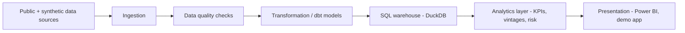

[Leia em português (pt-BR)](README.pt-BR.md)

# CredLens — Credit Risk & Portfolio Analytics

**CredLens turns a digital lender's credit portfolio into a reproducible, tested analytics product — from business question to KPI to decision.**

**Status: Foundation + Data Acquisition + Data Contracts + Counterfactual Synthetic Generator phase.** This repository contains business framing, architecture, project scaffolding, reproducibly acquired and audited public benchmark datasets (Phase 2), a conceptual data model/temporal semantics/formal data contracts (Phase 3), and — as of Phase 4A/4B — a real, deterministic, performance-optimized synthetic-portfolio generator with five executable scenarios (`baseline`, `policy_expansion`, `policy_tightening`, `macroeconomic_stress`, `collections_change`) sharing common random numbers, plus a `contract_coverage` test fixture and a data-quality-incident quarantine flow. No model has been trained, no dashboard exists, no KPI value has been computed, and no business result is claimed anywhere in this repository. Every business number you might expect to see here (portfolio size, delinquency, ROI, accuracy) is deliberately absent, and every generated value is explicitly synthetic — see [Current capabilities](#current-capabilities) and [`docs/roadmap.md`](docs/roadmap.md) for what happens next.

## The business scenario

CredLens is built around a fictional digital credit company that originates unsecured consumer loans. Like any lender, it has to manage tension between four levers at once: **how many applicants to approve, how much risk to carry, how much to charge, and how much to recover when payments slip.** Optimizing any one lever in isolation (e.g., approving more people) tends to damage another (e.g., delinquency). The company's leadership needs a shared, defensible view of the portfolio to make that trade-off deliberately instead of by accident.

The central executive question this project is organized around:

> **How do we grow or protect credit portfolio profitability while balancing approval, delinquency, expected loss, and recovery?**

Full context — situation, symptoms, executive questions, and the diagnostic tree connecting them — is in [`docs/business_problem.md`](docs/business_problem.md). None of it is presented as answered yet; see that document's explicit separation of description, diagnosis, forecast, and decision.

## Questions this project will eventually help answer

- Is delinquency rising because of new customers, specific vintages, or a shift in portfolio mix?
- Which segments concentrate the most exposure and loss?
- Is higher approval actually producing *profitable* growth, or just more volume?
- Which loan vintages are deteriorating fastest, and how fast?
- How do customers move between "current" and different delinquency buckets over time?
- How effective are the collections strategies in use?
- If the approval cutoff moved, what would happen to approval volume, risk, and expected result?
- What should leadership track daily, monthly, and by vintage?

These are stated and structured now (see [`docs/business_problem.md`](docs/business_problem.md) and [`docs/kpi_dictionary.md`](docs/kpi_dictionary.md)); they are **not** answered in this phase.

## Planned analytical products

Once later phases land, this project is scoped to produce:

- A **KPI dictionary and semantic layer** covering origination, portfolio, delinquency, vintage, recovery, and profitability metrics — each with an explicit formula, grain, and owner (draft: [`docs/kpi_dictionary.md`](docs/kpi_dictionary.md)).
- A **SQL/dbt-modeled warehouse** (DuckDB for local development) with tested, documented dimensional models.
- **Portfolio and vintage analysis** — growth, mix shift, delinquency roll rates, cure rates — built on top of that warehouse.
- An **interpretable credit risk model** and a **policy simulator** to estimate the effect of cutoff changes before they're made.
- A **Power BI dashboard** and a lightweight demo application for stakeholder-facing exploration.

None of these exist yet. They are scoped, not built — see [`docs/roadmap.md`](docs/roadmap.md).

## Architecture (summary)



This is the target architecture for the full project, not what is implemented today. Layer responsibilities, technology rationale, and what's implemented vs. planned are documented in [`docs/architecture.md`](docs/architecture.md).

## Current capabilities

What exists in the repository right now:

- Project scaffolding: source layout, dependency management, lint/type/test configuration.
- A tested CLI (`credlens --help`, `credlens version`, `credlens doctor`, plus `credlens data sources|fetch|verify|audit`).
- Centralized configuration loading (`config/base.yaml`) with validation and clear error messages.
- Structured logging setup.
- **Reproducible public-dataset acquisition and audit** (Phase 2): a source registry with license/DOI/citation per source (`data/metadata/source_registry.yaml`), an idempotent downloader (retries, atomic writes, path-traversal protection, checksum-verified), a Banco Central do Brasil SGS time-series client, and a structural data-quality audit that categorizes findings without ever modifying raw data. Four sources acquired and audited this phase: [Default of Credit Card Clients](https://archive.ics.uci.edu/dataset/350/default+of+credit+card+clients) (UCI, CC BY 4.0), [South German Credit](https://archive.ics.uci.edu/dataset/522/south+german+credit) (UCI, CC BY 4.0), and two BCB SGS series (portfolio balance and delinquency, ODbL). A fifth (Home Credit Default Risk, Kaggle) is registered but blocked — `BLOCKED_REQUIRES_USER_ACCESS`, with evidence — see [`docs/data_licensing.md`](docs/data_licensing.md).
- **Conceptual data model and data contracts** (Phase 3): a 17-entity conceptual model (events/state/snapshots, never one undifferentiated table) across 4 Mermaid ER diagrams, formal temporal semantics, reviewed state machines, and 20 typed data contracts (4 raw + 16 operational) enforced by `credlens contracts validate` in either `audit` (diagnostic) or `strict` (gating) mode — 22 named relational/temporal/financial business rules, all vectorized pandas, no `eval()`. Automated two pieces of Phase 2 technical debt (UCI EDUCATION/MARRIAGE domain detection, BCB date uniqueness/ordering) that were previously manual, each with a permanent regression test. See [`docs/data_contracts.md`](docs/data_contracts.md) and [`docs/conceptual_data_model.md`](docs/conceptual_data_model.md).
- **A real, deterministic, performance-optimized synthetic-portfolio generator with 5 counterfactual scenarios** (Phase 4A/4B): `credlens synthetic generate --scenario {baseline,policy_expansion,policy_tightening,macroeconomic_stress,collections_change,contract_coverage} --scale {smoke,sample,portfolio} --seed N` produces customers, applications, contracts, payments, snapshots, collections, write-offs, recoveries, and real-BCB-context tables, all validated in strict mode before being written to `data/synthetic/<run_id>/`. Reproducible (same seed → identical canonical content hash, proven in `tests/test_generation_orchestrator.py`), with a physically isolated synthetic-truth layer (`data/synthetic_truth/`, never used as a model feature) and a versioned feature allowlist enforcing that isolation as an interface, not just convention. `policy_expansion`/`policy_tightening`/`macroeconomic_stress`/`collections_change` share common random numbers with `baseline` for the same seed — see [`docs/common_random_numbers.md`](docs/common_random_numbers.md) — and can be generated together (`synthetic generate-suite`), compared (`synthetic compare`), validated together (`synthetic validate-suite`), and tested across seeds (`synthetic monte-carlo`). A ~2.27x `sample`-scale speedup was measured with the canonical content hash preserved exactly — see [`docs/performance_optimization.md`](docs/performance_optimization.md). Every parameter is an explicit synthetic assumption, classified in [`docs/synthetic_calibration.md`](docs/synthetic_calibration.md) — see [`docs/synthetic_generation_implementation.md`](docs/synthetic_generation_implementation.md) and [`docs/counterfactual_scenarios.md`](docs/counterfactual_scenarios.md). `data_quality_incident` remains without an executable generation config — see [`docs/data_quality_incident.md`](docs/data_quality_incident.md) for its quarantine-based alternative.
- Business documentation: charter, business problem framing, stakeholder map, KPI dictionary (definitions only, no computed values), data strategy, architecture, assumptions & limitations, glossary, roadmap — plus Phase 2's dataset selection matrix, data dictionary, data-quality audit, target/leakage audit, sensitive-attributes audit, Phase 3's conceptual model, temporal semantics, state machines, metric semantics, business rules, data contracts, fairness-data design, and Phase 4A's implementation record, for 9 ADRs total (see [Repository structure](#repository-structure)).
- CI (GitHub Actions): lint, format check, type check, tests with coverage — on every push.

## Planned capabilities (not yet implemented)

- The other 5 synthetic scenarios (`policy_expansion`, `policy_tightening`, `macroeconomic_stress`, `collections_change`, `data_quality_incident`) - specified but not calibrated or implemented.
- Dimensional data modeling and dbt transformations.
- A queryable SQL warehouse (DuckDB, optionally Postgres).
- Wiring `strict`-mode contract validation into a real ingestion/warehouse pipeline as an enforcement gate — today `credlens synthetic generate` gates its own output before promoting it, but nothing downstream reads from `data/synthetic/` yet.
- Portfolio, vintage, and roll-rate analysis.
- An interpretable probability-of-default model and expected-loss calculation.
- A cutoff/policy simulator.
- A Power BI dashboard and a demo application.
- Containerization and an expanded CI/CD pipeline.

See [`docs/roadmap.md`](docs/roadmap.md) for the full phase sequence and dependencies between phases.

## Quick start

Requires Python 3.11+ and, ideally, [`uv`](https://docs.astral.sh/uv/).

```bash
git clone <this-repository>
cd credlens-credit-analytics

# Install (uv resolves and locks dependencies automatically)
uv sync --all-groups

# Verify the installation
uv run credlens --help
uv run credlens version
uv run credlens doctor

# Data acquisition (Phase 2) - works offline; fetch/verify need network
uv run credlens data sources
uv run credlens data fetch --source uci-default-credit
uv run credlens data verify
uv run credlens data audit

# Data contracts (Phase 3) - all offline
uv run credlens contracts list
uv run credlens contracts show applications
uv run credlens contracts validate --contract applications --path tests/fixtures/contracts/valid_minimal_scenario --mode strict
uv run credlens synthetic plan
uv run credlens synthetic scenarios
uv run credlens synthetic validate-blueprints

# Synthetic portfolio generation (Phase 4A/4B) - offline, deterministic
uv run credlens synthetic generate --scenario baseline --scale smoke --seed 2026
uv run credlens synthetic validate --run-id RUN_baseline_smoke_2026_<config-hash-prefix>
uv run credlens synthetic inspect --run-id RUN_baseline_smoke_2026_<config-hash-prefix>
uv run credlens synthetic manifest --run-id RUN_baseline_smoke_2026_<config-hash-prefix>

# Counterfactual scenarios and suites (Phase 4B) - offline, deterministic
uv run credlens synthetic generate-suite --scale smoke --seed 2026
uv run credlens synthetic compare --baseline <run_id> --candidate <run_id>
uv run credlens synthetic validate-suite --suite-id SUITE_smoke_2026
uv run credlens synthetic monte-carlo --scenario macroeconomic_stress --scale smoke --seeds 10
uv run credlens synthetic profile --scale sample --seed 2026
```

Without `uv`, use a standard virtual environment instead:

```bash
python -m venv .venv
# Windows
.venv\Scripts\activate
# macOS / Linux
source .venv/bin/activate

pip install -e ".[dev]"
credlens --help
```

> Note: `pip install -e ".[dev]"` requires `dev` to be declared as an optional dependency group. This project defines its dev dependencies under `[dependency-groups]` (PEP 735) for `uv`; if you install with plain `pip`, install the packages listed under `dependency-groups.dev` in `pyproject.toml` individually (`pip install pytest pytest-cov ruff mypy types-PyYAML`).

## Development commands

A `Makefile` is provided for convenience. Every target has a documented `uv run` equivalent for contributors who don't use `make`.

| Task | Make | Direct (uv) |
|---|---|---|
| Install deps | `make install` | `uv sync --all-groups` |
| Lint | `make lint` | `uv run ruff check .` |
| Format check | `make format-check` | `uv run ruff format --check .` |
| Format (write) | `make format` | `uv run ruff format .` |
| Type check | `make typecheck` | `uv run mypy src tests` |
| Tests | `make test` | `uv run pytest` |
| Tests + coverage | `make coverage` | `uv run pytest --cov=credlens --cov-report=term-missing` |
| Run CLI | `make run ARGS="doctor"` | `uv run credlens doctor` |
| Everything CI runs | `make ci` | see `.github/workflows/ci.yml` |

See [`CONTRIBUTING.md`](CONTRIBUTING.md) for the full contributor workflow.

## Tests

```bash
uv run pytest
```

568 tests, 95% coverage on `src/credlens` as of Phase 4B. Coverage is a code-quality signal, not a proxy for how much of the eventual product is finished. Tests cover: package import/version, all CLI commands (including `data sources|fetch|verify|audit`, `contracts list|show|validate`, `synthetic plan|scenarios|validate-blueprints|generate|validate|inspect|manifest|generate-suite|compare|validate-suite|monte-carlo|profile`), configuration loading, the full data-acquisition layer, the full data-contracts layer (schema/loader/registry/validators, all 28 business rules, the 12-fixture end-to-end suite), dedicated regressions for the EDUCATION/MARRIAGE automation, BCB date uniqueness/chunking, a timezone-comparison bug, and CPF-shaped-identifier detection, the full synthetic-generation package (RNG substreams, id determinism, feature-freeze/fairness separation, amortization rounding, ledger reconciliation, the retention rule that replaced the old DPD=999 sentinel, canonical hashing, atomic staging/promotion, path-traversal protection, and real end-to-end generation runs validated against the actual `credlens.contracts` strict-mode code path), and — new in Phase 4B — common random numbers, superset/subset policy invariants, pre/post-shock identity and direction, collections pre-eligibility identity, `contract_coverage`'s rare-state coverage, all 5 data-quality-incident quarantine paths, suite generation, Monte Carlo aggregation, and functional/metamorphic truth-layer isolation (a static import/signature check, allowlist tests, and a metamorphic test proving decisions are unaffected by an extreme truth-layer perturbation). HTTP downloads and the BCB client are tested with mocked HTTP (`responses`), never real network calls; generation tests run the real (fast, offline) generator at `smoke` scale (Monte Carlo tests: 2 seeds at `smoke` scale) and clean up whatever they write under `data/synthetic(_truth)/` afterward.

## Repository structure

```text
credlens-credit-analytics/
├── README.md / README.pt-BR.md   # This file, and its Portuguese counterpart
├── pyproject.toml                # Package metadata, dependencies, tool config
├── config/                       # base.yaml (structural config) + synthetic/ (blueprints + baseline.generation.yaml)
├── contracts/                    # raw/ + operational/ data contract YAML files (Phase 3, extended Phase 4A)
├── data/                         # raw/ + synthetic/ + synthetic_truth/ (all git-ignored) + metadata/ (versioned) - see data/README.md
├── docs/                         # Business, architecture, data-acquisition, data-contracts, and generator documentation
├── src/credlens/                 # Application package (CLI, config, logging, data/, contracts/, generation/, synthetic.py)
├── tests/                        # Pytest suite, including tests/fixtures/contracts/ (valid + invalid scenarios)
├── reports/data_audit/           # Generated structural audit reports (reproducible via `credlens data audit`)
└── .github/                      # CI workflow and issue/PR templates
```

Phase 2 documentation, in addition to Phase 1's business docs: [`docs/dataset_selection.md`](docs/dataset_selection.md) (weighted decision matrix), [`docs/data_sources.md`](docs/data_sources.md) (how each source is acquired), [`docs/data_licensing.md`](docs/data_licensing.md), [`docs/data_dictionary.md`](docs/data_dictionary.md), [`docs/data_quality_audit.md`](docs/data_quality_audit.md), [`docs/target_and_leakage_audit.md`](docs/target_and_leakage_audit.md), [`docs/sensitive_attributes.md`](docs/sensitive_attributes.md).

Phase 3 documentation: [`docs/conceptual_data_model.md`](docs/conceptual_data_model.md), [`docs/temporal_semantics.md`](docs/temporal_semantics.md), [`docs/state_machines.md`](docs/state_machines.md), [`docs/metric_semantics.md`](docs/metric_semantics.md), [`docs/business_rules.md`](docs/business_rules.md), [`docs/data_contracts.md`](docs/data_contracts.md), [`docs/fairness_data_design.md`](docs/fairness_data_design.md), [`docs/synthetic_generation_spec.md`](docs/synthetic_generation_spec.md).

Phase 4A documentation: [`docs/synthetic_generation_implementation.md`](docs/synthetic_generation_implementation.md) (the as-built generator design), and 9 architecture decision records in total in [`docs/adr/`](docs/adr/) (7 from Phase 3, plus [`0008`](docs/adr/0008-macro-context-provenance.md) and [`0009`](docs/adr/0009-dpd-sentinel-removal.md) from Phase 4A).

## Data strategy (summary)

The target strategy is **public data + a reproducible synthetic operational layer**: real, licensed public credit/macroeconomic datasets provide realistic structure and distributions; a documented, code-generated synthetic layer fills in the operational detail (e.g., day-to-day delinquency transitions) that public datasets don't expose, without ever presenting synthetic values as real observed outcomes. As of Phase 2, four sources are acquired and licensed (two UCI individual-level benchmarks, two Banco Central do Brasil macro series); a fifth (Kaggle) is blocked pending user-provided credentials this project will not request. As of Phase 3, the synthetic layer's conceptual model, contracts, and generation *specification* existed but no generator was built. **As of Phase 4A, the generator itself is real for the `baseline` scenario** - `credlens synthetic generate --scenario baseline` produces a full, contract-valid, deterministic synthetic portfolio; every other scenario remains specification-only. See [`docs/data_strategy.md`](docs/data_strategy.md), [`docs/synthetic_generation_spec.md`](docs/synthetic_generation_spec.md), and [`docs/synthetic_generation_implementation.md`](docs/synthetic_generation_implementation.md) for the full picture.

## Limitations

This is a portfolio project about a **fictional** company. It contains no real customers, no real personal or financial data, and (in this phase) no computed business results. It cannot be used to make real credit decisions, and any future model or metric it produces will require independent statistical, legal, and regulatory validation before any real-world use. See [`docs/assumptions_and_limitations.md`](docs/assumptions_and_limitations.md) for the full list.

## Roadmap

See [`docs/roadmap.md`](docs/roadmap.md) for the phased plan, from this foundation through data acquisition, modeling, analytics, risk scoring, policy simulation, dashboards, and publication readiness.

## License

Code is licensed under [MIT](LICENSE). Any third-party dataset used in future phases remains subject to its own license — see [`docs/data_strategy.md`](docs/data_strategy.md).

---

[Leia em português (pt-BR)](README.pt-BR.md)
