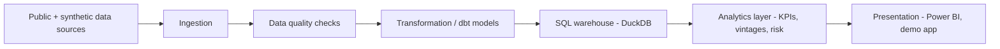

[Leia em português (pt-BR)](README.pt-BR.md)

# CredLens — Credit Risk & Portfolio Analytics

**CredLens turns a digital lender's credit portfolio into a reproducible, tested analytics product — from business question to KPI to decision.**

**Status: Foundation + Data Acquisition + Conceptual Modeling/Data Contracts phase.** This repository contains business framing, architecture, project scaffolding, reproducibly acquired and audited public benchmark datasets (Phase 2), and — as of Phase 3 — a conceptual data model, temporal semantics, formal data contracts, and a specification (not an implementation) for a future synthetic operational layer. No model has been trained, no dashboard exists, no KPI value has been computed, no synthetic data has been generated, and no business result is claimed anywhere in this repository. Every business number you might expect to see here (portfolio size, delinquency, ROI, accuracy) is deliberately absent — see [Current capabilities](#current-capabilities) and [`docs/roadmap.md`](docs/roadmap.md) for what happens next.

## The business scenario

CredLens is built around a fictional digital credit company that originates unsecured consumer loans. Like any lender, it has to manage tension between four levers at once: **how many applicants to approve, how much risk to carry, how much to charge, and how much to recover when payments slip.** Optimizing any one lever in isolation (e.g., approving more people) tends to damage another (e.g., delinquency). The company's leadership needs a shared, defensible view of the portfolio to make that trade-off deliberately instead of by accident.

The central executive question this project is organized around:

> **How do we grow or protect credit portfolio profitability while balancing approval, delinquency, expected loss, and recovery?**

Full context — situation, symptoms, executive questions, and the diagnostic tree connecting them — is in [`docs/business_problem.md`](docs/business_problem.md). None of it is presented as answered yet; see that document's explicit separation of description, diagnosis, forecast, and decision.

## Questions this project will eventually help answer

- Is delinquency rising because of new customers, specific vintages, or a shift in portfolio mix?
- Which segments concentrate the most exposure and loss?
- Is higher approval actually producing *profitable* growth, or just more volume?
- Which loan vintages are deteriorating fastest, and how fast?
- How do customers move between "current" and different delinquency buckets over time?
- How effective are the collections strategies in use?
- If the approval cutoff moved, what would happen to approval volume, risk, and expected result?
- What should leadership track daily, monthly, and by vintage?

These are stated and structured now (see [`docs/business_problem.md`](docs/business_problem.md) and [`docs/kpi_dictionary.md`](docs/kpi_dictionary.md)); they are **not** answered in this phase.

## Planned analytical products

Once later phases land, this project is scoped to produce:

- A **KPI dictionary and semantic layer** covering origination, portfolio, delinquency, vintage, recovery, and profitability metrics — each with an explicit formula, grain, and owner (draft: [`docs/kpi_dictionary.md`](docs/kpi_dictionary.md)).
- A **SQL/dbt-modeled warehouse** (DuckDB for local development) with tested, documented dimensional models.
- **Portfolio and vintage analysis** — growth, mix shift, delinquency roll rates, cure rates — built on top of that warehouse.
- An **interpretable credit risk model** and a **policy simulator** to estimate the effect of cutoff changes before they're made.
- A **Power BI dashboard** and a lightweight demo application for stakeholder-facing exploration.

None of these exist yet. They are scoped, not built — see [`docs/roadmap.md`](docs/roadmap.md).

## Architecture (summary)



This is the target architecture for the full project, not what is implemented today. Layer responsibilities, technology rationale, and what's implemented vs. planned are documented in [`docs/architecture.md`](docs/architecture.md).

## Current capabilities

What exists in the repository right now:

- Project scaffolding: source layout, dependency management, lint/type/test configuration.
- A tested CLI (`credlens --help`, `credlens version`, `credlens doctor`, plus `credlens data sources|fetch|verify|audit`).
- Centralized configuration loading (`config/base.yaml`) with validation and clear error messages.
- Structured logging setup.
- **Reproducible public-dataset acquisition and audit** (Phase 2): a source registry with license/DOI/citation per source (`data/metadata/source_registry.yaml`), an idempotent downloader (retries, atomic writes, path-traversal protection, checksum-verified), a Banco Central do Brasil SGS time-series client, and a structural data-quality audit that categorizes findings without ever modifying raw data. Four sources acquired and audited this phase: [Default of Credit Card Clients](https://archive.ics.uci.edu/dataset/350/default+of+credit+card+clients) (UCI, CC BY 4.0), [South German Credit](https://archive.ics.uci.edu/dataset/522/south+german+credit) (UCI, CC BY 4.0), and two BCB SGS series (portfolio balance and delinquency, ODbL). A fifth (Home Credit Default Risk, Kaggle) is registered but blocked — `BLOCKED_REQUIRES_USER_ACCESS`, with evidence — see [`docs/data_licensing.md`](docs/data_licensing.md).
- **Conceptual data model and data contracts** (Phase 3): a 17-entity conceptual model (events/state/snapshots, never one undifferentiated table) across 4 Mermaid ER diagrams, formal temporal semantics, reviewed state machines, and 20 typed data contracts (4 raw + 16 operational) enforced by `credlens contracts validate` in either `audit` (diagnostic) or `strict` (gating) mode — 22 named relational/temporal/financial business rules, all vectorized pandas, no `eval()`. Automated two pieces of Phase 2 technical debt (UCI EDUCATION/MARRIAGE domain detection, BCB date uniqueness/ordering) that were previously manual, each with a permanent regression test. See [`docs/data_contracts.md`](docs/data_contracts.md) and [`docs/conceptual_data_model.md`](docs/conceptual_data_model.md).
- **Synthetic-generation specification, not generation** (Phase 3): `docs/synthetic_generation_spec.md` and 6 scenario blueprints (`config/synthetic/scenarios/*.blueprint.yaml`) describe population, origination, performance, and temporal-dependence design for a future generator - every parameter is honestly marked `pending`/`requires_calibration`, never a fabricated value. `credlens synthetic generate` deliberately does nothing but report that generation isn't implemented yet.
- Business documentation: charter, business problem framing, stakeholder map, KPI dictionary (definitions only, no computed values), data strategy, architecture, assumptions & limitations, glossary, roadmap — plus Phase 2's dataset selection matrix, data dictionary, data-quality audit, target/leakage audit, sensitive-attributes audit, and Phase 3's conceptual model, temporal semantics, state machines, metric semantics, business rules, data contracts, fairness-data design, and 7 ADRs (see [Repository structure](#repository-structure)).
- CI (GitHub Actions): lint, format check, type check, tests with coverage — on every push.

## Planned capabilities (not yet implemented)

- The actual synthetic operational data generator - Phase 3 specified it (population/origination/performance/temporal-dependence design, 6 scenarios) but did not build it; `credlens synthetic generate` remains a stub by design.
- Dimensional data modeling and dbt transformations.
- A queryable SQL warehouse (DuckDB, optionally Postgres).
- Wiring `strict`-mode contract validation into a real ingestion pipeline as an enforcement gate — today it only gates `tests/fixtures/contracts/`, since there is no real synthetic data yet to gate.
- Portfolio, vintage, and roll-rate analysis.
- An interpretable probability-of-default model and expected-loss calculation.
- A cutoff/policy simulator.
- A Power BI dashboard and a demo application.
- Containerization and an expanded CI/CD pipeline.

See [`docs/roadmap.md`](docs/roadmap.md) for the full phase sequence and dependencies between phases.

## Quick start

Requires Python 3.11+ and, ideally, [`uv`](https://docs.astral.sh/uv/).

```bash
git clone <this-repository>
cd credlens-credit-analytics

# Install (uv resolves and locks dependencies automatically)
uv sync --all-groups

# Verify the installation
uv run credlens --help
uv run credlens version
uv run credlens doctor

# Data acquisition (Phase 2) - works offline; fetch/verify need network
uv run credlens data sources
uv run credlens data fetch --source uci-default-credit
uv run credlens data verify
uv run credlens data audit

# Data contracts and synthetic-generation planning (Phase 3) - all offline
uv run credlens contracts list
uv run credlens contracts show applications
uv run credlens contracts validate --contract applications --path tests/fixtures/contracts/valid_minimal_scenario --mode strict
uv run credlens synthetic plan
uv run credlens synthetic scenarios
uv run credlens synthetic validate-blueprints
```

Without `uv`, use a standard virtual environment instead:

```bash
python -m venv .venv
# Windows
.venv\Scripts\activate
# macOS / Linux
source .venv/bin/activate

pip install -e ".[dev]"
credlens --help
```

> Note: `pip install -e ".[dev]"` requires `dev` to be declared as an optional dependency group. This project defines its dev dependencies under `[dependency-groups]` (PEP 735) for `uv`; if you install with plain `pip`, install the packages listed under `dependency-groups.dev` in `pyproject.toml` individually (`pip install pytest pytest-cov ruff mypy types-PyYAML`).

## Development commands

A `Makefile` is provided for convenience. Every target has a documented `uv run` equivalent for contributors who don't use `make`.

| Task | Make | Direct (uv) |
|---|---|---|
| Install deps | `make install` | `uv sync --all-groups` |
| Lint | `make lint` | `uv run ruff check .` |
| Format check | `make format-check` | `uv run ruff format --check .` |
| Format (write) | `make format` | `uv run ruff format .` |
| Type check | `make typecheck` | `uv run mypy src tests` |
| Tests | `make test` | `uv run pytest` |
| Tests + coverage | `make coverage` | `uv run pytest --cov=credlens --cov-report=term-missing` |
| Run CLI | `make run ARGS="doctor"` | `uv run credlens doctor` |
| Everything CI runs | `make ci` | see `.github/workflows/ci.yml` |

See [`CONTRIBUTING.md`](CONTRIBUTING.md) for the full contributor workflow.

## Tests

```bash
uv run pytest
```

369 tests, 95% coverage on `src/credlens` as of Phase 3. Coverage is a code-quality signal, not a proxy for how much of the eventual product is finished. Tests cover: package import/version, all CLI commands (including `data sources|fetch|verify|audit`, `contracts list|show|validate`, `synthetic plan|scenarios|validate-blueprints|generate`), configuration loading, the full data-acquisition layer, and the full data-contracts layer — schema/loader/registry/validators, all 22 business rules, the 12-fixture end-to-end suite (1 valid scenario passing cleanly + 11 invalid scenarios each failing with its exact intended code), and dedicated regressions for the EDUCATION/MARRIAGE automation, BCB date uniqueness/chunking, a timezone-comparison bug found this phase, and CPF-shaped-identifier detection. HTTP downloads and the BCB client are tested with mocked HTTP (`responses`), never real network calls; every fetch/verify/audit CLI test is sandboxed to a temp directory and never touches this repository's real `data/` files.

## Repository structure

```text
credlens-credit-analytics/
├── README.md / README.pt-BR.md   # This file, and its Portuguese counterpart
├── pyproject.toml                # Package metadata, dependencies, tool config
├── config/                       # base.yaml (structural config) + synthetic/ (scenario blueprints, Phase 3)
├── contracts/                    # raw/ + operational/ data contract YAML files (Phase 3)
├── data/                         # raw/ (git-ignored) + metadata/ (versioned provenance) - see data/README.md
├── docs/                         # Business, architecture, data-acquisition, and data-contracts documentation
├── src/credlens/                 # Application package (CLI, config, logging, data/, contracts/, synthetic.py)
├── tests/                        # Pytest suite, including tests/fixtures/contracts/ (valid + invalid scenarios)
├── reports/data_audit/           # Generated structural audit reports (reproducible via `credlens data audit`)
└── .github/                      # CI workflow and issue/PR templates
```

Phase 2 documentation, in addition to Phase 1's business docs: [`docs/dataset_selection.md`](docs/dataset_selection.md) (weighted decision matrix), [`docs/data_sources.md`](docs/data_sources.md) (how each source is acquired), [`docs/data_licensing.md`](docs/data_licensing.md), [`docs/data_dictionary.md`](docs/data_dictionary.md), [`docs/data_quality_audit.md`](docs/data_quality_audit.md), [`docs/target_and_leakage_audit.md`](docs/target_and_leakage_audit.md), [`docs/sensitive_attributes.md`](docs/sensitive_attributes.md).

Phase 3 documentation: [`docs/conceptual_data_model.md`](docs/conceptual_data_model.md), [`docs/temporal_semantics.md`](docs/temporal_semantics.md), [`docs/state_machines.md`](docs/state_machines.md), [`docs/metric_semantics.md`](docs/metric_semantics.md), [`docs/business_rules.md`](docs/business_rules.md), [`docs/data_contracts.md`](docs/data_contracts.md), [`docs/fairness_data_design.md`](docs/fairness_data_design.md), [`docs/synthetic_generation_spec.md`](docs/synthetic_generation_spec.md), and 7 architecture decision records in [`docs/adr/`](docs/adr/).

## Data strategy (summary)

The target strategy is **public data + a reproducible synthetic operational layer**: real, licensed public credit/macroeconomic datasets provide realistic structure and distributions; a documented, code-generated synthetic layer fills in the operational detail (e.g., day-to-day delinquency transitions) that public datasets don't expose, without ever presenting synthetic values as real observed outcomes. As of Phase 2, four sources are acquired and licensed (two UCI individual-level benchmarks, two Banco Central do Brasil macro series); a fifth (Kaggle) is blocked pending user-provided credentials this project will not request. As of Phase 3, the synthetic layer's conceptual model, contracts, and generation *specification* exist (see [`docs/synthetic_generation_spec.md`](docs/synthetic_generation_spec.md)) but the generator itself is not built - `credlens synthetic generate` is a deliberate stub. See [`docs/data_strategy.md`](docs/data_strategy.md) and [`docs/dataset_selection.md`](docs/dataset_selection.md) for the full picture.

## Limitations

This is a portfolio project about a **fictional** company. It contains no real customers, no real personal or financial data, and (in this phase) no computed business results. It cannot be used to make real credit decisions, and any future model or metric it produces will require independent statistical, legal, and regulatory validation before any real-world use. See [`docs/assumptions_and_limitations.md`](docs/assumptions_and_limitations.md) for the full list.

## Roadmap

See [`docs/roadmap.md`](docs/roadmap.md) for the phased plan, from this foundation through data acquisition, modeling, analytics, risk scoring, policy simulation, dashboards, and publication readiness.

## License

Code is licensed under [MIT](LICENSE). Any third-party dataset used in future phases remains subject to its own license — see [`docs/data_strategy.md`](docs/data_strategy.md).

---

[Leia em português (pt-BR)](README.pt-BR.md)
