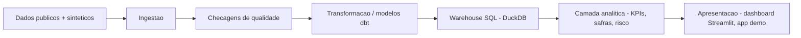

[Read in English](README.md) · [Resumo de portfólio em 2 minutos](PORTFOLIO.pt-BR.md)

# CredLens — Credit Risk & Portfolio Analytics

**O CredLens transforma a carteira de crédito de uma credor digital em um produto de analytics reprodutível e testado — da pergunta de negócio ao KPI, do KPI à decisão.**

**Status: `v1.0.0`, publicado como [GitHub Release](https://github.com/FilipePessoa30/CredLens/releases/tag/v1.0.0)** (um projeto de portfólio com uma release estável de software, não um sistema bancário de produção). Este repositório contém a definição do negócio, a arquitetura, o esqueleto do projeto, bases públicas de referência adquiridas e auditadas de forma reprodutível (Fase 2), um modelo conceitual de dados, semântica temporal e contratos de dados formais (Fase 3), um gerador determinístico real de carteira sintética, otimizado em performance, com cinco cenários executáveis (Fase 4A/4B), um warehouse analítico DuckDB + dbt com três gates de integridade reforçados (Fase 5-6), uma camada reprodutível de análise de portfólio que responde a um registro versionado de perguntas de negócio, com relatórios bilíngues, gráficos profissionais e um notebook de estudo de caso (Fase 6), um **Dashboard de Inteligência de Decisão** em Streamlit multipágina com um registro verificável de insights, uma varredura de robustez multi-seed completa para os quatro cenários, e um pacote demonstrativo pequeno e versionado (Fase 7), um **modelo comportamental de alerta antecipado de inadimplência**, treinado e validado no benchmark público real da UCI, com todo o rigor de leakage/calibração/incerteza/subgrupo/robustez e uma 9ª página no dashboard, **Model Lab** (Fase 8), uma **camada de validação independente** que recomputa essa evidência a partir de artefatos congelados (nunca copiando o relatório da Fase 8), um modelo `challenger` formalmente registrado, e uma **simulação de monitoramento** claramente rotulada com uma 10ª página no dashboard, **Model Monitoring Lab** (Fase 9) — e, na Fase 10, uma *reauditoria* dessa mesma camada de validação/monitoramento que encontrou e corrigiu dois problemas metodológicos reais (uma taxa de falso alerta de ~60% causada por um problema de comparações múltiplas não corrigido no monitoramento; um viés de otimismo de ~0,012 no ROC-AUC da referência de desempenho), uma **variante de modelo remediada pós-validação**, registrada separadamente do modelo original, uma política de governança de reason codes, uma hierarquia de escalonamento sinal→alerta→incidente no monitoramento, verificação real do dashboard com navegador headless, e ferramental de engenharia de release (inventário de licenças, SBOM, manifesto determinístico de release) — veja [Dashboard de Inteligência de Decisão](#dashboard-de-inteligência-de-decisão), [Model Lab](#model-lab--modelo-comportamental-de-alerta-antecipado), e [Model Monitoring Lab](#model-monitoring-lab--validação-independente-e-simulação-de-monitoramento) abaixo. Nem o modelo nem sua simulação de monitoramento são um sistema real de decisão ou monitoramento de produção — veja [Capacidades atuais](#capacidades-atuais), [`reports/modeling/model_card.pt-BR.md`](reports/modeling/model_card.pt-BR.md), [`reports/model_validation/validation_report.pt-BR.md`](reports/model_validation/validation_report.pt-BR.md) e [`docs/roadmap.md`](docs/roadmap.md) para os próximos passos.

## O cenário de negócio

O CredLens é construído em torno de uma empresa fictícia de crédito digital que concede empréstimos pessoais sem garantia. Como qualquer credor, ela precisa equilibrar quatro alavancas ao mesmo tempo: **quantos proponentes aprovar, quanto risco carregar, quanto cobrar e quanto recuperar quando os pagamentos atrasam.** Otimizar uma alavanca isoladamente (por exemplo, aprovar mais pessoas) tende a prejudicar outra (por exemplo, a inadimplência). A liderança da empresa precisa de uma visão compartilhada e defensável da carteira para fazer essa troca de forma deliberada, não acidental.

A pergunta executiva central que organiza este projeto:

> **Como aumentar ou preservar a rentabilidade da carteira de crédito, equilibrando aprovação, inadimplência, perda esperada e recuperação?**

O contexto completo — situação, sintomas, perguntas executivas e a árvore de diagnóstico que os conecta — está em [`docs/business_problem.md`](docs/business_problem.md). Nada ali é apresentado como já respondido; veja a separação explícita entre descrição, diagnóstico, previsão e decisão nesse documento.

## Dashboard de Inteligência de Decisão

Um aplicativo Streamlit multipágina (`dashboard/`, apoiado pelo pacote instalável e testado `src/credlens/dashboard/`) transforma os resultados do warehouse/análise acima em uma visão interativa e filtrável — **uma camada de apresentação apenas**: todo KPI exibido vem de um mart dbt já testado ou do registro de insights, nada é recalculado na interface.

**Experimente em menos de um minuto, sem precisar de warehouse:**

```bash
uv sync --extra warehouse --extra analysis --extra dashboard
uv run credlens dashboard run --demo
```

**Páginas:** Executive Overview · Credit Funnel · Portfolio & Delinquency · Vintages & Roll Rates · Cure, Collections & Recovery · Scenario Lab · Data Quality & Methodology · Public Benchmarks — veja [`dashboard/README.md`](dashboard/README.md) para o dicionário completo de páginas e filtros.

**Principais capacidades:**
- Dois modos explícitos, sempre visíveis: um modo de **warehouse validado** (revalida os testes dbt/integridade das fontes brutas antes de exibir qualquer coisa) e um modo de **agregado demonstrativo** (um pacote Parquet de ~190 KB, verificado contra adulteração, sem nenhuma linha em nível de cliente/contrato, versionado neste repositório).
- Dez filtros interativos (cenário, canal, produto, região, versão de política, faixa de score de bureau, faixa de renda, faixa de valor contratado, coorte, bucket de DPD) que nunca geram erro em uma seleção vazia ou em uma tabela sem aquela dimensão.
- Uma política de amostra mínima em três níveis (insuficiente / limitada / adequada — nunca um corte fixo e baixo demais) que controla o que pode ser ranqueado ou chamado de "melhor/pior".
- Um sistema explícito de proveniência de dados em cinco categorias (`synthetic_operational`, `synthetic_scenario`, `public_benchmark`, `public_market_context`, `mixed_context`) para que um dado público real nunca seja rotulado como sintético (nem o contrário).
- Exportações em CSV/PNG que carregam seus próprios metadados de build/análise/proveniência/tamanho de amostra.

**Arquitetura, reprodução com um warehouse validado real, e todas as limitações estão em [`dashboard/README.md`](dashboard/README.md).**

## Model Lab — Modelo Comportamental de Alerta Antecipado

**Benchmark público histórico — UCI, Taiwan, 2005. Não conectado à carteira sintética do CredLens acima, e não adequado para decisões reais de concessão de crédito.**

A Fase 8 adiciona um **modelo comportamental de alerta antecipado para inadimplência no mês seguinte**, treinado e validado no dataset público real [Default of Credit Card Clients](https://archive.ics.uci.edu/dataset/350/default+of+credit+card+clients) — nunca na carteira sintética, nunca misturado a ela. Ele responde a uma pergunta estruturalmente diferente de um score de concessão/originação: dado o histórico de 6 meses de uma conta **já existente**, ela parece estar prestes a entrar em inadimplência? Veja [`docs/target_and_leakage_audit.md`](docs/target_and_leakage_audit.md) (Fase 3) para o porquê desse enquadramento — e não o de originação — ser o único que a própria estrutura do dataset sustenta.

**Experimente:**

```bash
uv sync --extra analysis --extra modeling
uv run credlens model data-audit
uv run credlens model create-split --experiment-id EXP_demo --seed 42
uv run credlens model train --experiment-id EXP_demo --seed 42
uv run credlens model evaluate --experiment-id EXP_demo
uv run credlens dashboard run --demo   # depois abra a página "Model Lab"
```

**O que é:** 18 features comportamentais interpretáveis (agregados de atraso/fatura/pagamento — nenhum atributo demográfico bruto chega ao treinamento), uma baseline Dummy, uma regra isotônica transparente de uma única feature, uma regressão logística ajustada (o principal candidato interpretável — coeficientes/odds ratios) e um desafiante HistGradientBoosting. Controles completos de leakage (allowlist estática + 5 controles negativos funcionais: alvo embaralhado, detecção de leakage quase perfeito, apenas ID, rejeição de cópia direta/renomeada do alvo), um split estratificado 60/20/20 travado, comparação de calibração (mantido não calibrado quando nenhum método ajudou), um bootstrap estratificado e uma varredura de estabilidade em 5 seeds, diagnósticos pós-hoc de subgrupo (SEXO/EDUCAÇÃO/ESTADO CIVIL/IDADE — apenas auditoria, nunca uma feature de treino) e 9 perturbações controladas de robustez.

**O que não é:** um score de concessão/originação, um modelo regulatório de PD/LGD/EAD, uma certificação de fairness, um otimizador de lucro/corte, ou algo conectado a uma decisão real de crédito — veja [`reports/modeling/model_card.pt-BR.md`](reports/modeling/model_card.pt-BR.md) para a divulgação completa e obrigatória.

**Metodologia completa, números reais e o resultado de cada gate:** [`reports/modeling/technical_report.pt-BR.md`](reports/modeling/technical_report.pt-BR.md).

## Model Monitoring Lab — Validação Independente e Simulação de Monitoramento

**Simulação de monitoramento sobre um benchmark público histórico — nunca um sistema de monitoramento de produção real.**

A Fase 9 valida independentemente o modelo da Fase 8 (`credlens.model_validation` — um pacote separado que recomputa evidência a partir de artefatos congelados, nunca copia o relatório da Fase 8) e simula monitoramento sobre ele (`credlens.monitoring` — 12 batches simulados construídos particionando o conjunto de teste bloqueado, nunca dados reais de produção com data real). A Fase 10 então reauditou essa mesma camada de validação/monitoramento em busca de lacunas metodológicas remanescentes, adicionou uma política governada de reason codes, uma hierarquia de escalonamento sinal→alerta→incidente, e uma variante de modelo remediada registrada separadamente. **Holdout de avaliação congelado reutilizado ao longo de fases de validação documentadas** — não "intocado": o split e as previsões de teste nunca mudaram, mas o mesmo conjunto de teste foi consultado repetidamente ao longo das Fases 8-10 (veja a seção 6 de [`reports/model_validation/validation_report.pt-BR.md`](reports/model_validation/validation_report.pt-BR.md) para a divulgação completa e o risco de adaptação indireta que isso carrega para qualquer modelo remediado).

**Experimente:**

```bash
uv run credlens model validate-independent --model-id MODEL_behavioral_default_v1
uv run credlens model register-challenger --experiment-id EXP_behavioral_default_v1
uv run credlens model compare-candidates --experiment-id EXP_behavioral_default_v1
uv run credlens model remediate --experiment-id EXP_behavioral_default_v1
uv run credlens monitor create-reference --model-id MODEL_behavioral_default_v1
uv run credlens monitor simulate-batches --reference-id REF_MODEL_behavioral_default_v1
uv run credlens monitor calibrate-reference --reference-id REF_MODEL_behavioral_default_v1
uv run credlens monitor run --reference-id REF_MODEL_behavioral_default_v1 \
  --batch-set BATCHSET_REF_MODEL_behavioral_default_v1
uv run credlens monitor evaluate-false-alerts --reference-id REF_MODEL_behavioral_default_v1
uv run credlens dashboard run --demo   # depois abra a página "Model Monitoring Lab"
```

**O que foi encontrado (Fase 9):** um controle de permutação com 100 repetições substituindo o frágil teste de embaralhamento de banda fixa da Fase 8; uma auditoria de multicolinearidade sinalizando `months_delinquent_count`/`consecutive_months_delinquent` (VIF ~57/53) e dois pares total/média perfeitamente colineares como `redundant`; uma correção ao "gap máximo de TPR = 0,3323" reportado na Fase 8 (era a própria taxa de verdadeiro positivo de um grupo, escolhida como máximo apenas porque o mínimo veio de um grupo `limited` de 56 linhas — o gap corrigido, apenas entre grupos adequados, é 0,0657); o HistGradientBoosting formalmente registrado como `challenger` (nunca `candidate`/`production`) com um trade-off Pareto real contra o candidato interpretável; uma decisão independente de 14 gates — **`validation_passed_with_limitations`**.

**O que a reauditoria da Fase 10 encontrou:** o limiar de drift por feature do próprio modelo, embora corretamente calibrado para uma única feature isolada, produzia uma **taxa de falso alerta por família de ~60%** entre 18 features quando aplicado conjuntamente (um problema de comparações múltiplas não corrigido) — medido diretamente contra 100 batches reais sem perturbação, depois corrigido com um limiar calibrado por família sobre a estatística máxima, que reduziu a mesma medição para **~4% (revisão) / ~1% (material)**; a referência de desempenho do monitoramento combinava treino+validação, superestimando a generalização real em holdout em **~0,012 ROC-AUC** (0,7571 vs. 0,7451 do holdout real) — corrigido adicionando uma referência de desempenho apenas de validação; uma colinearidade quase perfeita mascarada (`utilization_ratio` vs. `limit_exposure_distance`, correlação -0,99997) que só ficou visível após remover o par colinear dominante — encontrada, documentada e excluída em um modelo `remediation_candidate` registrado separadamente (`MODEL_behavioral_default_v2_reduced`) que nunca sobrescreve o original; uma política governada de reason codes (`config/model_validation/reason_codes.yml`) que flagrou uma feature redundante e com sinal contraintuitivo aparecendo como uma das 3 principais "razões" nas explicações locais oficialmente registradas — corrigido e regenerado.

**O que não é:** uma certificação de fairness, uma avaliação de conformidade legal, ou um sistema real de monitoramento de produção — os alertas são apenas locais e estruturados, sem nenhum transporte por e-mail/Slack/webhook em todo este código, e sem remediação ou promoção automática.

**Metodologia completa, números reais e o resultado de cada gate:** [`reports/model_validation/validation_report.pt-BR.md`](reports/model_validation/validation_report.pt-BR.md), [`reports/model_validation/remediation_report.pt-BR.md`](reports/model_validation/remediation_report.pt-BR.md), [`reports/monitoring/monitoring_report.pt-BR.md`](reports/monitoring/monitoring_report.pt-BR.md).

## Perguntas que este projeto ajuda a responder hoje

- A inadimplência está crescendo por causa de clientes novos, de safras específicas, ou de uma mudança no mix da carteira? — veja os marts de funil/safra e o [Estudo de caso](#estudo-de-caso-credit-portfolio-intelligence).
- Quais segmentos concentram maior exposição e perda? — veja as quebras de subgrupo da análise de portfólio.
- Quais safras estão deteriorando mais rápido, e a que velocidade? — veja os marts de safra/coorte e os KPIs de roll rate.
- Como os clientes transitam entre "em dia" e as diferentes faixas de atraso ao longo do tempo? — veja a análise de transição/roll rate de inadimplência.
- Qual é a efetividade das estratégias de cobrança em uso, nesta carteira sintética? — veja os marts de cobrança/cure rate.
- Se um limiar de capacidade de revisão mudasse, o que aconteceria com o volume de revisão e o mix de casos em um cenário *ilustrativo*? — veja a simulação de cenário do [Model Lab](#model-lab--modelo-comportamental-de-alerta-antecipado) (nunca um otimizador de lucro/corte).
- É possível construir, validar de forma independente e monitorar quanto a drift um sinal comportamental de alerta antecipado sobre um dataset real (ainda que histórico e não brasileiro)? — veja [Model Lab](#model-lab--modelo-comportamental-de-alerta-antecipado) e [Model Monitoring Lab](#model-monitoring-lab--validação-independente-e-simulação-de-monitoramento).

Todas as perguntas acima são respondidas contra uma **carteira sintética** (funil/safra/cobrança) ou um **benchmark histórico real da UCI** (o modelo) — nunca dados de uma instituição real. Veja [`docs/business_problem.md`](docs/business_problem.md) e [`docs/kpi_dictionary.md`](docs/kpi_dictionary.md) para o registro completo de perguntas, e [Limitações](#limitações) para o que nada disso consegue responder.

## O que está fora de escopo por definição

Este projeto deliberadamente não implementa, e a Fase 10 exclui explicitamente adicionar: uma API de scoring em tempo real, deploy em nuvem, decisão automática/online, retreinamento ou promoção automática de modelo, um dashboard em Power BI, ou um novo modelo treinado sobre a carteira sintética (um rótulo de inadimplência sintético seria circular). Esses são limites de escopo, não um roadmap do que falta construir — veja [`docs/roadmap.md`](docs/roadmap.md) para o que de fato ainda está planejado (majoritariamente análises mais profundas em cima do warehouse já existente).

## Arquitetura (resumo)



Isso reflete o que está de fato implementado hoje, não um alvo aspiracional (a Fase 10 abandonou a camada de Power BI originalmente planejada em favor do dashboard Streamlit já construído na Fase 7 — veja [O que está fora de escopo por definição](#o-que-está-fora-de-escopo-por-definição)). As responsabilidades de cada camada e a justificativa das tecnologias estão documentadas em [`docs/architecture.md`](docs/architecture.md).

## Capacidades atuais

O que existe no repositório agora:

- Esqueleto do projeto: layout de código-fonte, gestão de dependências, configuração de lint/tipagem/testes.
- Uma CLI testada (`credlens --help`, `credlens version`, `credlens doctor`, além de `credlens data sources|fetch|verify|audit`).
- Carregamento centralizado de configuração (`config/base.yaml`) com validação e mensagens de erro claras.
- Configuração de logging estruturado.
- **Aquisição e auditoria reprodutível de dados públicos** (Fase 2): um registro de fontes com licença/DOI/citação por fonte (`data/metadata/source_registry.yaml`), um downloader idempotente (retries, escrita atômica, proteção contra path traversal, verificado por checksum), um cliente para as séries temporais do SGS do Banco Central, e uma auditoria estrutural de qualidade que categoriza achados sem nunca modificar os dados brutos. Quatro fontes adquiridas e auditadas nesta fase: [Default of Credit Card Clients](https://archive.ics.uci.edu/dataset/350/default+of+credit+card+clients) (UCI, CC BY 4.0), [South German Credit](https://archive.ics.uci.edu/dataset/522/south+german+credit) (UCI, CC BY 4.0), e duas séries do SGS/BCB (saldo de carteira e inadimplência, ODbL). Uma quinta fonte (Home Credit Default Risk, Kaggle) está registrada mas bloqueada — `BLOCKED_REQUIRES_USER_ACCESS`, com evidências — veja [`docs/data_licensing.md`](docs/data_licensing.md).
- **Modelo conceitual de dados e contratos de dados** (Fase 3): um modelo conceitual com 17 entidades (eventos/estado/snapshots, nunca uma única tabela indiferenciada) em 4 diagramas ER em Mermaid, semântica temporal formal, máquinas de estado revisadas, e 20 contratos de dados tipados (4 brutos + 16 operacionais) aplicados por `credlens contracts validate` em modo `audit` (diagnóstico) ou `strict` (bloqueante) — 22 regras de negócio nomeadas (relacionais/temporais/financeiras), todas vetorizadas em pandas, sem `eval()`. Automatizou dois itens de débito técnico da Fase 2 (detecção de domínio EDUCATION/MARRIAGE da UCI, unicidade/ordenação de datas do BCB) que antes eram manuais, cada um com teste de regressão permanente. Veja [`docs/data_contracts.md`](docs/data_contracts.md) e [`docs/conceptual_data_model.md`](docs/conceptual_data_model.md).
- **Um gerador determinístico real de carteira sintética, otimizado em performance, com 5 cenários contrafactuais** (Fase 4A/4B): `credlens synthetic generate --scenario {baseline,policy_expansion,policy_tightening,macroeconomic_stress,collections_change,contract_coverage} --scale {smoke,sample,portfolio} --seed N` produz clientes, propostas, contratos, pagamentos, snapshots, cobrança, baixas, recuperações e contexto macro real do BCB, tudo validado em modo estrito antes de ser gravado em `data/synthetic/<run_id>/`. Reprodutível (mesma seed → hash de conteúdo canônico idêntico, comprovado em `tests/test_generation_orchestrator.py`), com uma camada de verdade sintética fisicamente isolada (`data/synthetic_truth/`, nunca usada como feature de modelo) e uma allowlist versionada de features reforçando esse isolamento como interface, não apenas convenção. `policy_expansion`/`policy_tightening`/`macroeconomic_stress`/`collections_change` compartilham números aleatórios comuns com `baseline` para a mesma seed — veja [`docs/common_random_numbers.md`](docs/common_random_numbers.md) — e podem ser gerados juntos (`synthetic generate-suite`), comparados (`synthetic compare`), validados em conjunto (`synthetic validate-suite`) e testados em múltiplas seeds (`synthetic monte-carlo`). Um ganho de ~2,27x na escala `sample` foi medido preservando exatamente o hash de conteúdo canônico — veja [`docs/performance_optimization.md`](docs/performance_optimization.md). Todo parâmetro é uma premissa sintética explícita, classificada em [`docs/synthetic_calibration.md`](docs/synthetic_calibration.md) — veja [`docs/synthetic_generation_implementation.md`](docs/synthetic_generation_implementation.md) e [`docs/counterfactual_scenarios.md`](docs/counterfactual_scenarios.md). `data_quality_incident` permanece sem configuração de geração executável — veja [`docs/data_quality_incident.md`](docs/data_quality_incident.md) para sua alternativa baseada em quarentena.
- **Um warehouse analítico DuckDB + dbt com o DGP de inadimplência corrigido** (Fase 5): o mecanismo de cura do gerador foi corrigido para que quitar o atraso pague apenas o saldo vencido (não o contrato inteiro), as parcelas futuras continuem normalmente, e a **reincidência de inadimplência agora é genuinamente produzível e testada** — veja [`docs/adr/0010-cure-semantics-and-relapse.md`](docs/adr/0010-cure-semantics-and-relapse.md). Além disso: um projeto dbt-core 1.12 + dbt-duckdb 1.10 com 64 modelos (63 SQL + 1 seed) (raw → staging → intermediate → dimensions/facts → marts), seleção segura de fontes que nunca carrega um run em quarentena ou não validado, isolamento de chaves entre runs (comprovado sem colisões entre runs CRN), 10 marts analíticos, um catálogo de KPIs versionado (`warehouse/kpi_catalog.yml`, 59 entradas, 0 ainda `proposed`), 13 testes dbt singulares mais reconciliação independente em Python de 8 KPIs críticos lidos diretamente do parquet de origem com tolerância de **centavos exatos**, e uma CLI `credlens warehouse {prepare,build,test,status,query,docs,reconcile}` com manifesto de build + fingerprint analítico (idempotência comprovada: dois builds a partir das mesmas entradas produzem fingerprints idênticos). Veja [`docs/warehouse_architecture.md`](docs/warehouse_architecture.md). Instale com `uv sync --extra warehouse`.
- **Uma camada reprodutível de análise de portfólio** (Fase 6, `credlens.analysis`): corrigiu três lacunas do warehouse encontradas ao reler a própria documentação da Fase 5 contra o código — reconciliação monetária em centavos exatos (era uma faixa percentual larga), isolamento estrutural de diretórios de teste para que um teste nunca toque um run/suite/build de demonstração oficial, e reverificação obrigatória de integridade das fontes brutas em tempo de consulta/análise (um arquivo parquet adulterado é detectado e bloqueia toda consulta subsequente). Além disso: funções SQL-first de métricas/comparação de cenários/robustez multi-seed/benchmark público, 12 gráficos acessíveis a daltônicos, um resumo executivo e relatório técnico bilíngues (EN/PT-BR) construídos a partir de "decision cards", um manifesto completo de proveniência, um registro versionado de 20 perguntas de negócio (`analysis/questions.yml`), uma CLI `credlens analysis {validate,run,scenarios,benchmark,status,reproduce}`, e um notebook fino de estudo de caso. Veja [Estudo de caso: Credit Portfolio Intelligence](#estudo-de-caso-credit-portfolio-intelligence) e [`docs/analysis_architecture.md`](docs/analysis_architecture.md). Instale com `uv sync --extra warehouse --extra analysis`.
- Documentação de negócio: charter, definição do problema de negócio, mapa de stakeholders, dicionário de KPIs (apenas definições, sem valores calculados), estratégia de dados, arquitetura, premissas e limitações, glossário, roadmap — além, na Fase 2, da matriz de seleção de datasets, dicionário de dados, auditoria de qualidade, auditoria de alvo/vazamento e auditoria de atributos sensíveis, na Fase 3, do modelo conceitual, semântica temporal, máquinas de estado, semântica de métricas, regras de negócio, contratos de dados e desenho de fairness, na Fase 4A, do registro de implementação do gerador, na Fase 5, da arquitetura do warehouse, e na Fase 6, da arquitetura da camada de análise, totalizando 10 ADRs (veja [Estrutura do repositório](#estrutura-do-repositório)).
- **Um Dashboard de Inteligência de Decisão em Streamlit e o endurecimento analítico que o sustenta** (Fase 7): robustez multi-seed completada para os quatro cenários comparáveis (a Fase 6 só havia executado `macroeconomic_stress`), uma política de amostra mínima em três níveis (`credlens.analysis.sample_policy`, substituindo um corte fixo e baixo demais), um sistema de proveniência de dados em cinco categorias (`credlens.analysis.data_provenance`) que corrigiu um bug real de rotulagem (um gráfico de benchmark público estava marcado com a marca d'água "Synthetic data"), um registro de insights gerado e versionado (`reports/portfolio_analysis/insights.yml`), um fingerprint de reprodutibilidade estendido a relatórios/insights (comprovado via `credlens analysis reproduce`), um notebook de estudo de caso executado de fato em kernel Jupyter, e o próprio dashboard — veja [Dashboard de Inteligência de Decisão](#dashboard-de-inteligência-de-decisão) e [`dashboard/README.md`](dashboard/README.md). Instale com `uv sync --extra warehouse --extra analysis --extra dashboard`.
- **Um modelo comportamental interpretável de alerta antecipado de inadimplência** (Fase 8, `credlens.modeling`): treinado e validado no benchmark público real da UCI, nunca na carteira sintética — um contrato de alvo e um registro de features versionados (18 features comportamentais, 4 atributos sensíveis excluídos do treino por construção), uma allowlist estática de leakage mais 5 controles negativos funcionais, um split estratificado 60/20/20 travado, quatro níveis de modelo (Dummy, uma regra isotônica transparente de uma feature, uma regressão logística ajustada, um desafiante HistGradientBoosting), comparação de calibração, um bootstrap estratificado e uma varredura de estabilidade em 5 seeds, interpretabilidade global/local (coeficientes/odds ratios, permutation importance, partial dependence, reason codes pseudonimizados), diagnósticos pós-hoc de subgrupo, 9 perturbações controladas de robustez, um registro de experimentos/candidatos com gates explícitos de promoção, scoring em lote e uma 9ª página no dashboard (**Model Lab**) — veja [Model Lab](#model-lab--modelo-comportamental-de-alerta-antecipado) e [`reports/modeling/technical_report.pt-BR.md`](reports/modeling/technical_report.pt-BR.md). Instale com `uv sync --extra analysis --extra modeling`.
- **Uma camada independente de validação de modelo e simulação de monitoramento** (Fase 9, `credlens.model_validation` + `credlens.monitoring`): recomputa a evidência da Fase 8 a partir de artefatos congelados sob um pacote separado (nunca importado de volta para `credlens.modeling`), dois controles negativos independentes por permutação, um `challenger` formalmente registrado, e um pipeline simulado de monitoramento em batches com uma 10ª página no dashboard (**Model Monitoring Lab**) — veja [Model Monitoring Lab](#model-monitoring-lab--validação-independente-e-simulação-de-monitoramento).
- **Remediação, governança e empacotamento para o release candidate 1.0** (Fase 10): uma reauditoria da própria camada de validação/monitoramento da Fase 9 que encontrou e corrigiu uma taxa de falso alerta por família de ~60% e um viés de otimismo de ~0,012 no ROC-AUC da referência de desempenho (ambos documentados acima), uma variante de modelo remediada registrada separadamente (`credlens model remediate`/`compare-remediation`), uma política de governança de reason codes aplicada em explicações e no dashboard (`config/model_validation/reason_codes.yml`), uma hierarquia de escalonamento sinal→alerta→incidente no monitoramento (`credlens.monitoring.incidents`) que preserva todo sinal bruto ao mesmo tempo em que reduz a duplicação voltada ao executivo, uma matriz de avaliação de detecção com 12 cenários, verificação real do dashboard com navegador headless, e ferramental offline de engenharia de release — inventário de licenças de dependências, SBOM CycloneDX, e um manifesto determinístico de release com uma decisão programática de prontidão (`credlens release {validate,licenses,sbom,manifest,status}`). Veja [PORTFOLIO.pt-BR.md](PORTFOLIO.pt-BR.md) para o resumo completo da Fase 10.
- CI (GitHub Actions, 8 jobs paralelos): `quality` (lint/format/type-check), `unit-tests` em matriz (Python 3.11/3.12), `warehouse-integration`, `analytics-dashboard`, `modeling-validation`, `monitoring` (depende de `modeling-validation` via transferência de artefato, adiciona calibração + avaliação de detecção), `release-integrity` (checagem de lockfile + todos os comandos `credlens release`), e um job de agregação `ci-summary` — com um teste dedicado (`tests/test_ci_workflow_integrity.py`) que falha o build se qualquer step reintroduzir um padrão de mascaramento de tolerância (`|| true`, `continue-on-error: true`).

## Capacidades planejadas (ainda não implementadas)

- O cenário sintético restante (`data_quality_incident`) — especificado, mas não calibrado como configuração de geração executável (sua alternativa baseada em quarentena está implementada).
- Conectar a validação em modo `strict` a um pipeline de ingestão real como bloqueio de fato — hoje `credlens synthetic generate` já bloqueia sua própria saída antes de promovê-la, e `credlens warehouse` já bloqueia quais runs pode carregar, mas nada além desses dois pontos de entrada ainda lê de `data/synthetic/`.
- Um modelo treinado na carteira SINTÉTICA (deliberadamente restrito ao benchmark real da UCI — veja [O que está fora de escopo por definição](#o-que-está-fora-de-escopo-por-definição)), PD/LGD/EAD regulatórios e cálculo de perda esperada.
- Um otimizador de corte/lucro (as páginas "Scenario Lab"/"Model Lab" nunca são enquadradas como um otimizador).
- Um deploy de container em produção: `Dockerfile.dashboard` existe e foi avaliado para esta release (daemon Docker local indisponível neste ambiente → `not_executed`, nenhuma alteração no Docker Desktop foi tentada — veja [`reports/release/release_manifest.json`](reports/release/release_manifest.json)), permanecendo construído-porém-não-verificado em vez de nunca testado.

Veja [`docs/roadmap.md`](docs/roadmap.md) para a sequência completa de fases e suas dependências.

## Estudo de caso: Credit Portfolio Intelligence

**Tudo abaixo descreve um processo de geração de dados (DGP) totalmente sintético — não uma instituição financeira real, não um cliente real.** Existe para demonstrar a engenharia analítica: modelagem de KPIs SQL-first, comparação de cenários/contrafactuais, reprodutibilidade e relatórios bilíngues — não para fazer uma alegação sobre risco de crédito real.

**Problema.** Um credor digital precisa de uma visão compartilhada e reprodutível da sua carteira de crédito para raciocinar sobre os trade-offs de aprovação, inadimplência e recuperação (veja [O cenário de negócio](#o-cenário-de-negócio)) — não um notebook avulso, um produto analítico versionado e testado.

**Stack.** DuckDB + dbt-core (warehouse) → `credlens.analysis` (Python SQL-first: métricas, pareamento de cenários, robustez multi-seed, gráficos, relatórios bilíngues) → uma CLI e um notebook fino de estudo de caso. Sem ferramenta de BI, sem modelo treinado — veja [Explicitamente não incluído](#capacidades-planejadas-ainda-não-implementadas).

**Arquitetura.** `docs/warehouse_architecture.md` (raw → staging → intermediate → dimensions/facts → marts) e `docs/analysis_architecture.md` (a camada reprodutível de análise por cima) são as referências do que foi de fato construído.

**Perguntas respondidas.** Um registro versionado de 20 perguntas de negócio em 7 categorias — funil de crédito, composição da carteira, inadimplência, safras, cura/reincidência, cobrança/recuperação, cenários — cada uma com seu stakeholder, a decisão que poderia apoiar, e a função/tabela/figura exata que a responde: [`analysis/questions.yml`](analysis/questions.yml).

**Visualizações.** 12 gráficos acessíveis a daltônicos (paleta Okabe-Ito), com marca d'água — funil de crédito, evolução do saldo em aberto, curvas PAR30/60/90, um heatmap de roll-rate, curvas de safra, cura/reincidência, baixa/recuperação, comparação de cenário de política, comparação pré/pós-choque macro, estabilidade multi-seed, um scorecard de qualidade/proveniência, e uma visão geral do benchmark público — veja [`reports/portfolio_analysis/figures/`](reports/portfolio_analysis/figures/) após gerar (ignorado pelo git por padrão; regenere com os comandos abaixo).

**Reprodução:**

```bash
uv sync --extra warehouse --extra analysis
uv run credlens warehouse build --suite-id SUITE_sample_2026
uv run credlens analysis validate --build-id <build_id>
uv run credlens analysis run --build-id <build_id>          # grava reports/portfolio_analysis/
uv run credlens analysis reproduce --output-dir reports/portfolio_analysis   # prova que é determinístico
jupyter notebook notebooks/credit_portfolio_case_study.ipynb  # um visualizador fino e narrado sobre a mesma saída
```

**Próximos passos.** Este estudo de caso em si (a carteira sintética, Fases 6-7) ainda não tem modelo de risco treinado nem simulador de corte escopados para ela, e nunca terá um dashboard de BI (abandonado definitivamente — veja [O que está fora de escopo por definição](#o-que-está-fora-de-escopo-por-definição)). Um modelo de risco interpretável EXISTE em outra parte deste repositório, treinado no benchmark real da UCI — veja [Model Lab](#model-lab--modelo-comportamental-de-alerta-antecipado) — deliberadamente nunca sobre esta carteira sintética, já que um rótulo de inadimplência sintético seria circular. Veja [Capacidades planejadas](#capacidades-planejadas-ainda-não-implementadas) e [`docs/roadmap.md`](docs/roadmap.md).

## Início rápido

Requer Python 3.11+ e, idealmente, [`uv`](https://docs.astral.sh/uv/).

```bash
git clone <este-repositorio>
cd credlens-credit-analytics

# Instalar (o uv resolve e trava as dependências automaticamente)
uv sync --all-groups

# Verificar a instalação
uv run credlens --help
uv run credlens version
uv run credlens doctor

# Aquisição de dados (Fase 2) - funciona offline; fetch/verify precisam de rede
uv run credlens data sources
uv run credlens data fetch --source uci-default-credit
uv run credlens data verify
uv run credlens data audit

# Contratos de dados (Fase 3) - tudo offline
uv run credlens contracts list
uv run credlens contracts show applications
uv run credlens contracts validate --contract applications --path tests/fixtures/contracts/valid_minimal_scenario --mode strict
uv run credlens synthetic plan
uv run credlens synthetic scenarios
uv run credlens synthetic validate-blueprints

# Geração de carteira sintética (Fase 4A/4B) - offline, determinístico
uv run credlens synthetic generate --scenario baseline --scale smoke --seed 2026
uv run credlens synthetic generate-suite --scale smoke --seed 2026
uv run credlens synthetic compare --baseline <run_id> --candidate <run_id>
uv run credlens synthetic validate-suite --suite-id SUITE_smoke_2026
uv run credlens synthetic monte-carlo --scenario macroeconomic_stress --scale smoke --seeds 10
uv run credlens synthetic profile --scale sample --seed 2026
uv run credlens synthetic validate --run-id RUN_baseline_smoke_2026_<prefixo-do-hash-da-config>
uv run credlens synthetic inspect --run-id RUN_baseline_smoke_2026_<prefixo-do-hash-da-config>
uv run credlens synthetic manifest --run-id RUN_baseline_smoke_2026_<prefixo-do-hash-da-config>

# Warehouse analítico (Fase 5) - requer `uv sync --extra warehouse` antes
uv run credlens warehouse prepare --suite-id SUITE_smoke_2026
uv run credlens warehouse build --suite-id SUITE_smoke_2026
uv run credlens warehouse test --build-id <build_id>
uv run credlens warehouse reconcile --build-id <build_id>
uv run credlens warehouse query --build-id <build_id> --name portfolio_monthly
uv run credlens warehouse status --build-id <build_id>

# Análise de portfólio (Fase 6) - requer `uv sync --extra warehouse --extra analysis` antes
uv run credlens analysis validate --build-id <build_id>
uv run credlens analysis run --build-id <build_id> --insights  # grava reports/portfolio_analysis/
uv run credlens analysis scenarios --build-id <build_id>
uv run credlens analysis benchmark
uv run credlens analysis reproduce --output-dir reports/portfolio_analysis

# Dashboard de Inteligência de Decisão (Fase 7) - requer também `--extra dashboard`.
# O modo --demo gera seu próprio pacote de demonstração no primeiro uso
# (Fase 11C) - sem warehouse, sem dado local pré-existente, nada para baixar.
uv run credlens dashboard run --demo
uv run credlens dashboard export-demo --build-id <build_id>    # empacota a saída de análise de um build REAL
uv run credlens dashboard validate --build-id <build_id>        # ou --demo
uv run credlens dashboard status

# Fábrica de dados de demonstração (Fase 11C) - o MESMO gerador que o modo
# --demo chama automaticamente; use diretamente para pré-gerar, regenerar
# ou inspecionar qualquer um dos dois componentes.
uv run credlens demo prepare --component dashboard --seed 42
uv run credlens demo prepare --component monitoring   # precisa do benchmark UCI já baixado acima
uv run credlens demo prepare --component all --force

# Modelo comportamental de alerta antecipado (Fase 8) - requer também `--extra modeling`;
# roda no benchmark real da UCI já adquirido, nunca na carteira sintética
uv run credlens model data-audit
uv run credlens model validate-features
uv run credlens model create-split --experiment-id EXP_demo --seed 42
uv run credlens model train --experiment-id EXP_demo --seed 42
uv run credlens model evaluate --experiment-id EXP_demo
uv run credlens model compare --experiment-id EXP_demo
uv run credlens model explain --experiment-id EXP_demo
uv run credlens model audit-groups --experiment-id EXP_demo
uv run credlens model stress-test --experiment-id EXP_demo
uv run credlens model register --experiment-id EXP_demo --model-id MODEL_demo
uv run credlens model validate --model-id MODEL_demo
uv run credlens model report --experiment-id EXP_demo --model-id MODEL_demo
```

Sem `uv`, use um ambiente virtual padrão:

```bash
python -m venv .venv
# Windows
.venv\Scripts\activate
# macOS / Linux
source .venv/bin/activate

pip install -e ".[dev]"
credlens --help
```

> Nota: `pip install -e ".[dev]"` requer que `dev` esteja declarado como grupo opcional de dependências. Este projeto define suas dependências de desenvolvimento em `[dependency-groups]` (PEP 735) para uso com `uv`; se instalar com `pip` puro, instale os pacotes listados em `dependency-groups.dev` no `pyproject.toml` individualmente (`pip install pytest pytest-cov ruff mypy types-PyYAML`).

## Comandos de desenvolvimento

Um `Makefile` é fornecido por conveniência. Todo alvo tem um equivalente documentado via `uv run` para quem não usa `make`.

| Tarefa | Make | Direto (uv) |
|---|---|---|
| Instalar dependências | `make install` | `uv sync --all-groups` |
| Lint | `make lint` | `uv run ruff check .` |
| Checar formatação | `make format-check` | `uv run ruff format --check .` |
| Formatar (gravar) | `make format` | `uv run ruff format .` |
| Checar tipos | `make typecheck` | `uv run mypy src tests` |
| Testes | `make test` | `uv run pytest` |
| Testes + cobertura | `make coverage` | `uv run pytest --cov=credlens --cov-report=term-missing` |
| Rodar a CLI | `make run ARGS="doctor"` | `uv run credlens doctor` |
| Tudo que o CI executa | `make ci` | ver `.github/workflows/ci.yml` |

Veja [`CONTRIBUTING.md`](CONTRIBUTING.md) para o fluxo completo de contribuição.

## Testes

```bash
uv run pytest
```

**Gate de cobertura: ≥95% em `src/credlens`, obrigatório no CI a cada push (Python 3.11 e 3.12); uma execução completa de `pytest --cov` faz parte do checklist de release, não é uma medição pontual.** Validação da `v1.0.0rc2`: 1.944 testes coletados/aprovados, 95,07% de cobertura — veja [`reports/release/release_manifest.json`](reports/release/release_manifest.json) e a [Pre-Release publicada](https://github.com/FilipePessoa30/CredLens/releases/tag/v1.0.0rc2) para esse número exato e evidenciado; a contagem real de um commit posterior pode ser diferente e deve ser lida do CI, não copiada daqui. Cobertura é um sinal de qualidade de código, não um proxy de quanto do produto final está pronto. Os testes cobrem: importação do pacote e exposição da versão, todos os comandos da CLI (`data`, `contracts`, `synthetic`, `warehouse`, `analysis`, `dashboard`, `model`, `monitor`, `release` — dezenas de subcomandos, cada um testado independentemente), carregamento de configuração, toda a camada de aquisição de dados, toda a camada de contratos de dados (schema/loader/registry/validators, todas as regras de negócio, a suíte de 12 fixtures ponta a ponta), regressões dedicadas para a automação EDUCATION/MARRIAGE, unicidade/chunking de datas do BCB, um bug de comparação de fuso horário, e detecção de identificadores com formato de CPF, todo o pacote de geração sintética (substreams de RNG, determinismo de ids, congelamento de features/separação de fairness, arredondamento de amortização, reconciliação de ledger, hash canônico, staging/promoção atômica, proteção contra path traversal, e execuções reais de geração ponta a ponta validadas contra o código real de `credlens.contracts` em modo estrito), números aleatórios comuns, invariantes de superset/subset de política, identidade pré-choque e direção pós-choque, identidade pré-elegibilidade de cobrança, cobertura de estados raros do `contract_coverage`, os 5 caminhos de quarentena de incidentes de qualidade, geração de suítes, agregação de Monte Carlo, e isolamento funcional/metamórfico da camada de verdade, toda a camada de warehouse (seleção segura de fontes, isolamento de chaves entre runs, reconciliação em centavos exatos com teste negativo obrigatório, reverificação de integridade das fontes brutas com teste de adulteração obrigatório, idempotência de build), toda a camada `credlens.analysis` (cada função de métrica/cenário/gráfico/proveniência/relatório, dispatch da CLI, e as propriedades metamórficas exigidas — independência de ordem de linhas, duplicação de tabela de eventos não alterando uma métrica de estoque, dados futuros não alterando resultados históricos, e a mesma análise executada duas vezes produzindo hashes de conteúdo idênticos), toda a camada `credlens.modeling` (controles de leakage, calibração, robustez, interpretabilidade, a política de governança de reason codes), toda a camada `credlens.model_validation` (recomputação independente, os dois controles negativos por permutação, a derivação de conjuntos de features e a lógica de decisão do pipeline de remediação), toda a camada `credlens.monitoring` (Benjamini-Hochberg, calibração por família, o estudo de taxa de falso alerta, a hierarquia sinal/alerta/incidente incluindo as duas regressões de severidade/encadeamento encontradas nesta release, avaliação de detecção), e toda a camada `credlens.release` (checagens de integridade incluindo o teste de regressão do padrão de mascaramento em CI, inventário de licenças, forma/determinismo do SBOM, determinismo do manifesto e decisões de prontidão). Downloads HTTP e o cliente do BCB são testados com HTTP simulado (`responses`), nunca com chamadas de rede reais; os testes de geração/warehouse/análise/modelagem/monitoramento rodam o gerador real (rápido, offline), um build dbt real em escala `smoke`, e execuções reais (pequenas) de treino/validação/monitoramento de modelo sob diretórios `tmp_path` isolados (gate B da Fase 6 — nunca os diretórios oficiais compartilhados `data/synthetic/`/`data/warehouse/`/`reports/`), e limpam tudo o que escrevem.

## Estrutura do repositório

```text
credlens-credit-analytics/
├── README.md / README.pt-BR.md   # Este arquivo e sua versão em português
├── PORTFOLIO.md / .pt-BR.md      # Resumo de portfólio em 2 minutos (Fase 10)
├── pyproject.toml                # Metadados do pacote, dependências, configuração de ferramentas
├── config/                       # base.yaml (config estrutural) + synthetic/ (blueprints) + modeling/ (Fase 8) + model_validation/, monitoring/ (Fase 9, estendidos na Fase 10 com reason_codes.yml, remediation_policy.yml)
├── contracts/                    # Arquivos YAML de contratos de dados raw/ + operational/ (Fase 3, estendidos na Fase 4A)
├── data/                         # raw/ + synthetic/ + synthetic_truth/ + warehouse/ (todos ignorados pelo git) + metadata/ (versionado) - ver data/README.md
├── warehouse/                    # Projeto dbt-core: models (raw/staging/intermediate/dimensions/facts/marts), tests, seeds, kpi_catalog.yml (Fase 5-6)
├── analysis/                     # questions.yml (registro versionado de perguntas de negócio) + specifications/ (Fase 6-7) - ver analysis/README.md
├── notebooks/                    # credit_portfolio_case_study.ipynb - um visualizador fino e narrado sobre reports/portfolio_analysis/ (Fase 6)
├── dashboard/                    # app.py + pages/ (incl. 9_Model_Lab.py, 10_Model_Monitoring_Lab.py) + demo_data/ do Streamlit (Fase 7-9) - ver dashboard/README.md
├── docs/                         # Documentação de negócio, arquitetura, aquisição de dados, contratos, gerador, warehouse, análise, além de release_checklist (Fase 10)
├── src/credlens/                 # Pacote da aplicação (CLI, config, logging, data/, contracts/, generation/, warehouse/, analysis/, dashboard/, modeling/, model_validation/, monitoring/, release/, synthetic.py)
├── tests/                        # Suíte de testes Pytest, incluindo tests/fixtures/contracts/ (cenários válido/inválidos)
├── reports/                      # data_audit/, synthetic_validation/, portfolio_analysis/, modeling/, model_validation/, monitoring/, release/ - todos reproduzíveis, nenhum editado à mão
└── .github/                      # Workflow de CI e templates de issue/PR
```

Documentação da Fase 2, além dos documentos de negócio da Fase 1: [`docs/dataset_selection.md`](docs/dataset_selection.md) (matriz de decisão ponderada), [`docs/data_sources.md`](docs/data_sources.md) (como cada fonte é adquirida), [`docs/data_licensing.md`](docs/data_licensing.md), [`docs/data_dictionary.md`](docs/data_dictionary.md), [`docs/data_quality_audit.md`](docs/data_quality_audit.md), [`docs/target_and_leakage_audit.md`](docs/target_and_leakage_audit.md), [`docs/sensitive_attributes.md`](docs/sensitive_attributes.md).

Documentação da Fase 3: [`docs/conceptual_data_model.md`](docs/conceptual_data_model.md), [`docs/temporal_semantics.md`](docs/temporal_semantics.md), [`docs/state_machines.md`](docs/state_machines.md), [`docs/metric_semantics.md`](docs/metric_semantics.md), [`docs/business_rules.md`](docs/business_rules.md), [`docs/data_contracts.md`](docs/data_contracts.md), [`docs/fairness_data_design.md`](docs/fairness_data_design.md), [`docs/synthetic_generation_spec.md`](docs/synthetic_generation_spec.md).

Documentação da Fase 4A: [`docs/synthetic_generation_implementation.md`](docs/synthetic_generation_implementation.md) (o registro de implementação real do gerador), e 9 registros de decisão arquitetural no total em [`docs/adr/`](docs/adr/) (7 da Fase 3, mais [`0008`](docs/adr/0008-macro-context-provenance.md) e [`0009`](docs/adr/0009-dpd-sentinel-removal.md) da Fase 4A).

Documentação da Fase 5: [`docs/warehouse_architecture.md`](docs/warehouse_architecture.md) (o desenho real do dbt + DuckDB) e [`docs/adr/0010-cure-semantics-and-relapse.md`](docs/adr/0010-cure-semantics-and-relapse.md) (10º e último ADR).

Documentação da Fase 6: [`docs/analysis_architecture.md`](docs/analysis_architecture.md) (a camada reprodutível de análise, como construída), [`analysis/README.md`](analysis/README.md) e [`analysis/questions.yml`](analysis/questions.yml) (o registro de perguntas de negócio), [`analysis/specifications/segmentation_policy.md`](analysis/specifications/segmentation_policy.md), e [`reports/portfolio_analysis/README.md`](reports/portfolio_analysis/README.md).

Documentação da Fase 7: [`dashboard/README.md`](dashboard/README.md) (arquitetura do dashboard, dicionários de páginas/filtros, pacote demonstrativo, troubleshooting), o [`analysis/specifications/segmentation_policy.md`](analysis/specifications/segmentation_policy.md) revisado (a política de amostra mínima em três níveis), e [`reports/portfolio_analysis/insights.yml`](reports/portfolio_analysis/insights.yml) (o registro de insights gerado e versionado).

Documentação da Fase 8: [`config/modeling/behavioral_default.yml`](config/modeling/behavioral_default.yml) (o contrato de alvo versionado), [`config/modeling/feature_registry.yml`](config/modeling/feature_registry.yml) (governança de features), [`config/modeling/evaluation.yml`](config/modeling/evaluation.yml) (o protocolo completo de avaliação), e [`reports/modeling/`](reports/modeling/) (model card e relatório técnico bilíngues, gerados após `credlens model report`).

Documentação da Fase 9: [`config/model_validation/validation.yml`](config/model_validation/validation.yml) (o protocolo de validação independente) e [`reports/model_validation/validation_report.pt-BR.md`](reports/model_validation/validation_report.pt-BR.md) / [`reports/monitoring/monitoring_report.pt-BR.md`](reports/monitoring/monitoring_report.pt-BR.md) (bilíngues, gerados após `credlens model validate-independent` / `credlens monitor run`).

Documentação da Fase 10: [`config/model_validation/remediation_policy.yml`](config/model_validation/remediation_policy.yml) e [`reports/model_validation/remediation_report.pt-BR.md`](reports/model_validation/remediation_report.pt-BR.md) (a comparação e decisão do modelo remediado), [`config/model_validation/reason_codes.yml`](config/model_validation/reason_codes.yml) (a política de governança de reason codes), [`config/monitoring/thresholds.yml`](config/monitoring/thresholds.yml) (calibração por família, hierarquia de incidentes, metas demonstrativas), [`PORTFOLIO.md`](PORTFOLIO.md) / [`PORTFOLIO.pt-BR.md`](PORTFOLIO.pt-BR.md), e [`docs/release_checklist.md`](docs/release_checklist.md).

## Estratégia de dados (resumo)

A estratégia-alvo é **dados públicos + uma camada operacional sintética reprodutível**: bases públicas de crédito/macroeconômicas reais e licenciadas fornecem estrutura e distribuições realistas; uma camada sintética documentada e gerada por código preenche o detalhe operacional (por exemplo, transições diárias de inadimplência) que bases públicas não expõem, sem nunca apresentar valores sintéticos como resultados reais observados. Na Fase 2, quatro fontes foram adquiridas e licenciadas (duas bases individuais da UCI, duas séries macro do Banco Central); uma quinta (Kaggle) está bloqueada aguardando credenciais fornecidas pelo usuário, que este projeto não solicitará. Na Fase 3, o modelo conceitual, os contratos e a *especificação* de geração da camada sintética passaram a existir, mas nenhum gerador foi construído. **Na Fase 4A, o gerador em si é real para o cenário `baseline`** — `credlens synthetic generate --scenario baseline` produz uma carteira sintética completa, válida contra os contratos e determinística; todo outro cenário permanece apenas especificado. Veja [`docs/data_strategy.md`](docs/data_strategy.md), [`docs/synthetic_generation_spec.md`](docs/synthetic_generation_spec.md) e [`docs/synthetic_generation_implementation.md`](docs/synthetic_generation_implementation.md) para o quadro completo.

## Garantia de clone limpo

Um `git clone` novo deste repositório, seguido apenas pelos comandos abaixo, produz um dashboard funcional e uma simulação de monitoramento funcional — nenhum arquivo gerado na máquina de um contribuidor anterior é necessário (Fase 11C).

- **Versionado**: todo o código-fonte, SQL, config, testes, docs, o seed do dbt ([`warehouse/seeds/dim_dpd_bucket.csv`](warehouse/seeds/dim_dpd_bucket.csv) — dado de referência pequeno e estático, não dado gerado/adquirido), os artefatos do modelo candidato oficial (`reports/modeling/models/*.joblib`) e as 10 capturas de tela do dashboard (`docs/assets/dashboard/`).
- **Gerado sob demanda, nunca versionado**: o pacote Parquet de demonstração do dashboard e a referência/lotes simulados de monitoramento — ambos produzidos deterministicamente por `credlens demo prepare` (`src/credlens/demo/factory.py`), reaproveitando o mesmo pipeline de geração sintética/warehouse/análise descrito acima, nunca uma segunda implementação. `credlens dashboard run --demo` chama isso automaticamente na primeira vez que é necessário; nada para rodar manualmente no caso comum.
- **Baixado sob demanda, nunca versionado**: o benchmark público real da UCI "Default of Credit Card Clients" (`credlens data fetch --source uci-default-credit`) — necessário pelos comandos de modelagem/monitoramento, nunca pelo caminho de carteira sintética ou demo do dashboard. Esta é a única etapa que precisa de acesso à rede; todo o resto é totalmente offline e determinístico.
- **Onde ficam os dados gerados/baixados**: dentro da própria árvore de trabalho deste repositório (`dashboard/demo_data/`, `reports/monitoring/reference/`, `reports/monitoring/runs/`, `data/raw/`, `data/warehouse/`) — todos cobertos pelo `.gitignore`, nunca adicionados por `git add -A`.
- **Regenerar**: `credlens demo prepare --component all --force`. Idempotente fora isso — rodar novamente sem `--force` é um no-op rápido quando já existe um pacote compatível.
- **Limpar apenas artefatos reconhecidos**: `credlens demo prepare` nunca apaga um diretório que não criou (ele se recusa, com um erro explícito, a sobrescrever qualquer `--output` que esteja não-vazio e não carregue seu próprio marcador de conclusão) — logo, apontar `--output` para qualquer lugar é sempre seguro de tentar novamente.

## Limitações

Este é um projeto de portfólio sobre uma empresa **fictícia**. Não contém clientes reais nem dados pessoais ou financeiros reais — todo KPI, insight e número do dashboard construído a partir da carteira sintética descreve um processo de geração de dados sintético, nunca o resultado de uma instituição real. A Fase 8 adiciona um modelo treinado em um **benchmark público histórico real** (UCI, Taiwan, 2005) — é um estudo de caso de alerta antecipado comportamental, não um score de originação, não um modelo regulatório de PD/LGD/EAD, não uma certificação de fairness, e não está conectado de forma alguma à carteira sintética; veja [`reports/modeling/model_card.pt-BR.md`](reports/modeling/model_card.pt-BR.md) para sua divulgação completa e explícita de "Não é adequado para decisões reais de concessão de crédito". Nada neste repositório pode ser usado para tomar uma decisão real de crédito, e qualquer modelo ou métrica futura que ele produza exigirá validação estatística, jurídica e regulatória independente antes de qualquer uso real. Nenhuma otimização de corte/lucro, inferência causal ou cálculo de lucro/ROI existe em nenhum lugar deste repositório (veja [`docs/roadmap.md`](docs/roadmap.md) para o que essas fases futuras exigiriam). Veja [`docs/assumptions_and_limitations.md`](docs/assumptions_and_limitations.md) para a lista completa.

## Roadmap

Veja [`docs/roadmap.md`](docs/roadmap.md) para o plano faseado, desde esta fundação até aquisição de dados, modelagem, analytics, score de risco, simulação de política, dashboards e preparação para publicação.

## Licença

O código é licenciado sob [MIT](LICENSE). Qualquer base de dados de terceiros usada em fases futuras permanece sujeita à sua própria licença — veja [`docs/data_strategy.md`](docs/data_strategy.md).

---

[Read in English](README.md)
