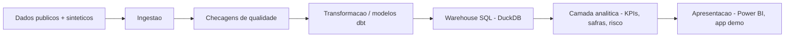

[Read in English](README.md)

# CredLens — Credit Risk & Portfolio Analytics

**O CredLens transforma a carteira de crédito de uma credor digital em um produto de analytics reprodutível e testado — da pergunta de negócio ao KPI, do KPI à decisão.**

**Status: fase de Fundação + Aquisição de Dados.** Este repositório contém a definição do negócio, a arquitetura, o esqueleto do projeto e, desde a Fase 2, bases públicas de referência adquiridas e auditadas de forma reprodutível. Nenhum modelo foi treinado, nenhum dashboard existe, nenhum valor de KPI foi calculado, e nenhum resultado de negócio é alegado em lugar algum deste repositório. Todo número de negócio que você esperaria ver aqui (tamanho de carteira, inadimplência, ROI, acurácia) está deliberadamente ausente — veja [Capacidades atuais](#capacidades-atuais) e [`docs/roadmap.md`](docs/roadmap.md) para os próximos passos.

## O cenário de negócio

O CredLens é construído em torno de uma empresa fictícia de crédito digital que concede empréstimos pessoais sem garantia. Como qualquer credor, ela precisa equilibrar quatro alavancas ao mesmo tempo: **quantos proponentes aprovar, quanto risco carregar, quanto cobrar e quanto recuperar quando os pagamentos atrasam.** Otimizar uma alavanca isoladamente (por exemplo, aprovar mais pessoas) tende a prejudicar outra (por exemplo, a inadimplência). A liderança da empresa precisa de uma visão compartilhada e defensável da carteira para fazer essa troca de forma deliberada, não acidental.

A pergunta executiva central que organiza este projeto:

> **Como aumentar ou preservar a rentabilidade da carteira de crédito, equilibrando aprovação, inadimplência, perda esperada e recuperação?**

O contexto completo — situação, sintomas, perguntas executivas e a árvore de diagnóstico que os conecta — está em [`docs/business_problem.md`](docs/business_problem.md). Nada ali é apresentado como já respondido; veja a separação explícita entre descrição, diagnóstico, previsão e decisão nesse documento.

## Perguntas que este projeto pretende ajudar a responder no futuro

- A inadimplência está crescendo por causa de clientes novos, de safras específicas, ou de uma mudança no mix da carteira?
- Quais segmentos concentram maior exposição e perda?
- O aumento da aprovação está de fato gerando crescimento *rentável*, ou apenas mais volume?
- Quais safras estão deteriorando mais rápido, e a que velocidade?
- Como os clientes transitam entre "em dia" e as diferentes faixas de atraso ao longo do tempo?
- Qual é a efetividade das estratégias de cobrança em uso?
- Se o ponto de corte de aprovação mudasse, o que aconteceria com volume aprovado, risco e resultado esperado?
- O que a liderança deveria acompanhar diariamente, mensalmente e por safra?

Essas perguntas estão formalizadas e estruturadas agora (veja [`docs/business_problem.md`](docs/business_problem.md) e [`docs/kpi_dictionary.md`](docs/kpi_dictionary.md)); elas **não** são respondidas nesta fase.

## Produtos analíticos planejados

Quando as próximas fases forem implementadas, este projeto está escopado para produzir:

- Um **dicionário de KPIs e camada semântica** cobrindo originação, carteira, inadimplência, safras, recuperação e rentabilidade — cada um com fórmula, granularidade e responsável explícitos (rascunho: [`docs/kpi_dictionary.md`](docs/kpi_dictionary.md)).
- Um **warehouse modelado em SQL/dbt** (DuckDB para desenvolvimento local) com modelos dimensionais testados e documentados.
- **Análise de carteira e safras** — crescimento, mudança de mix, roll rates de inadimplência, cure rates — construída sobre esse warehouse.
- Um **modelo de risco de crédito interpretável** e um **simulador de política** para estimar o efeito de mudanças no ponto de corte antes que elas sejam feitas.
- Um **dashboard em Power BI** e uma aplicação demonstrativa leve para exploração por stakeholders.

Nada disso existe ainda. Está escopado, não implementado — veja [`docs/roadmap.md`](docs/roadmap.md).

## Arquitetura (resumo)



Esta é a arquitetura-alvo do projeto completo, não o que está implementado hoje. As responsabilidades de cada camada, a justificativa das tecnologias e o que já existe versus o que está planejado estão documentados em [`docs/architecture.md`](docs/architecture.md).

## Capacidades atuais

O que existe no repositório agora:

- Esqueleto do projeto: layout de código-fonte, gestão de dependências, configuração de lint/tipagem/testes.
- Uma CLI testada (`credlens --help`, `credlens version`, `credlens doctor`, além de `credlens data sources|fetch|verify|audit`).
- Carregamento centralizado de configuração (`config/base.yaml`) com validação e mensagens de erro claras.
- Configuração de logging estruturado.
- **Aquisição e auditoria reprodutível de dados públicos** (Fase 2): um registro de fontes com licença/DOI/citação por fonte (`data/metadata/source_registry.yaml`), um downloader idempotente (retries, escrita atômica, proteção contra path traversal, verificado por checksum), um cliente para as séries temporais do SGS do Banco Central, e uma auditoria estrutural de qualidade que categoriza achados sem nunca modificar os dados brutos. Quatro fontes adquiridas e auditadas nesta fase: [Default of Credit Card Clients](https://archive.ics.uci.edu/dataset/350/default+of+credit+card+clients) (UCI, CC BY 4.0), [South German Credit](https://archive.ics.uci.edu/dataset/522/south+german+credit) (UCI, CC BY 4.0), e duas séries do SGS/BCB (saldo de carteira e inadimplência, ODbL). Uma quinta fonte (Home Credit Default Risk, Kaggle) está registrada mas bloqueada — `BLOCKED_REQUIRES_USER_ACCESS`, com evidências — veja [`docs/data_licensing.md`](docs/data_licensing.md).
- Documentação de negócio: charter, definição do problema de negócio, mapa de stakeholders, dicionário de KPIs (apenas definições, sem valores calculados), estratégia de dados, arquitetura, premissas e limitações, glossário, roadmap — além, na Fase 2, da matriz de seleção de datasets, dicionário de dados, auditoria de qualidade, auditoria de alvo/vazamento e auditoria de atributos sensíveis (veja [Estrutura do repositório](#estrutura-do-repositório)).
- CI (GitHub Actions): lint, checagem de formatação, checagem de tipos, testes com cobertura — a cada push.

## Capacidades planejadas (ainda não implementadas)

- Uma camada operacional sintética reprodutível (necessária porque nenhuma das duas bases públicas adquiridas é um painel de carteira genuinamente longitudinal).
- Modelagem dimensional e transformações em dbt.
- Um warehouse SQL consultável (DuckDB, opcionalmente Postgres).
- Contratos de qualidade de dados aplicados (Pandera ou equivalente) — a auditoria atual é diagnóstica, não um bloqueio automático.
- Análise de carteira, safras e roll rate.
- Um modelo interpretável de probabilidade de inadimplência e cálculo de perda esperada.
- Um simulador de ponto de corte / política de crédito.
- Um dashboard em Power BI e uma aplicação demonstrativa.
- Containerização e um pipeline de CI/CD ampliado.

Veja [`docs/roadmap.md`](docs/roadmap.md) para a sequência completa de fases e suas dependências.

## Início rápido

Requer Python 3.11+ e, idealmente, [`uv`](https://docs.astral.sh/uv/).

```bash
git clone <este-repositorio>
cd credlens-credit-analytics

# Instalar (o uv resolve e trava as dependências automaticamente)
uv sync --all-groups

# Verificar a instalação
uv run credlens --help
uv run credlens version
uv run credlens doctor

# Aquisição de dados (Fase 2) - funciona offline; fetch/verify precisam de rede
uv run credlens data sources
uv run credlens data fetch --source uci-default-credit
uv run credlens data verify
uv run credlens data audit
```

Sem `uv`, use um ambiente virtual padrão:

```bash
python -m venv .venv
# Windows
.venv\Scripts\activate
# macOS / Linux
source .venv/bin/activate

pip install -e ".[dev]"
credlens --help
```

> Nota: `pip install -e ".[dev]"` requer que `dev` esteja declarado como grupo opcional de dependências. Este projeto define suas dependências de desenvolvimento em `[dependency-groups]` (PEP 735) para uso com `uv`; se instalar com `pip` puro, instale os pacotes listados em `dependency-groups.dev` no `pyproject.toml` individualmente (`pip install pytest pytest-cov ruff mypy types-PyYAML`).

## Comandos de desenvolvimento

Um `Makefile` é fornecido por conveniência. Todo alvo tem um equivalente documentado via `uv run` para quem não usa `make`.

| Tarefa | Make | Direto (uv) |
|---|---|---|
| Instalar dependências | `make install` | `uv sync --all-groups` |
| Lint | `make lint` | `uv run ruff check .` |
| Checar formatação | `make format-check` | `uv run ruff format --check .` |
| Formatar (gravar) | `make format` | `uv run ruff format .` |
| Checar tipos | `make typecheck` | `uv run mypy src tests` |
| Testes | `make test` | `uv run pytest` |
| Testes + cobertura | `make coverage` | `uv run pytest --cov=credlens --cov-report=term-missing` |
| Rodar a CLI | `make run ARGS="doctor"` | `uv run credlens doctor` |
| Tudo que o CI executa | `make ci` | ver `.github/workflows/ci.yml` |

Veja [`CONTRIBUTING.md`](CONTRIBUTING.md) para o fluxo completo de contribuição.

## Testes

```bash
uv run pytest
```

141 testes, 95% de cobertura em `src/credlens` na Fase 2. Cobertura é um sinal de qualidade de código, não um proxy de quanto do produto final está pronto. Os testes cobrem: importação do pacote e exposição da versão, todos os comandos da CLI (incluindo `data sources|fetch|verify|audit`), carregamento de configuração, e toda a camada de aquisição de dados — downloads HTTP e o cliente do BCB são testados com HTTP simulado (`responses`), nunca com chamadas de rede reais; todo teste de CLI de fetch/verify/audit roda em um diretório temporário isolado e nunca toca nos arquivos reais de `data/` deste repositório.

## Estrutura do repositório

```text
credlens-credit-analytics/
├── README.md / README.pt-BR.md   # Este arquivo e sua versão em português
├── pyproject.toml                # Metadados do pacote, dependências, configuração de ferramentas
├── config/                       # base.yaml - configuração estrutural (sem segredos)
├── data/                         # raw/ (ignorado pelo git) + metadata/ (proveniência versionada) - ver data/README.md
├── docs/                         # Documentação de negócio, arquitetura e aquisição de dados
├── src/credlens/                 # Pacote da aplicação (CLI, config, logging, data/)
├── tests/                        # Suíte de testes Pytest
├── reports/data_audit/           # Relatórios de auditoria estrutural gerados (reproduzíveis via `credlens data audit`)
└── .github/                      # Workflow de CI e templates de issue/PR
```

Documentação da Fase 2, além dos documentos de negócio da Fase 1: [`docs/dataset_selection.md`](docs/dataset_selection.md) (matriz de decisão ponderada), [`docs/data_sources.md`](docs/data_sources.md) (como cada fonte é adquirida), [`docs/data_licensing.md`](docs/data_licensing.md), [`docs/data_dictionary.md`](docs/data_dictionary.md), [`docs/data_quality_audit.md`](docs/data_quality_audit.md), [`docs/target_and_leakage_audit.md`](docs/target_and_leakage_audit.md), [`docs/sensitive_attributes.md`](docs/sensitive_attributes.md).

## Estratégia de dados (resumo)

A estratégia-alvo é **dados públicos + uma camada operacional sintética reprodutível**: bases públicas de crédito/macroeconômicas reais e licenciadas fornecem estrutura e distribuições realistas; uma camada sintética documentada e gerada por código (ainda não construída) preenche o detalhe operacional (por exemplo, transições diárias de inadimplência) que bases públicas não expõem, sem nunca apresentar valores sintéticos como resultados reais observados. Na Fase 2, quatro fontes foram adquiridas e licenciadas (duas bases individuais da UCI, duas séries macro do Banco Central); uma quinta (Kaggle) está bloqueada aguardando credenciais fornecidas pelo usuário, que este projeto não solicitará. Veja [`docs/data_strategy.md`](docs/data_strategy.md) e [`docs/dataset_selection.md`](docs/dataset_selection.md) para o quadro completo.

## Limitações

Este é um projeto de portfólio sobre uma empresa **fictícia**. Não contém clientes reais, dados pessoais ou financeiros reais e, nesta fase, nenhum resultado de negócio calculado. Não pode ser usado para conceder crédito real, e qualquer modelo ou métrica futura que ele produza exigirá validação estatística, jurídica e regulatória independente antes de qualquer uso real. Veja [`docs/assumptions_and_limitations.md`](docs/assumptions_and_limitations.md) para a lista completa.

## Roadmap

Veja [`docs/roadmap.md`](docs/roadmap.md) para o plano faseado, desde esta fundação até aquisição de dados, modelagem, analytics, score de risco, simulação de política, dashboards e preparação para publicação.

## Licença

O código é licenciado sob [MIT](LICENSE). Qualquer base de dados de terceiros usada em fases futuras permanece sujeita à sua própria licença — veja [`docs/data_strategy.md`](docs/data_strategy.md).

---

[Read in English](README.md)
