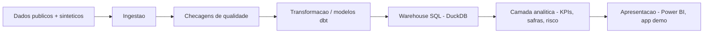

[Read in English](README.md)

# CredLens — Credit Risk & Portfolio Analytics

**O CredLens transforma a carteira de crédito de uma credor digital em um produto de analytics reprodutível e testado — da pergunta de negócio ao KPI, do KPI à decisão.**

**Status: fase de Fundação + Aquisição de Dados + Contratos de Dados + Gerador Sintético Contrafactual.** Este repositório contém a definição do negócio, a arquitetura, o esqueleto do projeto, bases públicas de referência adquiridas e auditadas de forma reprodutível (Fase 2), um modelo conceitual de dados, semântica temporal e contratos de dados formais (Fase 3) e, desde a Fase 4A/4B, um gerador determinístico real de carteira sintética, otimizado em performance, com cinco cenários executáveis (`baseline`, `policy_expansion`, `policy_tightening`, `macroeconomic_stress`, `collections_change`) compartilhando números aleatórios comuns, além de uma fixture de cobertura de contratos (`contract_coverage`) e um fluxo de quarentena de incidentes de qualidade de dados. Nenhum modelo foi treinado, nenhum dashboard existe, nenhum valor de KPI foi calculado, e nenhum resultado de negócio é alegado em lugar algum deste repositório. Todo número de negócio que você esperaria ver aqui (tamanho de carteira, inadimplência, ROI, acurácia) está deliberadamente ausente, e todo valor gerado é explicitamente sintético — veja [Capacidades atuais](#capacidades-atuais) e [`docs/roadmap.md`](docs/roadmap.md) para os próximos passos.

## O cenário de negócio

O CredLens é construído em torno de uma empresa fictícia de crédito digital que concede empréstimos pessoais sem garantia. Como qualquer credor, ela precisa equilibrar quatro alavancas ao mesmo tempo: **quantos proponentes aprovar, quanto risco carregar, quanto cobrar e quanto recuperar quando os pagamentos atrasam.** Otimizar uma alavanca isoladamente (por exemplo, aprovar mais pessoas) tende a prejudicar outra (por exemplo, a inadimplência). A liderança da empresa precisa de uma visão compartilhada e defensável da carteira para fazer essa troca de forma deliberada, não acidental.

A pergunta executiva central que organiza este projeto:

> **Como aumentar ou preservar a rentabilidade da carteira de crédito, equilibrando aprovação, inadimplência, perda esperada e recuperação?**

O contexto completo — situação, sintomas, perguntas executivas e a árvore de diagnóstico que os conecta — está em [`docs/business_problem.md`](docs/business_problem.md). Nada ali é apresentado como já respondido; veja a separação explícita entre descrição, diagnóstico, previsão e decisão nesse documento.

## Perguntas que este projeto pretende ajudar a responder no futuro

- A inadimplência está crescendo por causa de clientes novos, de safras específicas, ou de uma mudança no mix da carteira?
- Quais segmentos concentram maior exposição e perda?
- O aumento da aprovação está de fato gerando crescimento *rentável*, ou apenas mais volume?
- Quais safras estão deteriorando mais rápido, e a que velocidade?
- Como os clientes transitam entre "em dia" e as diferentes faixas de atraso ao longo do tempo?
- Qual é a efetividade das estratégias de cobrança em uso?
- Se o ponto de corte de aprovação mudasse, o que aconteceria com volume aprovado, risco e resultado esperado?
- O que a liderança deveria acompanhar diariamente, mensalmente e por safra?

Essas perguntas estão formalizadas e estruturadas agora (veja [`docs/business_problem.md`](docs/business_problem.md) e [`docs/kpi_dictionary.md`](docs/kpi_dictionary.md)); elas **não** são respondidas nesta fase.

## Produtos analíticos planejados

Quando as próximas fases forem implementadas, este projeto está escopado para produzir:

- Um **dicionário de KPIs e camada semântica** cobrindo originação, carteira, inadimplência, safras, recuperação e rentabilidade — cada um com fórmula, granularidade e responsável explícitos (rascunho: [`docs/kpi_dictionary.md`](docs/kpi_dictionary.md)).
- Um **warehouse modelado em SQL/dbt** (DuckDB para desenvolvimento local) com modelos dimensionais testados e documentados.
- **Análise de carteira e safras** — crescimento, mudança de mix, roll rates de inadimplência, cure rates — construída sobre esse warehouse.
- Um **modelo de risco de crédito interpretável** e um **simulador de política** para estimar o efeito de mudanças no ponto de corte antes que elas sejam feitas.
- Um **dashboard em Power BI** e uma aplicação demonstrativa leve para exploração por stakeholders.

Nada disso existe ainda. Está escopado, não implementado — veja [`docs/roadmap.md`](docs/roadmap.md).

## Arquitetura (resumo)



Esta é a arquitetura-alvo do projeto completo, não o que está implementado hoje. As responsabilidades de cada camada, a justificativa das tecnologias e o que já existe versus o que está planejado estão documentados em [`docs/architecture.md`](docs/architecture.md).

## Capacidades atuais

O que existe no repositório agora:

- Esqueleto do projeto: layout de código-fonte, gestão de dependências, configuração de lint/tipagem/testes.
- Uma CLI testada (`credlens --help`, `credlens version`, `credlens doctor`, além de `credlens data sources|fetch|verify|audit`).
- Carregamento centralizado de configuração (`config/base.yaml`) com validação e mensagens de erro claras.
- Configuração de logging estruturado.
- **Aquisição e auditoria reprodutível de dados públicos** (Fase 2): um registro de fontes com licença/DOI/citação por fonte (`data/metadata/source_registry.yaml`), um downloader idempotente (retries, escrita atômica, proteção contra path traversal, verificado por checksum), um cliente para as séries temporais do SGS do Banco Central, e uma auditoria estrutural de qualidade que categoriza achados sem nunca modificar os dados brutos. Quatro fontes adquiridas e auditadas nesta fase: [Default of Credit Card Clients](https://archive.ics.uci.edu/dataset/350/default+of+credit+card+clients) (UCI, CC BY 4.0), [South German Credit](https://archive.ics.uci.edu/dataset/522/south+german+credit) (UCI, CC BY 4.0), e duas séries do SGS/BCB (saldo de carteira e inadimplência, ODbL). Uma quinta fonte (Home Credit Default Risk, Kaggle) está registrada mas bloqueada — `BLOCKED_REQUIRES_USER_ACCESS`, com evidências — veja [`docs/data_licensing.md`](docs/data_licensing.md).
- **Modelo conceitual de dados e contratos de dados** (Fase 3): um modelo conceitual com 17 entidades (eventos/estado/snapshots, nunca uma única tabela indiferenciada) em 4 diagramas ER em Mermaid, semântica temporal formal, máquinas de estado revisadas, e 20 contratos de dados tipados (4 brutos + 16 operacionais) aplicados por `credlens contracts validate` em modo `audit` (diagnóstico) ou `strict` (bloqueante) — 22 regras de negócio nomeadas (relacionais/temporais/financeiras), todas vetorizadas em pandas, sem `eval()`. Automatizou dois itens de débito técnico da Fase 2 (detecção de domínio EDUCATION/MARRIAGE da UCI, unicidade/ordenação de datas do BCB) que antes eram manuais, cada um com teste de regressão permanente. Veja [`docs/data_contracts.md`](docs/data_contracts.md) e [`docs/conceptual_data_model.md`](docs/conceptual_data_model.md).
- **Um gerador determinístico real de carteira sintética, otimizado em performance, com 5 cenários contrafactuais** (Fase 4A/4B): `credlens synthetic generate --scenario {baseline,policy_expansion,policy_tightening,macroeconomic_stress,collections_change,contract_coverage} --scale {smoke,sample,portfolio} --seed N` produz clientes, propostas, contratos, pagamentos, snapshots, cobrança, baixas, recuperações e contexto macro real do BCB, tudo validado em modo estrito antes de ser gravado em `data/synthetic/<run_id>/`. Reprodutível (mesma seed → hash de conteúdo canônico idêntico, comprovado em `tests/test_generation_orchestrator.py`), com uma camada de verdade sintética fisicamente isolada (`data/synthetic_truth/`, nunca usada como feature de modelo) e uma allowlist versionada de features reforçando esse isolamento como interface, não apenas convenção. `policy_expansion`/`policy_tightening`/`macroeconomic_stress`/`collections_change` compartilham números aleatórios comuns com `baseline` para a mesma seed — veja [`docs/common_random_numbers.md`](docs/common_random_numbers.md) — e podem ser gerados juntos (`synthetic generate-suite`), comparados (`synthetic compare`), validados em conjunto (`synthetic validate-suite`) e testados em múltiplas seeds (`synthetic monte-carlo`). Um ganho de ~2,27x na escala `sample` foi medido preservando exatamente o hash de conteúdo canônico — veja [`docs/performance_optimization.md`](docs/performance_optimization.md). Todo parâmetro é uma premissa sintética explícita, classificada em [`docs/synthetic_calibration.md`](docs/synthetic_calibration.md) — veja [`docs/synthetic_generation_implementation.md`](docs/synthetic_generation_implementation.md) e [`docs/counterfactual_scenarios.md`](docs/counterfactual_scenarios.md). `data_quality_incident` permanece sem configuração de geração executável — veja [`docs/data_quality_incident.md`](docs/data_quality_incident.md) para sua alternativa baseada em quarentena.
- **Um warehouse analítico DuckDB + dbt com o DGP de inadimplência corrigido** (Fase 5): o mecanismo de cura do gerador foi corrigido para que quitar o atraso pague apenas o saldo vencido (não o contrato inteiro), as parcelas futuras continuem normalmente, e a **reincidência de inadimplência agora é genuinamente produzível e testada** — veja [`docs/adr/0010-cure-semantics-and-relapse.md`](docs/adr/0010-cure-semantics-and-relapse.md). Além disso: um projeto dbt-core 1.12 + dbt-duckdb 1.10 com 62 modelos (mais 1 seed) (raw → staging → intermediate → dimensions/facts → marts), seleção segura de fontes que nunca carrega um run em quarentena ou não validado, isolamento de chaves entre runs (comprovado sem colisões entre runs CRN), 9 marts analíticos, um catálogo de KPIs versionado (`warehouse/kpi_catalog.yml`, 54 entradas), 12 testes dbt singulares mais reconciliação independente em Python de 6 KPIs críticos lidos diretamente do parquet de origem, e uma CLI `credlens warehouse {prepare,build,test,status,query,docs,reconcile}` com manifesto de build + fingerprint analítico (idempotência comprovada: dois builds a partir das mesmas entradas produzem fingerprints idênticos). Veja [`docs/warehouse_architecture.md`](docs/warehouse_architecture.md). Instale com `uv sync --extra warehouse`.
- Documentação de negócio: charter, definição do problema de negócio, mapa de stakeholders, dicionário de KPIs (apenas definições, sem valores calculados), estratégia de dados, arquitetura, premissas e limitações, glossário, roadmap — além, na Fase 2, da matriz de seleção de datasets, dicionário de dados, auditoria de qualidade, auditoria de alvo/vazamento e auditoria de atributos sensíveis, na Fase 3, do modelo conceitual, semântica temporal, máquinas de estado, semântica de métricas, regras de negócio, contratos de dados e desenho de fairness, na Fase 4A, do registro de implementação do gerador, e, na Fase 5, da arquitetura do warehouse, totalizando 10 ADRs (veja [Estrutura do repositório](#estrutura-do-repositório)).
- CI (GitHub Actions): lint, checagem de formatação, checagem de tipos, testes com cobertura, e um build de warehouse em escala smoke (dbt build + test + reconcile) — a cada push.

## Capacidades planejadas (ainda não implementadas)

- O cenário sintético restante (`data_quality_incident`) — especificado, mas não calibrado como configuração de geração executável (sua alternativa baseada em quarentena está implementada).
- Conectar a validação em modo `strict` a um pipeline de ingestão real como bloqueio de fato — hoje `credlens synthetic generate` já bloqueia sua própria saída antes de promovê-la, e `credlens warehouse` já bloqueia quais runs pode carregar, mas nada além desses dois pontos de entrada ainda lê de `data/synthetic/`.
- Um dashboard voltado a ferramentas de BI (Power BI/Tableau/Looker Studio) lendo os marts do warehouse, e uma aplicação demonstrativa.
- Um modelo interpretável de probabilidade de inadimplência e cálculo de perda esperada.
- Um simulador de ponto de corte / política de crédito.
- Containerização e um pipeline de CI/CD ampliado.

Veja [`docs/roadmap.md`](docs/roadmap.md) para a sequência completa de fases e suas dependências.

## Início rápido

Requer Python 3.11+ e, idealmente, [`uv`](https://docs.astral.sh/uv/).

```bash
git clone <este-repositorio>
cd credlens-credit-analytics

# Instalar (o uv resolve e trava as dependências automaticamente)
uv sync --all-groups

# Verificar a instalação
uv run credlens --help
uv run credlens version
uv run credlens doctor

# Aquisição de dados (Fase 2) - funciona offline; fetch/verify precisam de rede
uv run credlens data sources
uv run credlens data fetch --source uci-default-credit
uv run credlens data verify
uv run credlens data audit

# Contratos de dados (Fase 3) - tudo offline
uv run credlens contracts list
uv run credlens contracts show applications
uv run credlens contracts validate --contract applications --path tests/fixtures/contracts/valid_minimal_scenario --mode strict
uv run credlens synthetic plan
uv run credlens synthetic scenarios
uv run credlens synthetic validate-blueprints

# Geração de carteira sintética (Fase 4A/4B) - offline, determinístico
uv run credlens synthetic generate --scenario baseline --scale smoke --seed 2026
uv run credlens synthetic generate-suite --scale smoke --seed 2026
uv run credlens synthetic compare --baseline <run_id> --candidate <run_id>
uv run credlens synthetic validate-suite --suite-id SUITE_smoke_2026
uv run credlens synthetic monte-carlo --scenario macroeconomic_stress --scale smoke --seeds 10
uv run credlens synthetic profile --scale sample --seed 2026
uv run credlens synthetic validate --run-id RUN_baseline_smoke_2026_<prefixo-do-hash-da-config>
uv run credlens synthetic inspect --run-id RUN_baseline_smoke_2026_<prefixo-do-hash-da-config>
uv run credlens synthetic manifest --run-id RUN_baseline_smoke_2026_<prefixo-do-hash-da-config>

# Warehouse analítico (Fase 5) - requer `uv sync --extra warehouse` antes
uv run credlens warehouse prepare --suite-id SUITE_smoke_2026
uv run credlens warehouse build --suite-id SUITE_smoke_2026
uv run credlens warehouse test --build-id <build_id>
uv run credlens warehouse reconcile --build-id <build_id>
uv run credlens warehouse query --build-id <build_id> --name portfolio_monthly
uv run credlens warehouse status --build-id <build_id>
```

Sem `uv`, use um ambiente virtual padrão:

```bash
python -m venv .venv
# Windows
.venv\Scripts\activate
# macOS / Linux
source .venv/bin/activate

pip install -e ".[dev]"
credlens --help
```

> Nota: `pip install -e ".[dev]"` requer que `dev` esteja declarado como grupo opcional de dependências. Este projeto define suas dependências de desenvolvimento em `[dependency-groups]` (PEP 735) para uso com `uv`; se instalar com `pip` puro, instale os pacotes listados em `dependency-groups.dev` no `pyproject.toml` individualmente (`pip install pytest pytest-cov ruff mypy types-PyYAML`).

## Comandos de desenvolvimento

Um `Makefile` é fornecido por conveniência. Todo alvo tem um equivalente documentado via `uv run` para quem não usa `make`.

| Tarefa | Make | Direto (uv) |
|---|---|---|
| Instalar dependências | `make install` | `uv sync --all-groups` |
| Lint | `make lint` | `uv run ruff check .` |
| Checar formatação | `make format-check` | `uv run ruff format --check .` |
| Formatar (gravar) | `make format` | `uv run ruff format .` |
| Checar tipos | `make typecheck` | `uv run mypy src tests` |
| Testes | `make test` | `uv run pytest` |
| Testes + cobertura | `make coverage` | `uv run pytest --cov=credlens --cov-report=term-missing` |
| Rodar a CLI | `make run ARGS="doctor"` | `uv run credlens doctor` |
| Tudo que o CI executa | `make ci` | ver `.github/workflows/ci.yml` |

Veja [`CONTRIBUTING.md`](CONTRIBUTING.md) para o fluxo completo de contribuição.

## Testes

```bash
uv run pytest
```

568 testes, 95% de cobertura em `src/credlens` na Fase 4B. Cobertura é um sinal de qualidade de código, não um proxy de quanto do produto final está pronto. Os testes cobrem: importação do pacote e exposição da versão, todos os comandos da CLI (incluindo `data sources|fetch|verify|audit`, `contracts list|show|validate`, `synthetic plan|scenarios|validate-blueprints|generate|validate|inspect|manifest|generate-suite|compare|validate-suite|monte-carlo|profile`), carregamento de configuração, toda a camada de aquisição de dados, toda a camada de contratos de dados (schema/loader/registry/validators, as 28 regras de negócio, a suíte de 12 fixtures ponta a ponta), regressões dedicadas para a automação EDUCATION/MARRIAGE, unicidade/chunking de datas do BCB, um bug de comparação de fuso horário, e detecção de identificadores com formato de CPF, todo o pacote de geração sintética (substreams de RNG, determinismo de ids, congelamento de features/separação de fairness, arredondamento de amortização, reconciliação de ledger, a regra de retenção que substituiu o antigo sentinela DPD=999, hash canônico, staging/promoção atômica, proteção contra path traversal, e execuções reais de geração ponta a ponta validadas contra o código real de `credlens.contracts` em modo estrito), e — novo na Fase 4B — números aleatórios comuns, invariantes de superset/subset de política, identidade pré-choque e direção pós-choque, identidade pré-elegibilidade de cobrança, cobertura de estados raros do `contract_coverage`, os 5 caminhos de quarentena de incidentes de qualidade, geração de suítes, agregação de Monte Carlo, e isolamento funcional/metamórfico da camada de verdade (checagem estática de import/assinatura, testes de allowlist, e um teste metamórfico provando que decisões são inafetadas por uma perturbação extrema da camada de verdade). Downloads HTTP e o cliente do BCB são testados com HTTP simulado (`responses`), nunca com chamadas de rede reais; os testes de geração rodam o gerador real (rápido, offline) em escala `smoke` (testes de Monte Carlo: 2 seeds em escala `smoke`) e limpam o que escrevem em `data/synthetic(_truth)/` ao final.

## Estrutura do repositório

```text
credlens-credit-analytics/
├── README.md / README.pt-BR.md   # Este arquivo e sua versão em português
├── pyproject.toml                # Metadados do pacote, dependências, configuração de ferramentas
├── config/                       # base.yaml (config estrutural) + synthetic/ (blueprints + baseline.generation.yaml)
├── contracts/                    # Arquivos YAML de contratos de dados raw/ + operational/ (Fase 3, estendidos na Fase 4A)
├── data/                         # raw/ + synthetic/ + synthetic_truth/ (todos ignorados pelo git) + metadata/ (versionado) - ver data/README.md
├── docs/                         # Documentação de negócio, arquitetura, aquisição de dados, contratos e gerador
├── src/credlens/                 # Pacote da aplicação (CLI, config, logging, data/, contracts/, generation/, synthetic.py)
├── tests/                        # Suíte de testes Pytest, incluindo tests/fixtures/contracts/ (cenários válido/inválidos)
├── reports/data_audit/           # Relatórios de auditoria estrutural gerados (reproduzíveis via `credlens data audit`)
└── .github/                      # Workflow de CI e templates de issue/PR
```

Documentação da Fase 2, além dos documentos de negócio da Fase 1: [`docs/dataset_selection.md`](docs/dataset_selection.md) (matriz de decisão ponderada), [`docs/data_sources.md`](docs/data_sources.md) (como cada fonte é adquirida), [`docs/data_licensing.md`](docs/data_licensing.md), [`docs/data_dictionary.md`](docs/data_dictionary.md), [`docs/data_quality_audit.md`](docs/data_quality_audit.md), [`docs/target_and_leakage_audit.md`](docs/target_and_leakage_audit.md), [`docs/sensitive_attributes.md`](docs/sensitive_attributes.md).

Documentação da Fase 3: [`docs/conceptual_data_model.md`](docs/conceptual_data_model.md), [`docs/temporal_semantics.md`](docs/temporal_semantics.md), [`docs/state_machines.md`](docs/state_machines.md), [`docs/metric_semantics.md`](docs/metric_semantics.md), [`docs/business_rules.md`](docs/business_rules.md), [`docs/data_contracts.md`](docs/data_contracts.md), [`docs/fairness_data_design.md`](docs/fairness_data_design.md), [`docs/synthetic_generation_spec.md`](docs/synthetic_generation_spec.md).

Documentação da Fase 4A: [`docs/synthetic_generation_implementation.md`](docs/synthetic_generation_implementation.md) (o registro de implementação real do gerador), e 9 registros de decisão arquitetural no total em [`docs/adr/`](docs/adr/) (7 da Fase 3, mais [`0008`](docs/adr/0008-macro-context-provenance.md) e [`0009`](docs/adr/0009-dpd-sentinel-removal.md) da Fase 4A).

## Estratégia de dados (resumo)

A estratégia-alvo é **dados públicos + uma camada operacional sintética reprodutível**: bases públicas de crédito/macroeconômicas reais e licenciadas fornecem estrutura e distribuições realistas; uma camada sintética documentada e gerada por código preenche o detalhe operacional (por exemplo, transições diárias de inadimplência) que bases públicas não expõem, sem nunca apresentar valores sintéticos como resultados reais observados. Na Fase 2, quatro fontes foram adquiridas e licenciadas (duas bases individuais da UCI, duas séries macro do Banco Central); uma quinta (Kaggle) está bloqueada aguardando credenciais fornecidas pelo usuário, que este projeto não solicitará. Na Fase 3, o modelo conceitual, os contratos e a *especificação* de geração da camada sintética passaram a existir, mas nenhum gerador foi construído. **Na Fase 4A, o gerador em si é real para o cenário `baseline`** — `credlens synthetic generate --scenario baseline` produz uma carteira sintética completa, válida contra os contratos e determinística; todo outro cenário permanece apenas especificado. Veja [`docs/data_strategy.md`](docs/data_strategy.md), [`docs/synthetic_generation_spec.md`](docs/synthetic_generation_spec.md) e [`docs/synthetic_generation_implementation.md`](docs/synthetic_generation_implementation.md) para o quadro completo.

## Limitações

Este é um projeto de portfólio sobre uma empresa **fictícia**. Não contém clientes reais, dados pessoais ou financeiros reais e, nesta fase, nenhum resultado de negócio calculado. Não pode ser usado para conceder crédito real, e qualquer modelo ou métrica futura que ele produza exigirá validação estatística, jurídica e regulatória independente antes de qualquer uso real. Veja [`docs/assumptions_and_limitations.md`](docs/assumptions_and_limitations.md) para a lista completa.

## Roadmap

Veja [`docs/roadmap.md`](docs/roadmap.md) para o plano faseado, desde esta fundação até aquisição de dados, modelagem, analytics, score de risco, simulação de política, dashboards e preparação para publicação.

## Licença

O código é licenciado sob [MIT](LICENSE). Qualquer base de dados de terceiros usada em fases futuras permanece sujeita à sua própria licença — veja [`docs/data_strategy.md`](docs/data_strategy.md).

---

[Read in English](README.md)
