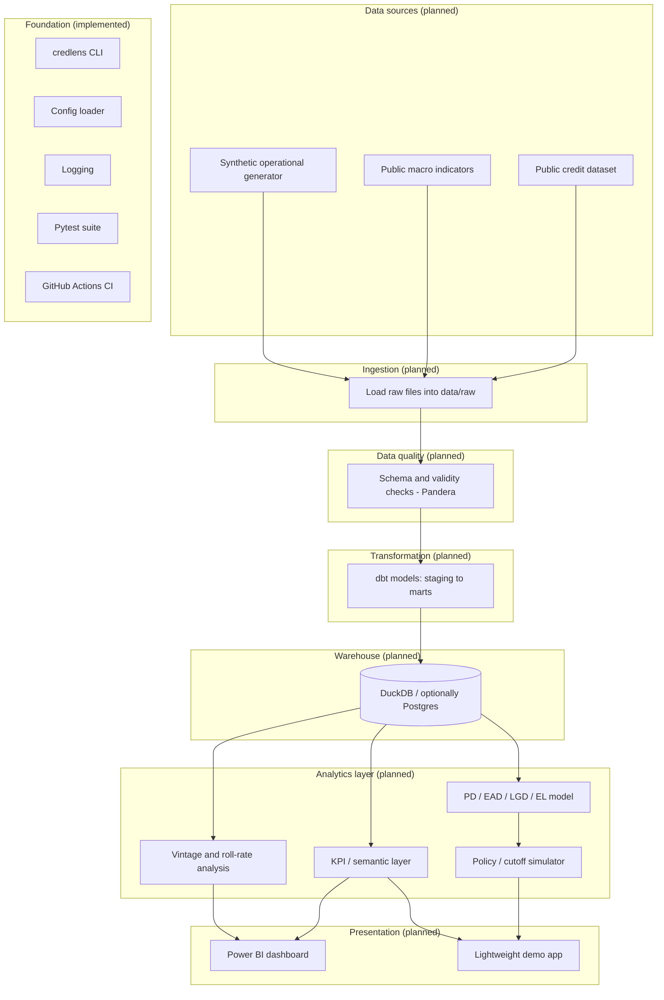

# Architecture

This document describes the **target** architecture for the full CredLens project. It states plainly, section by section, what exists today (foundation phase) versus what is planned. Nothing described as "planned" below is implemented yet.

## Logical architecture

The `Foundation` subgraph (CLI, config, logging, tests, CI) is the only part of this diagram that exists in the current phase. Everything else is scope, not implementation.

## Layer responsibilities

| Layer | Responsibility | Explicit non-responsibility |
|---|---|---|
| **Ingestion** | Pull raw data (public download or synthetic generation) into `data/raw`, unmodified, with provenance recorded. | Does not clean, join, or interpret the data. |
| **Data quality** | Validate schema, types, ranges, and referential expectations before data is trusted downstream; fail loudly on violation. | Does not silently drop or "fix" bad rows without a documented rule. |
| **Transformation** | Convert validated raw data into clean, dimensionally modeled staging and mart tables (dbt). | Does not compute business KPIs directly in application code — that belongs to the analytics layer, reading from marts. |
| **Warehouse** | Store the modeled tables in a queryable SQL engine (DuckDB locally; Postgres as an optional heavier alternative) so all downstream consumers share one source of truth. | Not a system of record for raw or synthetic source files — those live in `data/`. |
| **Analytics** | Compute KPIs, vintage/roll-rate views, and risk model outputs from the warehouse; own the separation between description, diagnosis, forecast, and decision (see `docs/business_problem.md`). | Does not re-implement ingestion or transformation logic. |
| **Presentation** | Surface analytics-layer outputs to stakeholders (Power BI, demo app) in a form matched to each stakeholder's cadence and detail level (see `docs/stakeholder_map.md`). | Does not compute new business logic that isn't already validated in the analytics layer. |

## Data flow (future)

1. Ingestion pulls the selected public dataset(s) and runs the synthetic generator, writing immutable files to `data/raw/` (git-ignored).
2. Data quality checks run against `data/raw/`, gating whether transformation proceeds.
3. dbt models transform validated raw data into staging and mart tables inside the DuckDB warehouse.
4. The analytics layer queries the warehouse to compute KPIs, vintage curves, roll rates, and (eventually) risk model features/outputs.
5. Power BI and the demo app read from the analytics layer's outputs — never directly from raw files.

Each arrow above is a planned interface, not a built one. When each phase in `docs/roadmap.md` lands, this section will be updated to reflect what's actually implemented versus what remains planned.

## Technology choices and rationale (planned)

| Technology | Role | Why (rationale, not commitment beyond current plan) |
|---|---|---|
| Python | Ingestion, orchestration, CLI, risk modeling | Already the foundation-phase language; strong ecosystem for data + ML work. |
| DuckDB | Local analytical warehouse | Zero-infrastructure, fast columnar engine, excellent fit for a portfolio project that must run on a laptop without external services. |
| PostgreSQL | Optional heavier warehouse alternative | Demonstrates SQL-on-a-real-RDBMS skills if a later phase benefits from it; not required for DuckDB to work. |
| dbt | Transformation and dimensional modeling | Industry-standard way to demonstrate testable, documented SQL transformations with lineage. |
| Pandera | Data quality validation | Schema/contract validation expressed in Python, close to the ingestion code it protects. |
| Pytest | Testing (already in use) | Already the foundation-phase test runner; will extend to data and model tests. |
| Power BI | Executive/stakeholder dashboard | Directly relevant to the BI-hiring audience this project targets. |
| Streamlit (or similar) | Lightweight demo app | Fast way to expose the policy simulator interactively without building a full frontend. |
| Docker | Reproducible environment for later phases | Only once there's an actual service (e.g., the demo app) worth containerizing. |
| GitHub Actions | CI/CD | Already in use for lint/type/test; will extend to data/model checks as they're added. |

None of these choices beyond the already-implemented Python/Pytest/GitHub Actions foundation are locked in stone — they are the current best plan, subject to revision as later phases surface real constraints.

## Boundaries this architecture enforces

- **Ingestion never writes directly to the warehouse.** Everything passes through data quality checks first.
- **The analytics layer never reads raw files directly.** It only reads from the modeled warehouse, so every KPI has a traceable, tested path back to its source.
- **Presentation never computes new business logic.** Anything a dashboard shows must already exist as a tested output of the analytics layer.
- **Synthetic and public data are never merged without a provenance marker** (see `docs/data_strategy.md`).

## What is explicitly not decided yet

- Whether Postgres will actually be introduced, or DuckDB alone suffices for the project's full scope.
- The exact dbt project structure (naming conventions for staging vs. marts) — to be defined when transformation work starts.
- Whether the demo app is Streamlit specifically or another lightweight framework.
- The specific risk model algorithm (a later, interpretable-model decision, not made here).
