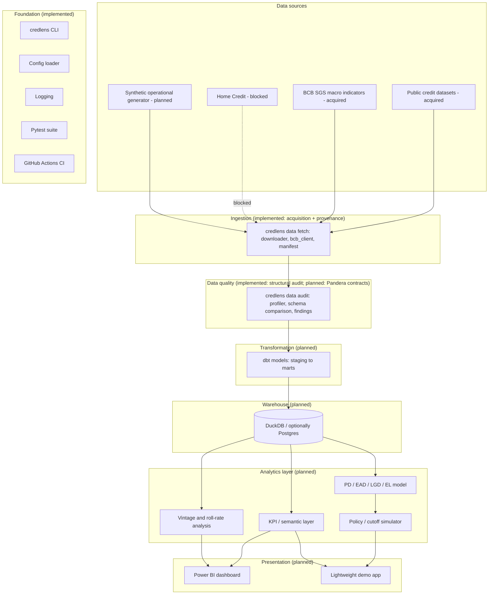

# Architecture

This document describes the **target** architecture for the full CredLens project. It states plainly, section by section, what exists today versus what is planned. Nothing described as "planned" below is implemented yet.

## Logical architecture

The `Foundation` subgraph (CLI, config, logging, tests, CI) and the `Ingestion`/`Quality` subgraphs (acquisition, provenance, and structural audit - `credlens data fetch|verify|audit`, see `src/credlens/data/`) are implemented, as of Phase 2. `Transform` (dbt), `Warehouse` (DuckDB), `Analytics`, and `Presentation` remain planned, not implemented.

## Layer responsibilities

| Layer | Responsibility | Explicit non-responsibility |
|---|---|---|
| **Ingestion** *(implemented)* | Pull raw data (public download; synthetic generation still planned) into `data/raw`, unmodified, with provenance recorded (`data/metadata/file_manifest.csv`, SHA-256 checksums, retrieval timestamps). Implemented as `credlens.data.downloader` (HTTP, atomic writes, retries, path-traversal protection) and `credlens.data.bcb_client` (BCB SGS time series). | Does not clean, join, or interpret the data. Does not download anything on its own schedule - only on explicit `credlens data fetch`. |
| **Data quality** *(implemented: structural audit; planned: enforced contracts)* | `credlens.data.profiler` and `credlens.data.audit` compute structural statistics and categorized findings (`confirmed_problem` / `candidate_anomaly` / `documented_characteristic` / `hypothesis_requiring_investigation` / `structural_limitation`) without modifying raw data - see `docs/data_quality_audit.md`. A future phase may add Pandera-style enforced contracts that block downstream transformation on violation; today's audit is diagnostic, not a gate. | Does not silently drop or "fix" bad rows without a documented rule - confirmed by the fact that every acquired raw file is byte-identical to what was downloaded (see `uv run credlens data verify`). |
| **Transformation** | Convert validated raw data into clean, dimensionally modeled staging and mart tables (dbt). | Does not compute business KPIs directly in application code — that belongs to the analytics layer, reading from marts. |
| **Warehouse** | Store the modeled tables in a queryable SQL engine (DuckDB locally; Postgres as an optional heavier alternative) so all downstream consumers share one source of truth. | Not a system of record for raw or synthetic source files — those live in `data/`. |
| **Analytics** | Compute KPIs, vintage/roll-rate views, and risk model outputs from the warehouse; own the separation between description, diagnosis, forecast, and decision (see `docs/business_problem.md`). | Does not re-implement ingestion or transformation logic. |
| **Presentation** | Surface analytics-layer outputs to stakeholders (Power BI, demo app) in a form matched to each stakeholder's cadence and detail level (see `docs/stakeholder_map.md`). | Does not compute new business logic that isn't already validated in the analytics layer. |

## Data flow

1. **(Implemented)** Ingestion pulls the selected public dataset(s) via `credlens data fetch`, writing immutable files to `data/raw/` (git-ignored) plus a versioned manifest entry. The synthetic generator is not built yet.
2. **(Implemented, diagnostic only)** `credlens data audit` computes structural findings against `data/raw/` and writes `reports/data_audit/quality_metrics.json`. It does not yet gate whether transformation proceeds, because transformation doesn't exist yet either.
3. **(Planned)** dbt models transform validated raw data into staging and mart tables inside the DuckDB warehouse.
4. **(Planned)** The analytics layer queries the warehouse to compute KPIs, vintage curves, roll rates, and (eventually) risk model features/outputs.
5. **(Planned)** Power BI and the demo app read from the analytics layer's outputs — never directly from raw files.

Steps 3-5 remain planned interfaces, not built ones. When each phase in `docs/roadmap.md` lands, this section will be updated further.

## Technology choices and rationale (planned)

| Technology | Role | Why (rationale, not commitment beyond current plan) |
|---|---|---|
| Python | Ingestion, orchestration, CLI, risk modeling | Already the foundation-phase language; strong ecosystem for data + ML work. |
| `requests` *(implemented)* | HTTP downloads with retries/timeouts | Standard, well-justified dependency for `credlens.data.downloader` and `credlens.data.bcb_client` - see `docs/roadmap.md` phase 2 and the Phase 2 final report's dependency rationale. |
| `pandas` *(implemented)* | Reading acquired tabular files; computing structural audit statistics | Standard dependency for `credlens.data.profiler`; avoided in Phase 1 because nothing needed it yet. |
| DuckDB | Local analytical warehouse | Zero-infrastructure, fast columnar engine, excellent fit for a portfolio project that must run on a laptop without external services. |
| PostgreSQL | Optional heavier warehouse alternative | Demonstrates SQL-on-a-real-RDBMS skills if a later phase benefits from it; not required for DuckDB to work. |
| dbt | Transformation and dimensional modeling | Industry-standard way to demonstrate testable, documented SQL transformations with lineage. |
| Pandera | Data quality validation | Schema/contract validation expressed in Python, close to the ingestion code it protects. |
| Pytest | Testing (already in use) | Already the foundation-phase test runner; will extend to data and model tests. |
| Power BI | Executive/stakeholder dashboard | Directly relevant to the BI-hiring audience this project targets. |
| Streamlit (or similar) | Lightweight demo app | Fast way to expose the policy simulator interactively without building a full frontend. |
| Docker | Reproducible environment for later phases | Only once there's an actual service (e.g., the demo app) worth containerizing. |
| GitHub Actions | CI/CD | Already in use for lint/type/test; will extend to data/model checks as they're added. |

None of these choices beyond the already-implemented Python/Pytest/GitHub Actions foundation are locked in stone — they are the current best plan, subject to revision as later phases surface real constraints.

## Boundaries this architecture enforces

- **Ingestion never writes directly to the warehouse.** Everything passes through data quality checks first.
- **The analytics layer never reads raw files directly.** It only reads from the modeled warehouse, so every KPI has a traceable, tested path back to its source.
- **Presentation never computes new business logic.** Anything a dashboard shows must already exist as a tested output of the analytics layer.
- **Synthetic and public data are never merged without a provenance marker** (see `docs/data_strategy.md`).

## What is explicitly not decided yet

- Whether Postgres will actually be introduced, or DuckDB alone suffices for the project's full scope.
- The exact dbt project structure (naming conventions for staging vs. marts) — to be defined when transformation work starts.
- Whether the demo app is Streamlit specifically or another lightweight framework.
- The specific risk model algorithm (a later, interpretable-model decision, not made here).
