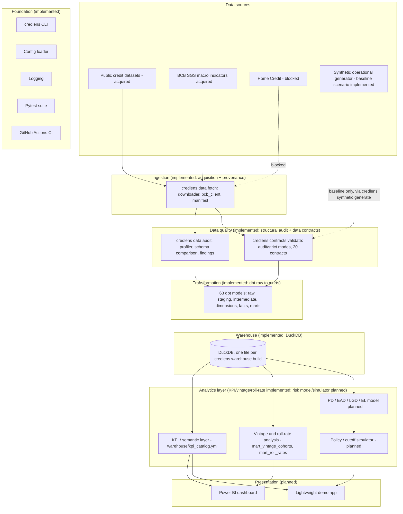

# Architecture

This document describes the **target** architecture for the full CredLens project. It states plainly, section by section, what exists today versus what is planned. Nothing described as "planned" below is implemented yet - as of Phase 5, `Transform` and `Warehouse` below have moved from planned to implemented; see `docs/warehouse_architecture.md` for the as-built design.

## Logical architecture

The `Foundation` subgraph (CLI, config, logging, tests, CI) and the `Ingestion`/`Quality` subgraphs (acquisition, provenance, structural audit, and - as of Phase 3 - formal data contracts with two validation modes: `credlens data fetch|verify|audit` and `credlens contracts list|show|validate`, see `src/credlens/data/` and `src/credlens/contracts/`) are implemented. The synthetic operational layer itself (`SYN` above) is implemented for `baseline`, `policy_expansion`, `policy_tightening`, `macroeconomic_stress`, `collections_change`, and the `contract_coverage` test fixture as of Phase 4B: `credlens synthetic generate --scenario <name> --scale {smoke,sample,portfolio} --seed N` (`src/credlens/generation/`) produces a real, deterministic, contract-valid portfolio, written to `data/synthetic/<run_id>/` - see `docs/synthetic_generation_implementation.md` and `docs/counterfactual_scenarios.md`. `policy_expansion`/`policy_tightening`/`macroeconomic_stress`/`collections_change` share common random numbers with `baseline` (`docs/common_random_numbers.md`) and can be generated together with `credlens synthetic generate-suite`, compared with `credlens synthetic compare`, and tested across seeds with `credlens synthetic monte-carlo`. `data_quality_incident` remains specification-only as a *generation config* - it is instead a post-hoc corruption of an already-valid run, handled by `credlens.generation.quarantine` (`docs/data_quality_incident.md`), writing to `data/quarantine/`, never `data/synthetic/`. As of Phase 5, `Transform` (63 dbt models) and `Warehouse` (DuckDB) are implemented - `credlens warehouse build --run-id|--suite-id` safely loads validated, non-quarantined runs from `data/synthetic/` into a DuckDB warehouse; see `docs/warehouse_architecture.md`. The KPI/semantic and vintage/roll-rate parts of `Analytics` are implemented (`warehouse/kpi_catalog.yml`, `mart_vintage_cohorts`, `mart_roll_rates`); a trained risk model, a policy/cutoff simulator, and `Presentation` (dashboard/demo app) remain planned.

## Layer responsibilities

| Layer | Responsibility | Explicit non-responsibility |
|---|---|---|
| **Ingestion** *(implemented)* | Pull raw data (public download; synthetic generation still planned) into `data/raw`, unmodified, with provenance recorded (`data/metadata/file_manifest.csv`, SHA-256 checksums, retrieval timestamps). Implemented as `credlens.data.downloader` (HTTP, atomic writes, retries, path-traversal protection) and `credlens.data.bcb_client` (BCB SGS time series). | Does not clean, join, or interpret the data. Does not download anything on its own schedule - only on explicit `credlens data fetch`. |
| **Data quality** *(implemented: structural audit + formal contracts)* | `credlens.data.profiler`/`credlens.data.audit` compute structural statistics and categorized findings (`confirmed_problem` / `candidate_anomaly` / `documented_characteristic` / `hypothesis_requiring_investigation` / `structural_limitation`) without modifying raw data - see `docs/data_quality_audit.md`. As of Phase 3, `credlens.contracts` adds 20 typed data contracts (4 raw, 16 operational) with vectorized pandas checks (PK/FK/domain/nullability, plus 22 named relational/temporal/financial business rules) and two explicit modes: `audit` (diagnostic, never fails the command) and `strict` (gates on any error finding) - see `docs/data_contracts.md`. | Does not silently drop or "fix" bad rows without a documented rule - confirmed by the fact that every acquired raw file is byte-identical to what was downloaded (see `uv run credlens data verify`). `strict` mode only exists for the not-yet-generated synthetic operational layer and its test fixtures - it has never been used to gate the (unmodifiable) public source files. |
| **Transformation** | Convert validated raw data into clean, dimensionally modeled staging and mart tables (dbt). | Does not compute business KPIs directly in application code — that belongs to the analytics layer, reading from marts. |
| **Warehouse** | Store the modeled tables in a queryable SQL engine (DuckDB locally; Postgres as an optional heavier alternative) so all downstream consumers share one source of truth. | Not a system of record for raw or synthetic source files — those live in `data/`. |
| **Analytics** | Compute KPIs, vintage/roll-rate views, and risk model outputs from the warehouse; own the separation between description, diagnosis, forecast, and decision (see `docs/business_problem.md`). | Does not re-implement ingestion or transformation logic. |
| **Presentation** | Surface analytics-layer outputs to stakeholders (Power BI, demo app) in a form matched to each stakeholder's cadence and detail level (see `docs/stakeholder_map.md`). | Does not compute new business logic that isn't already validated in the analytics layer. |

## Data flow

1. **(Implemented)** Ingestion pulls the selected public dataset(s) via `credlens data fetch`, writing immutable files to `data/raw/` (git-ignored) plus a versioned manifest entry. Separately, `credlens synthetic generate --scenario ... --scale ... --seed N` (Phase 4A/4B) produces a deterministic synthetic operational portfolio under `data/synthetic/<run_id>/`.
2. **(Implemented, diagnostic only)** `credlens data audit` computes structural findings against `data/raw/` and writes `reports/data_audit/quality_metrics.json`. `credlens contracts validate --mode audit` runs the same kind of diagnostic pass against any contract-declared table.
2a. **(Implemented, gating)** `credlens contracts validate --mode strict` fails (exit 1) on any error-severity finding. Wired as a real gate in two places: `credlens synthetic generate` validates its own output in strict mode before promoting a run out of staging, and `credlens.warehouse.sources.resolve_sources` (Phase 5) refuses to load any run whose manifest does not record `validation_passed = true`.
3. **(Implemented, Phase 5)** `credlens warehouse build --run-id|--suite-id` loads validated runs and transforms them through 63 dbt models (raw → staging → intermediate → dimensions/facts → marts) into a DuckDB warehouse - see `docs/warehouse_architecture.md`.
4. **(Implemented for KPI/vintage/roll-rate; planned for a trained risk model)** The marts layer computes funnel, portfolio, delinquency, vintage, roll-rate, cure/redefault, collections, write-off/recovery, and scenario-comparison KPIs (`warehouse/kpi_catalog.yml`). A trained PD/EAD/LGD model and its features remain planned - see `docs/roadmap.md`.
5. **(Planned)** Power BI and the demo app read from the warehouse marts — never directly from raw files.

Step 5 remains a planned interface, not a built one. When each phase in `docs/roadmap.md` lands, this section will be updated further.

## Technology choices and rationale (planned)

| Technology | Role | Why (rationale, not commitment beyond current plan) |
|---|---|---|
| Python | Ingestion, orchestration, CLI, risk modeling | Already the foundation-phase language; strong ecosystem for data + ML work. |
| `requests` *(implemented)* | HTTP downloads with retries/timeouts | Standard, well-justified dependency for `credlens.data.downloader` and `credlens.data.bcb_client` - see `docs/roadmap.md` phase 2 and the Phase 2 final report's dependency rationale. |
| `pandas` *(implemented)* | Reading acquired tabular files; computing structural audit statistics; vectorized data-contract row validation | Standard dependency for `credlens.data.profiler` and `credlens.contracts.domain_rules`/`*_rules`; avoided in Phase 1 because nothing needed it yet. |
| `pydantic` *(implemented, Phase 3)* | Typed parsing/validation of contract and blueprint **metadata** YAML (not row data) | Chosen over hand-rolled dataclasses because ~20 contracts' worth of nested column/domain/FK/rule specs need real validation error messages; see `docs/adr/0006-audit-vs-strict-validation.md`. Deliberately never used per-row on table data - see that same ADR for why vectorized pandas does that job instead. |
| `numpy` *(implemented, Phase 4A)* | Reproducible RNG substreams for the synthetic generator | `SeedSequence`/`Generator` give independently-derived, per-step random streams from one seed - see `docs/synthetic_generation_implementation.md` "Reproducibility". |
| `pyarrow` *(implemented, Phase 4A)* | Parquet read/write for generated synthetic tables | Lets pandas write/read the columnar, typed output format the generator uses, without depending on a full analytical engine this phase doesn't otherwise need. |
| DuckDB | Local analytical warehouse | Zero-infrastructure, fast columnar engine, excellent fit for a portfolio project that must run on a laptop without external services. |
| PostgreSQL | Optional heavier warehouse alternative | Demonstrates SQL-on-a-real-RDBMS skills if a later phase benefits from it; not required for DuckDB to work. |
| dbt | Transformation and dimensional modeling | Industry-standard way to demonstrate testable, documented SQL transformations with lineage. |
| Pandera | Enforced (not just diagnostic) contracts at the warehouse/transformation layer | Considered for the Phase 3 contracts system itself and explicitly not adopted there (see `docs/adr/0006-audit-vs-strict-validation.md`); remains a candidate for a later, dbt-adjacent enforcement layer. |
| Pytest | Testing (already in use) | Already the foundation-phase test runner; will extend to data and model tests. |
| Power BI | Executive/stakeholder dashboard | Directly relevant to the BI-hiring audience this project targets. |
| Streamlit (or similar) | Lightweight demo app | Fast way to expose the policy simulator interactively without building a full frontend. |
| Docker | Reproducible environment for later phases | Only once there's an actual service (e.g., the demo app) worth containerizing. |
| GitHub Actions | CI/CD | Already in use for lint/type/test; will extend to data/model checks as they're added. |

None of these choices beyond the already-implemented Python/Pytest/GitHub Actions foundation are locked in stone — they are the current best plan, subject to revision as later phases surface real constraints.

## Boundaries this architecture enforces

- **Ingestion never writes directly to the warehouse.** Everything passes through data quality checks first.
- **The analytics layer never reads raw files directly.** It only reads from the modeled warehouse, so every KPI has a traceable, tested path back to its source.
- **Presentation never computes new business logic.** Anything a dashboard shows must already exist as a tested output of the analytics layer.
- **Synthetic and public data are never merged without a provenance marker** (see `docs/data_strategy.md`).

## What is explicitly not decided yet

- Whether Postgres will actually be introduced, or DuckDB alone suffices for the project's full scope.
- The exact dbt project structure (naming conventions for staging vs. marts) — to be defined when transformation work starts.
- Whether the demo app is Streamlit specifically or another lightweight framework.
- The specific risk model algorithm (a later, interpretable-model decision, not made here).
