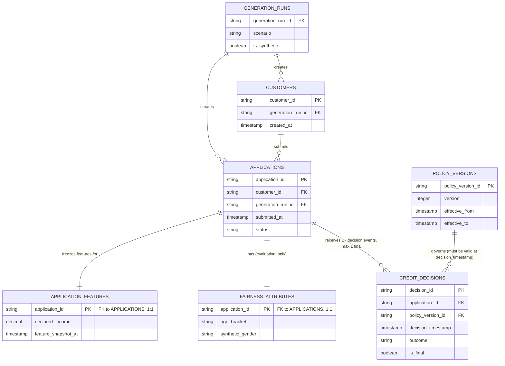
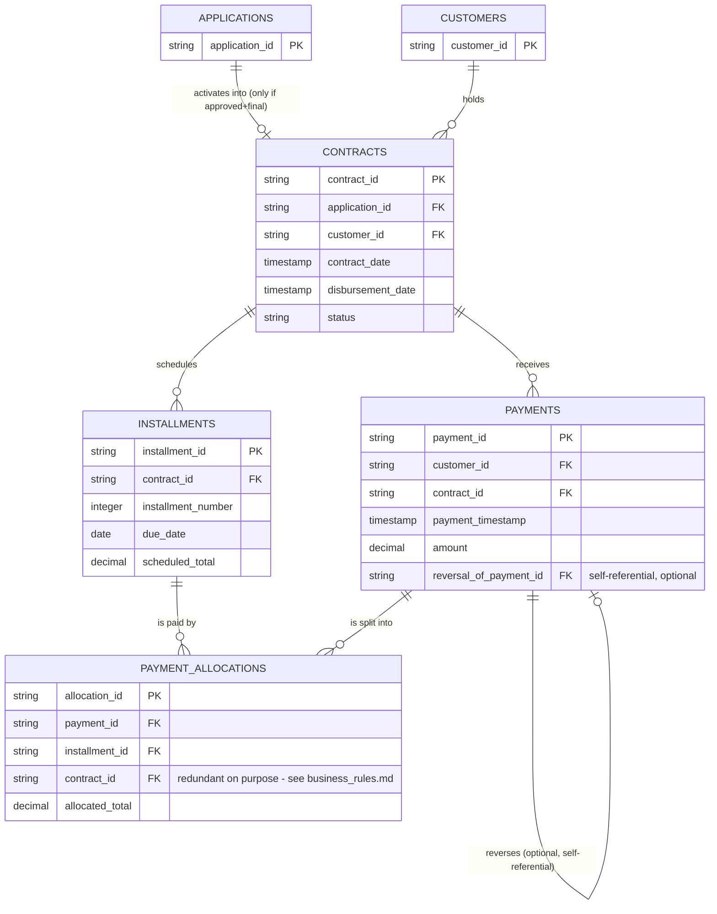
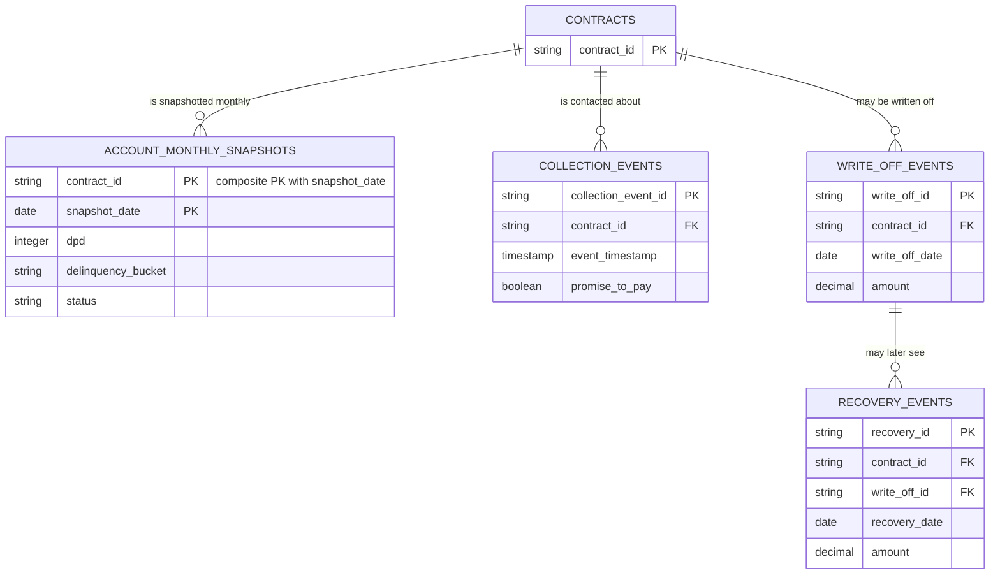
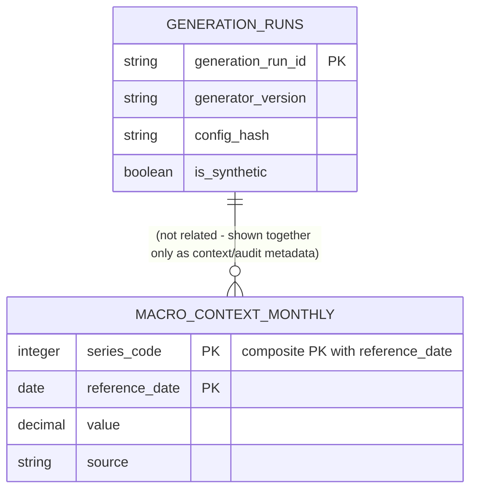

# Conceptual Data Model

This is the conceptual model for the future synthetic operational layer (see `docs/data_strategy.md` and `docs/roadmap.md` phase 4) plus the four Phase 2 public sources. **Nothing described here as an "operational" entity has been generated** - these are schemas (`contracts/operational/*.yaml`), not populated tables. The only real data behind any of this is the four acquired public sources (`contracts/raw/*.yaml`) and the small artificial fixtures in `tests/fixtures/contracts/`.

Split into four diagrams (per this phase's brief) because one combined diagram of 20 entities would be unreadable:

1. Origination (customer through decision)
2. Contracts and payments
3. Snapshots and collections
4. Generation, audit, and market context

## 1. Origination

**Note the two 1:1 relationships to APPLICATIONS drawn separately on purpose**: APPLICATION_FEATURES (`synthetic_operational`, `available_for_modeling: true` on most columns) and FAIRNESS_ATTRIBUTES (`evaluation_only`, `available_for_modeling: false` on every column) are physically separate tables specifically so a future model-training step cannot accidentally join in a sensitive attribute by joining "the wrong table" - see `docs/adr/0005-fairness-attribute-separation.md`.

## 2. Contracts and payments

**PAYMENT_ALLOCATIONS is the many-to-many resolution table between PAYMENTS and INSTALLMENTS** - a payment can be split across several installments' principal/interest/fees, and an installment can be paid off by several payments over time. Its own `contract_id` column is deliberately redundant with both `payments.contract_id` and `installments.contract_id` so the "an allocation must never cross contracts" rule (`allocation_same_contract`, see `docs/business_rules.md`) can be checked without needing every table joined at once.

## 3. Snapshots and collections

**ACCOUNT_MONTHLY_SNAPSHOTS is explicitly a snapshot, not an event table** - see `docs/temporal_semantics.md`. It never substitutes for COLLECTION_EVENTS/WRITE_OFF_EVENTS/RECOVERY_EVENTS, and a write-off never deletes or rewrites any row in any other table (`write_off_not_before_contract` only constrains ordering, not history).

## 4. Generation, audit, and market context

**GENERATION_RUNS and MACRO_CONTEXT_MONTHLY are not actually foreign-keyed to each other** - they're grouped in this fourth diagram because both are metadata/context rather than part of the origination-to-recovery chain, not because one references the other. MACRO_CONTEXT_MONTHLY re-expresses the two BCB SGS series acquired in Phase 2 (`contracts/raw/bcb_sgs_20570.yaml`, `bcb_sgs_21112.yaml`) at operational grain - it is never joined to individual UCI/South-German-Credit rows as if they shared a population; see `docs/assumptions_and_limitations.md`.

## Entity summary table

| Entity | Grain | PK | Main FKs | Classification |
|---|---|---|---|---|
| `generation_runs` | one row per generator execution | `generation_run_id` | — | `technical_metadata` |
| `customers` | one row per synthetic customer | `customer_id` | `generation_run_id` | `synthetic_operational` |
| `applications` | one row per application | `application_id` | `customer_id`, `generation_run_id` | `synthetic_operational` |
| `application_features` | one row per application | `application_id` | `application_id` | `synthetic_operational` |
| `fairness_attributes` | one row per application | `application_id` | `application_id` | `evaluation_only` |
| `policy_versions` | one row per policy version | `policy_version_id` | — | `synthetic_operational` |
| `credit_decisions` | one row per decision event | `decision_id` | `application_id`, `policy_version_id` | `synthetic_operational` |
| `contracts` | one row per contract | `contract_id` | `application_id`, `customer_id` | `synthetic_operational` |
| `installments` | one row per contract per installment | `installment_id` | `contract_id` | `synthetic_operational` |
| `payments` | one row per payment transaction | `payment_id` | `customer_id`, `contract_id` | `synthetic_operational` |
| `payment_allocations` | one row per payment-to-installment allocation | `allocation_id` | `payment_id`, `installment_id`, `contract_id` | `synthetic_operational` |
| `account_monthly_snapshots` | one row per contract per month | `contract_id, snapshot_date` | `contract_id` | `synthetic_operational` |
| `collection_events` | one row per collections event | `collection_event_id` | `contract_id` | `synthetic_operational` |
| `write_off_events` | one row per write-off event | `write_off_id` | `contract_id` | `synthetic_operational` |
| `recovery_events` | one row per recovery event | `recovery_id` | `contract_id`, `write_off_id` | `synthetic_operational` |
| `macro_context_monthly` | one row per series per month | `series_code, reference_date` | — | `synthetic_operational` |
| `uci_default_credit` | one row per client (Taiwan, 2005) | `ID` | — | `public_source` |
| `south_german_credit` | one row per applicant (Germany, 1970s) | (none documented) | — | `public_source` |
| `bcb_sgs_20570` | one row per month | `data` | — | `public_source` |
| `bcb_sgs_21112` | one row per month | `data` | — | `public_source` |

Full column-level detail for every entity: `contracts/raw/*.yaml` and `contracts/operational/*.yaml`, or run `credlens contracts show <name>`.

## 4.17 — The synthetic-truth layer (not built)

A fifth conceptual layer is deliberately **not** in the four diagrams above and has no contract file in `contracts/`: latent parameters known only to a future generator (true latent risk, true payment propensity, true response-to-collections, the generator's own segment assignment, the true probability used to simulate an outcome). This layer:

- Would never be used as a model feature (it wouldn't exist in a real operational system - it's only meaningful for validating a *simulator* against its own ground truth).
- Would never feed an operational dashboard.
- Would be git-ignored, exactly like `data/raw/`.
- Would be marked `synthetic_truth_only`, physically separate from every table above (see `docs/adr/0007-synthetic-truth-isolation.md`).
- Exists in this document only as a placeholder for a later phase - see `docs/synthetic_generation_spec.md`, "Known truth".
