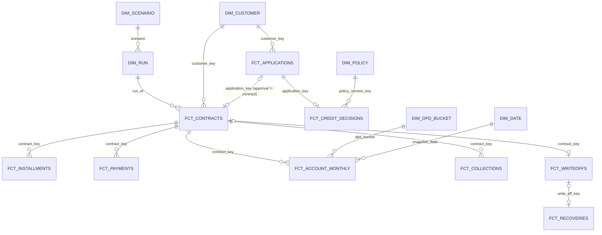

# Warehouse Architecture (Phase 5, hardened in Phase 6)

This document describes the **implemented** DuckDB + dbt analytical warehouse under `warehouse/`. It is the as-built companion to `docs/adr/0010-cure-semantics-and-relapse.md` (the DGP correction that made this layer meaningful to build) and to `warehouse/kpi_catalog.yml` (the KPI-by-KPI catalog this architecture supports). Phase 6 hardened three specific gaps found by re-reading this document against the actual code (see [Testing strategy](#testing-strategy) and [Raw Materialization Trade-off](#raw-materialization-trade-off) below) and added a reproducible analysis layer on top - see `docs/analysis_architecture.md`.

**Everything in this warehouse describes a synthetic portfolio.** No number here represents a real financial institution, a real borrower, or a real-world base rate - see `docs/counterfactual_scenarios.md` and `docs/synthetic_calibration.md`.

## Contents

- [Why a warehouse, and why now](#why-a-warehouse-and-why-now)
- [Layered architecture](#layered-architecture)
- [Dimensional schema (ERD)](#dimensional-schema-erd)
- [Source selection and safety](#source-selection-and-safety)
- [Cross-run key isolation](#cross-run-key-isolation)
- [Raw materialization trade-off](#raw-materialization-trade-off)
- [Layer-by-layer reference](#layer-by-layer-reference)
- [Fact grain reference](#fact-grain-reference)
- [Dimension dictionary](#dimension-dictionary)
- [Flow vs. stock](#flow-vs-stock)
- [DPD bucket rules](#dpd-bucket-rules)
- [Cure and relapse semantics](#cure-and-relapse-semantics)
- [Vintage / months-on-book (MOB) rules](#vintage--months-on-book-mob-rules)
- [Temporal semantics](#temporal-semantics)
- [Determinism and Decimal Money](#determinism-and-decimal-money)
- [Testing strategy](#testing-strategy)
- [Build manifest, analytical fingerprint, and idempotency](#build-manifest-analytical-fingerprint-and-idempotency)
- [Scenario strategy](#scenario-strategy)
- [Running it](#running-it)
- [Demo queries](#demo-queries)
- [Limitations](#limitations)
- [Architectural decisions](#architectural-decisions)
- [Troubleshooting](#troubleshooting)

## Why a warehouse, and why now

Phases 1-4B built a reproducible synthetic-portfolio generator (deterministic, contract-validated, with counterfactual scenarios and common random numbers). What they did not build was a place to *ask questions* of that data without writing pandas by hand every time. Phase 5 does two things, in order, because the second depends on the first:

1. **Objective A** - fixes a real gap in the generator: curing arrears used to imply full payoff, and delinquency relapse was not producible. Fixed in `credlens.generation.payments` (see the ADR) and proven with a real `contract_coverage` run.
2. **Objective B** - this warehouse: raw → staging → intermediate → dimensions/facts → marts, built with dbt-core 1.12.0 + dbt-duckdb 1.10.1 (`uv sync --extra warehouse`).

## Layered architecture

```mermaid
flowchart LR
    subgraph Sources["credlens.generation output (Phase 4A/4B/5)"]
        PARQUET["data/synthetic/RUN_.../operational/*.parquet\n+ manifest.json"]
    end

    subgraph Selection["credlens.warehouse.sources (Python)"]
        RESOLVE["resolve_sources(run_id | suite_id)\nblocks: missing manifest, status != completed,\nvalidation_passed != true, quarantine path,\nunsupported contract_version_set"]
    end

    subgraph Raw["raw/ (VIEW)"]
        RAWM["raw_* (16 models)\nraw_union_sources() macro\ntags: run_id/suite_id/scenario/seed/scale/generator_version"]
    end

    subgraph Staging["staging/ (VIEW)"]
        STGM["stg_* (16 models)\nrename + cast + surrogate_key()\nDECIMAL(18,2) for money"]
    end

    subgraph Intermediate["intermediate/ (VIEW)"]
        INTM["int_calendar_months\nint_applications_decisions_contracts\nint_contract_monthly_enriched (cure/relapse/MOB)\nint_write_off_recovery"]
    end

    subgraph Core["dimensions/ + facts/ (TABLE)"]
        DIMM["dim_date, dim_run, dim_scenario,\ndim_customer, dim_channel, dim_region,\ndim_policy, dim_dpd_bucket (seed)"]
        FCTM["fct_applications, fct_credit_decisions,\nfct_contracts, fct_installments, fct_payments,\nfct_account_monthly, fct_collections,\nfct_writeoffs, fct_recoveries, fct_macro_monthly"]
    end

    subgraph Marts["marts/ (TABLE)"]
        MARTM["mart_credit_funnel_monthly, mart_portfolio_monthly,\nmart_delinquency_monthly, mart_vintage_cohorts,\nmart_roll_rates, mart_cure_and_redefault,\nmart_collections_performance, mart_writeoff_recovery,\nmart_scenario_comparison, mart_macro_stress_pre_post"]
    end

    subgraph Consumers["credlens.analysis (Phase 6, implemented - see docs/analysis_architecture.md)"]
        AN["SQL-first metrics/scenarios/charts/reports\n(never a BI tool - out of scope, see docs/roadmap.md)"]
    end

    PARQUET --> RESOLVE --> RAWM --> STGM --> INTM --> DIMM
    INTM --> FCTM
    DIMM --> FCTM --> MARTM --> AN
```



63 SQL models total (16 raw + 16 staging + 4 intermediate + 7 dimensions + 10 facts + 10 marts) plus 1 seed (`dim_dpd_bucket`) - 64 files total, 122+ generic dbt tests, 13 singular dbt tests (Phase 6 added `mart_macro_stress_pre_post` and `assert_pre_shock_period_identical_across_scenarios.sql`). A full `dbt build` against one suite (5 runs) currently produces 199 total nodes (27 tables, 36 views, 135 data tests, 1 seed) - see [Running it](#running-it) for real timing.

## Dimensional schema (ERD)



## Source selection and safety

`credlens.warehouse.sources.resolve_sources(*, run_id=None, suite_id=None)` is the ONLY way data enters the warehouse - there is no glob, no "most recent run" default. It:

- requires exactly one of `run_id` / `suite_id` (argparse-level `add_mutually_exclusive_group(required=True)` in the CLI, plus an explicit XOR check in Python for any programmatic caller);
- reads that run's `manifest.json` and refuses anything with `status != "completed"`, `validation_passed != True`, a missing `global_content_hash`, or a `contract_version_set` outside `SUPPORTED_CONTRACT_VERSION_SETS = ("phase5-v1",)`;
- resolves the run id path-traversal-safely under `config.output.operational_dir` (`data/synthetic/`) via `credlens.generation.writers.resolve_within_directory`, and explicitly rejects any resolved path containing a `"quarantine"` segment as defense in depth;
- for `suite_id`, delegates to `credlens.generation.suite.load_suite_manifest` and returns the baseline run plus every one of its CRN scenario runs as one list.

The result (`list[SourceRecord]`) is serialized straight into `dbt build --vars '{"selected_runs": [...]}'` - see `warehouse/macros/raw_union_sources.sql`, which raises a compiler error if `selected_runs` is empty, so a bare `dbt build` run outside `credlens warehouse` fails loudly instead of silently building nothing.

## Cross-run key isolation

CRN (common random numbers) scenarios *legitimately* reuse the same natural `customer_id`/`application_id`/`contract_id` across different runs (see `docs/common_random_numbers.md`) - a naive warehouse would silently collapse two different customers from two different runs into one row. Every warehouse key is instead a deterministic composite surrogate key:

```sql
-- warehouse/macros/surrogate_key.sql
md5(concat_ws('||', coalesce(cast(col as varchar), '\x00NULL\x00'), ...))
```

applied as `surrogate_key(['run_id', 'customer_id'])`, never the bare natural id. Proven twice:

- manually, by direct query: 5 CRN runs sharing the same `customer_id` values produced 1000/1000 unique `customer_key` values, zero collisions;
- automatically, by `warehouse/tests/assert_natural_id_reuse_across_runs_does_not_collide.sql` - a dbt singular test that fails if a natural id shared by N runs does not yield exactly N distinct surrogate keys.

## Raw Materialization Trade-off

Raw models (`raw_*`) are materialized as **views**, not tables. Each one is a single call to the `raw_union_sources(table_name)` macro, which compiles a `read_parquet(...)` per selected run, `union all`'d together, tagged with `run_id`/`suite_id`/`scenario`/`seed`/`scale`/`generator_version`.

- **Trade-off accepted**: a raw view always reflects the current parquet files on disk (re-reading them, and re-verifying their existence, on every query) - there is no separate "load" step that can silently go stale relative to the source files. The direct consequence: a file that mutates (or is deleted/corrupted) **after** a build finished would silently change what every query downstream of that build sees, with nothing in the build's own manifest or fingerprint ever having been wrong at build time - a real gap, not a hypothetical one.
- **Phase 6 gate C closes that gap directly, without abandoning views**: `credlens.warehouse.integrity.verify_build_sources()` re-verifies, at query/reconcile/report time (not just at build time), every source's file existence, size, row count, and the generator's own `canonical_table_hash` (recomputed from the file currently on disk) against what the build's manifest recorded - plus the run's own `manifest.json` status/validation_passed/generator_version/contract_version_set. Every one of `credlens warehouse query`, `reconcile`, and the entire `credlens.analysis` layer's own `validate_build_for_analysis()` calls this first and raises `RawIntegrityError` (refusing to proceed) on any mismatch. Proven with a mandatory negative test (`tests/test_warehouse_integrity.py::TestPostBuildParquetMutationIsDetected`): mutate a parquet file after the build, confirm detection, confirm both reconciliation and named queries are blocked.
- **Cost**: every query against a raw model (and everything downstream of it that DuckDB can't cache within one session) re-reads the source parquet from disk, and every reconcile/query/analysis call now also re-hashes every source table before proceeding. For the smoke/sample scales this project uses, that cost is small (observed: full 197-node build in ~7-13s - see [Running it](#running-it)).
- **Alternative considered, rejected for this phase**: materializing raw as tables (with hashes recorded at materialization time) would need an explicit invalidation/refresh step whenever `data/synthetic/` changes, adding state to reason about, and would still need the same re-verification-on-read discipline to catch a file that changed between materialization and use - it does not remove the need for gate C, it only relocates it. Revisit if portfolio-scale (50k customers) raw queries become a bottleneck.

## Layer-by-layer reference

| Layer | Materialization | Responsibility | Example |
|---|---|---|---|
| `raw/` | view | Source-validated union across selected runs, run/suite/scenario metadata added, no business rules, no renaming beyond adding metadata columns | `raw_contracts` |
| `staging/` (`stg_`) | view | Technical normalization only: rename, cast, surrogate keys. No KPI computation, no joins beyond what's needed to compute a key. Preserves raw's grain exactly (see `warehouse/tests/assert_raw_to_staging_row_counts_reconcile.sql`) | `stg_contracts` |
| `intermediate/` (`int_`) | view | Reusable business logic that more than one fact/mart needs: calendar, funnel linkage, cure/relapse/MOB derivation, write-off/recovery linkage | `int_contract_monthly_enriched` |
| `dimensions/` | table | Descriptive entities - customer, run, scenario, channel, region, policy, date, DPD bucket | `dim_customer` |
| `facts/` | table | Business events/snapshots at a documented grain - see [Fact grain reference](#fact-grain-reference) | `fct_account_monthly` |
| `marts/` | table | Analyst-ready aggregates, one mart per analytical concern (funnel, portfolio, delinquency, vintages, roll rates, cure/redefault, collections, write-off/recovery, scenario comparison) | `mart_delinquency_monthly` |

Dimensions/facts/marts are materialized as **tables** (not views) specifically because they are queried repeatedly by downstream marts/analyses/a future BI tool, and query performance matters more than always-fresh-from-parquet there - a `dbt build` on the same selected sources always fully recomputes them, so "stale table" is never a real risk within one build.

## Fact grain reference

| Fact | Grain | Key | Temporal dimension | Type | Additive measure(s) |
|---|---|---|---|---|---|
| `fct_applications` | one application | `application_key` | `submitted_at` | FLOW | `requested_amount` |
| `fct_credit_decisions` | one decision | `decision_key` | `decision_timestamp` | FLOW | `approved_amount` (only if `outcome='approved'`) |
| `fct_contracts` | one contract | `contract_key` | `contract_date`/`disbursement_date` | FLOW (origination) | `financed_amount` |
| `fct_installments` | one installment | `installment_key` | `due_date` | FLOW (schedule) | `scheduled_principal`/`interest`/`fees`/`total` |
| `fct_payments` | one payment transaction (a reversal is its own row) | `payment_key` | `payment_timestamp` | FLOW | `amount`; use `net_amount` when summing across reversals |
| `fct_account_monthly` | one (contract, snapshot_date) | `contract_key` + `snapshot_date` | `snapshot_date` | **STOCK** | `total_balance`, `exposure` (never sum across `snapshot_date` for the same contract) |
| `fct_collections` | one collection contact event | `collection_event_key` | `event_timestamp` | FLOW | count of events |
| `fct_writeoffs` | one write-off event | `write_off_key` | `write_off_date` | FLOW, terminal | `write_off_amount` |
| `fct_recoveries` | one recovery event | `recovery_key` | `recovery_date` | FLOW | `recovery_amount` |
| `fct_macro_monthly` | one (run_id, source_type, source_id, reference_date) | `macro_key` | `reference_date` | context/STOCK-like | n/a (rate/index values, not summed) |

## Dimension dictionary

| Dimension | Primary key | Natural key | Grain | Historical treatment |
|---|---|---|---|---|
| `dim_date` | `date_key` | calendar date | one calendar day | Static - no SCD needed, a date never changes |
| `dim_run` | `run_id` | `run_id` | one generation run | Static per run - a run's own metadata (scenario/seed/scale/generator_version) never changes after generation |
| `dim_scenario` | `scenario` | `scenario` | one scenario name | Static - `baseline`/`policy_expansion`/`policy_tightening`/`macroeconomic_stress`/`collections_change`/`contract_coverage` |
| `dim_customer` | `customer_key` | (`run_id`, `customer_id`) | one customer per run | Static - the DGP never mutates a customer's own attributes after arrival (see `docs/adr/0007-synthetic-truth-isolation.md`) |
| `dim_channel` | `channel_key` | `channel` | one acquisition channel | Static |
| `dim_region` | `region_key` | `region` | one region | Static |
| `dim_policy` | `policy_version_key` | (`run_id`, `policy_version_id`) | one policy version per run | Static per run |
| `dim_dpd_bucket` | `dpd_bucket` | `dpd_bucket` | one DPD bucket (seed, 6 rows) | Static reference data |

No dimension needed SCD Type 2 in this phase: every attribute the current DGP produces for a dimension is fixed at creation and never revised in place - see `docs/adr/0007-synthetic-truth-isolation.md`'s truth-layer isolation guarantee (customer attributes are frozen at population time) and `docs/business_rules.md` (policy versions are immutable once referenced by a decision). If a future phase adds a genuinely time-varying dimension attribute, implement SCD Type 2 then, not preemptively.

## Flow vs. stock

- **FLOW** events (applications, decisions, contract origination, installment schedule, payments, collection events, write-offs, recoveries): each row is a discrete event at a point in time. Safe to `sum()` across any time window.
- **STOCK** snapshots (`fct_account_monthly`): each row is a balance-sheet position AS OF `snapshot_date`. Safe to `sum()` **across contracts within one `snapshot_date`** (a portfolio-level balance at one point in time). **Never** sum across `snapshot_date` for the same contract - `total_balance` in March already reflects everything that happened through March; adding it to April's `total_balance` double-counts the carried-over principal.

Every mart that touches `fct_account_monthly` documents which of the two rules applies in its own header comment - see e.g. `mart_portfolio_monthly.sql`.

## DPD bucket rules

Buckets (`warehouse/seeds/dim_dpd_bucket.csv`, 6 rows): `current`, `1-29`, `30-59`, `60-89`, `90+`, and a separate terminal `write_off` bucket (a charged-off contract is not a DPD level - see the seed's own `description` column). `dpd_bucket` is a single column per `fct_account_monthly` row, so mutual exclusivity is structural (a contract cannot be in two buckets at once). What the tests actually guard:

- every `dpd_bucket` value resolves to a real row in `dim_dpd_bucket` (generic `relationships` test);
- the cumulative "N+" rollups used throughout the marts nest correctly - `contracts_90plus <= contracts_60plus <= contracts_30plus <= total_contracts` for every `mart_delinquency_monthly` row (`warehouse/tests/assert_cumulative_dpd_buckets_nested.sql`).

PAR30/60/90 (`mart_delinquency_monthly.par30/par60/par90`) are **balance-weighted** (numerator/denominator both in BRL); `rate_30plus/60plus/90plus` are **contract-count-weighted** (numerator/denominator both in count). These are two different denominators computing superficially similar-sounding numbers - see `warehouse/kpi_catalog.yml` DEL-001 through DEL-006 for the exact formulas, and never present one as if it were the other.

## Cure and relapse semantics

Full detail in `docs/adr/0010-cure-semantics-and-relapse.md`. Warehouse-layer summary:

- `is_cure_month` (`int_contract_monthly_enriched`): `contract_status = 'active' AND prior_month_status = 'delinquent'` - the account eliminated its overdue backlog without the contract terminating. `prior_month_status` comes from `lag(contract_status) over (partition by contract_key order by snapshot_date)`.
- `is_relapse_month`: `contract_status = 'delinquent' AND prior_month_status != 'delinquent'` (first month of a NEW delinquency episode, not a continuation) `AND` at least one `is_cure_month` occurred earlier in that same contract's history (a windowed `sum(...) over (... rows between unbounded preceding and 1 preceding)`).
- Both flags are **derived**, never stored as a redundant operational column - reconstructable purely from `account_monthly_snapshots.status`'s own time series.
- `payments.payment_type` (`scheduled`/`partial`/`cure`/`prepayment`) is the generator's own explicit classification, propagated unchanged through `stg_payments` → `fct_payments`. A cure pays only the overdue backlog as of the event's own month-end; a prepayment pays the full remaining balance including not-yet-due installments - these are different `payment_type` values, never conflated.
- `mart_cure_and_redefault` is per-contract (`was_ever_cured`, `cure_count`, `ever_relapsed`, `relapse_count`, `redefaulted`); `cure_rate`/`redefault_rate` are aggregates OVER that mart (a rate has no meaning at contract grain) - see `warehouse/kpi_catalog.yml` DEL-009/DEL-010 and `warehouse/analyses/redefault_rate.sql` for the exact aggregate query.

## Vintage / months-on-book (MOB) rules

`int_contract_monthly_enriched` computes `vintage_month = date_trunc('month', disbursement_date)` and `months_on_book = datediff('month', vintage_month, date_trunc('month', snapshot_date))`. `mart_vintage_cohorts` aggregates by `(vintage_month, months_on_book)` instead of by calendar date, so cohorts of different ages can be compared on a like-for-like maturity basis.

**Limitation, checkable not just documented**: more recent vintages have fewer MOB periods observed within the simulated period. `mart_vintage_cohorts.max_mob_observed_for_cohort` (`max(months_on_book)` per `vintage_month`) makes this bound explicit - never compare two cohorts beyond the MOB range **both** actually reached.

## Temporal semantics

Enforced AND tested, not just assumed:

| Rule | Where enforced | Where tested |
|---|---|---|
| Application can't be decided before submission | generator (`DECISION_BEFORE_SUBMISSION`) | `warehouse/tests/assert_decision_not_before_submission.sql` (re-asserted independently inside the warehouse's own join) |
| Contract can't originate before its decision | generator | `warehouse/tests/assert_contract_not_before_decision.sql` |
| A terminal contract must not reappear as active | generator (`no_snapshot_after_terminal_status`) | `warehouse/tests/assert_no_active_contract_after_terminal_status.sql` |
| Roll rates only ever compare a contract's own consecutive months, never a different contract | `mart_roll_rates` groups by `contract_key`-scoped `lag()` output, never a cross-contract join | inherent to the query shape - see the mart's own header comment |
| Future information must never influence a historical metric | `int_contract_monthly_enriched`'s `lag()` window functions | `warehouse/tests/assert_prior_month_status_never_uses_future_data.sql` - **the deliberate test**: recomputes each contract's true prior-month status via an independent correlated subquery and fails on any mismatch with the model's own `lag()`-derived value |

## Determinism and Decimal Money

Two real, load-bearing bugs were found and fixed while proving the idempotency requirement (two builds from the same inputs must produce the same analytical fingerprint):

1. **Floating-point non-associativity.** Staging originally cast every monetary column to `DOUBLE`. DuckDB parallelizes `SUM`/`AVG` across threads, and float64 addition is not associative - two builds from *identical* inputs produced tiny (~1e-11 relative) but real differences in `mart_portfolio_monthly`, `mart_delinquency_monthly`, `mart_roll_rates`, and `mart_vintage_cohorts`. Source parquet itself stores every amount as float64 (the generator's pandas/pyarrow write path has no native Decimal dtype), so the fix lives entirely in staging: `warehouse/macros/money.sql`'s `money(column_name)` macro casts to `DECIMAL(18,2)` instead. Decimal arithmetic is exact fixed-point, so `SUM`/`AVG` over it is thread-order-independent. Applied to every genuine currency amount across 11 staging models (`stg_installments`, `stg_write_off_events`, `stg_recovery_events`, `stg_payment_allocations`, `stg_credit_decisions`, `stg_payments`, `stg_contracts`, `stg_collection_events`, `stg_applications`, `stg_account_monthly_snapshots`, `stg_application_features`) - rates/ratios (`contract_rate`, `offered_rate`, `debt_to_income`) intentionally remain `DOUBLE`.
2. **DuckDB/dbt-duckdb file-handle leakage across in-process invocations.** `credlens.warehouse.build._invoke_dbt` calls dbt-core's `dbtRunner` directly (no subprocess), which is designed for long-lived processes and keeps the adapter's DuckDB connection, dbt's own event-log file handle, and dbt-duckdb's class-level cached `Environment` all open after `invoke()` returns. On Windows this produced hard `PermissionError`s the moment a second in-process call (fingerprint read-back, a second build, `dbt test`) touched the same file. Fixed with three release calls after every invocation (`dbt.adapters.factory.reset_adapters()`, `dbt.events.logging.cleanup_event_logger()`, `dbt.adapters.duckdb.connections.DuckDBConnectionManager.close_all_connections()`, followed by `gc.collect()`) plus giving every invocation its own timestamped `dbt_logs/<timestamp>/` subdirectory so a force-rebuild never needs to delete a log file that might still be closing.

Both bugs are documented in detail in `CHANGELOG.md`'s `[0.6.0]` entry with the exact before/after fingerprints observed.

## Testing strategy

- **Generic dbt tests** (`not_null`, `unique`, `relationships`, `accepted_values`) on every model's own primary key, foreign keys, and domain-constrained columns - see each layer's `_*__models.yml`.
- **13 singular tests** (`warehouse/tests/*.sql`), each a SELECT that returns rows only when the invariant is violated:
  - `assert_prior_month_status_never_uses_future_data.sql` - the deliberate temporal-leakage test (see [Temporal semantics](#temporal-semantics))
  - `assert_decision_not_before_submission.sql`, `assert_contract_not_before_decision.sql`, `assert_no_active_contract_after_terminal_status.sql` - temporal integrity
  - `assert_natural_id_reuse_across_runs_does_not_collide.sql` - cross-run key isolation
  - `assert_no_quarantined_runs_in_warehouse.sql` - quarantine absence, defense in depth
  - `assert_balance_components_reconcile.sql`, `assert_balance_non_negative.sql`, `assert_recovery_not_exceeding_write_off.sql` - financial reconciliation/sanity
  - `assert_cumulative_dpd_buckets_nested.sql` - DPD bucket structural invariant
  - `assert_raw_to_staging_row_counts_reconcile.sql`, `assert_write_off_recovery_join_no_fanout.sql` - raw/staging reconciliation and join-fanout absence
  - `assert_pre_shock_period_identical_across_scenarios.sql` (Phase 6) - baseline and `macroeconomic_stress` must be exactly identical, per metric, in every pre-shock month
- **Independent Python reconciliation** (`credlens.warehouse.reconciliation`, `credlens warehouse reconcile --build-id`): re-derives 8 KPIs (approval rate, outstanding balance, PAR90, cure rate, write-off amount, recovery amount, paid amount, scheduled amount) directly from source parquet via pandas - never through dbt/SQL - and compares against the built warehouse.
  - **Monetary tolerance (Phase 6 gate A) is EXACT integer cents, not a percentage band.** The original `max(0.01, 0.1% of expected)` rule was wide enough to mask a material discrepancy on a large balance (0.1% of a six-figure balance is real money). Every monetary value on both sides is converted to integer cents via `decimal.Decimal(str(value)).quantize(Decimal('0.01'), rounding=ROUND_HALF_UP)` - verified empirically to match DuckDB's own `CAST(x AS DECIMAL(18,2))` rounding exactly (round-half-away-from-zero on the decimal string, sidestepping both Python's banker's-rounding `round()` and float64 representation error) - then compared for exact equality. This is achievable, not just aspirational, because the staging layer casts every monetary column to `DECIMAL(18,2)` exactly once and every downstream `SUM` is exact decimal addition (see [Determinism and Decimal Money](#determinism-and-decimal-money)) - both sides are summing an identical multiset of already-rounded values, so the sums must match exactly. `tests/test_warehouse_reconciliation.py::TestOldToleranceRuleWasInsufficient` is the mandatory negative test: a discrepancy small enough to pass the old percentage rule that MUST fail the new exact-cents rule.
  - Ratios (`approval_rate`, `par90`, `cure_rate`) remain `1e-6` absolute tolerance - no monetary rounding is involved on either side.
- **Idempotency**: `tests/test_warehouse_build.py::TestIdempotency` runs two real, independent builds from the same `run_id` and asserts identical `analytical_fingerprint`, `model_row_counts`, and `included_run_ids`.
- **Raw source integrity (Phase 6 gate C)**: see [Raw Materialization Trade-off](#raw-materialization-trade-off) above.
- **Test-root isolation (Phase 6 gate B)**: every test that generates data or builds a warehouse does so under an isolated `tmp_path`-rooted directory, never the shared `data/synthetic/`/`data/warehouse/` roots an official demonstration run/suite/build occupies - see `credlens.generation.testing_support` (`isolated_output_dirs`, `isolated_manifest_dir`, `safe_rmtree`, `delete_exact_run_dir`) and `tests/test_generation_isolated_roots.py`, which proves (among other things) that a test using the exact same `scenario=baseline, scale=smoke, seed=2026` coordinates an official suite occupies never touches that suite's files.

## Build manifest, analytical fingerprint, and idempotency

Every `credlens warehouse build` writes `data/warehouse/<build_id>/build_manifest.json` recording: build id, database path, included run ids/suite id, code/dbt/DuckDB versions, per-source hashes, raw and materialized-model row counts, test results, step durations, the analytical fingerprint, and final status.

The **analytical fingerprint** is a sha256 over: for every table in a schema ending in `dimensions`/`facts`/`marts` (raw/staging/intermediate are views, not build artifacts, and are excluded), its exact row count plus an order-independent content hash (`md5(string_agg((t)::varchar, '' order by (t)::varchar))` per table), combined with build metadata (each source's `run_id`+`global_content_hash`). It is deliberately **not** a hash of the `.duckdb` file itself - DuckDB's on-disk layout is not guaranteed byte-identical across otherwise-equivalent rebuilds.

Destination safety: `run_build` refuses to overwrite an existing `build_id` unless `force=True`/`--force`; on a forced rebuild it removes only the database file and dbt's own compiled-artifacts directory, never the accumulated `dbt_logs/` history (see [Determinism and Decimal Money](#determinism-and-decimal-money) point 2).

## Scenario strategy

`credlens warehouse build --suite-id SUITE_smoke_2026` loads a baseline run plus every one of its CRN scenario runs (`policy_expansion`, `policy_tightening`, `macroeconomic_stress`, `collections_change`) into the SAME analytical build, keyed apart by `run_id`-scoped surrogate keys (see [Cross-run key isolation](#cross-run-key-isolation)). `mart_scenario_comparison` self-joins `dim_run` within one `suite_id` to produce baseline-vs-scenario absolute/relative deltas for approval rate, final-month DPD90+ rate, and write-off count - see `warehouse/kpi_catalog.yml`'s SCN-001 through SCN-005. Every comparison is scoped to runs that share common random numbers (same suite) - never diff runs from different suites or seeds.

## Running it

```bash
uv sync --extra warehouse                     # installs dbt-core, dbt-duckdb, duckdb
uv run credlens synthetic generate-suite --scale smoke --seed 2026   # produces SUITE_smoke_2026
uv run credlens warehouse prepare --suite-id SUITE_smoke_2026        # validates sources, no dbt invoked
uv run credlens warehouse build --suite-id SUITE_smoke_2026          # full dbt build + manifest
uv run credlens warehouse status --build-id <build_id>
uv run credlens warehouse test --build-id <build_id>                 # re-run tests, no rebuild
uv run credlens warehouse reconcile --build-id <build_id>            # independent Python checks
uv run credlens warehouse query --build-id <build_id> --name portfolio_monthly
uv run credlens warehouse docs --build-id <build_id>                 # generates (does not serve) dbt docs
```

Observed on this development machine (see the Phase 5 final report for the authoritative numbers with exact timings/row counts): a 5-run suite build completes in roughly 6-13 seconds end to end (185-197 dbt nodes depending on how many singular tests exist at build time), producing a `warehouse.duckdb` file of a few MB at smoke scale. No universal benchmark claim is made - these are single-machine, single-run observations.

## Demo queries

`credlens warehouse query --build-id <id> --name <NAME>` for any of: `credit_funnel`, `portfolio_monthly`, `delinquency_monthly`, `vintage_cohorts`, `roll_rates`, `cure_and_redefault`, `collections_performance`, `writeoff_recovery`, `scenario_comparison` (see `credlens.warehouse.queries.NAMED_QUERIES`). Two additional ad-hoc analyses live under `warehouse/analyses/` (compiled by `dbt compile`, not materialized): `redefault_rate.sql` and `roll_forward_back_summary.sql`. `mart_macro_stress_pre_post` (Phase 6) is queried through `credlens analysis` rather than a named warehouse query - see `docs/analysis_architecture.md`.

## Limitations

- No revenue, cost of capital, operating cost, LGD, EAD, PD, ROI, margin, or regulatory-threshold KPI is implemented - none of these has a supporting field in the DGP, and inventing one was explicitly out of scope (see `warehouse/kpi_catalog.yml`'s `NSU-*` entries).
- `cure_after_collection` (individual-contact-to-cure attribution) is explicitly `not_supported` - the `collections_change` scenario only varies aggregate, scenario-level parameters; the DGP has no per-contact causal link recorded.
- Vintage/MOB comparisons are only valid within the MOB range every compared cohort actually reached (`max_mob_observed_for_cohort`).
- Scenario comparisons are only valid within one `suite_id` (shared common random numbers) - never across suites or seeds.
- `scheduled_amount_due_this_month` (`mart_portfolio_monthly`, Phase 6) is a **period-scoped** figure - installments whose `due_date` falls in that snapshot's own calendar month - never the whole future amortization schedule summed into one row. See the mart's own header comment for the scheduled/due/overdue distinction.
- `mart_macro_stress_pre_post` (Phase 6) compares baseline vs. `macroeconomic_stress` split at the shock date derived from `fct_macro_monthly.is_synthetic`, not a hardcoded config value - the pre-shock period is asserted identical by `assert_pre_shock_period_identical_across_scenarios.sql`.
- Portfolio scale (50,000 customers) has not been rebuilt through this warehouse - see the Phase 5 final report for the explicit scale decision and rationale (still true as of Phase 6).

## Architectural decisions

- `docs/adr/0010-cure-semantics-and-relapse.md` - the DGP correction this whole warehouse depends on being correct.
- Raw materialization as views, not tables - see [Raw Materialization Trade-off](#raw-materialization-trade-off).
- Dynamic source selection via `dbt --vars` instead of static `source:` YAML - keeps "which runs are in this build" an explicit, auditable, Python-validated decision rather than a config file that could point at anything on disk.
- Composite surrogate keys everywhere instead of natural ids - see [Cross-run key isolation](#cross-run-key-isolation).
- DECIMAL(18,2) for money instead of DOUBLE - see [Determinism and Decimal Money](#determinism-and-decimal-money).
- No SCD Type 2 anywhere - see [Dimension dictionary](#dimension-dictionary).

## Troubleshooting

| Symptom | Likely cause | Fix |
|---|---|---|
| `No selected_runs provided` compiler error | Ran `dbt build` directly instead of through `credlens warehouse build/test` | Always go through the CLI, which resolves sources and passes `--vars` for you |
| `No run found at '...'` from `warehouse prepare/build` | Typo'd run id, or the run was cleaned up by a test fixture (CredLens run ids are fully deterministic - a test using the same scenario/scale/seed/config as a "real" demo run will legitimately recreate-then-delete that exact directory as part of its own lifecycle) | Regenerate: `credlens synthetic generate --scenario ... --scale ... --seed ... --force` (or `generate-suite`) |
| `[WinError 32] O arquivo já está sendo usado por outro processo` on a `.duckdb`/`dbt.log` file | Expected only if calling `credlens.warehouse.build` functions directly, multiple times, in one long-lived Python process (each CLI invocation is its own OS process, so this should not occur through the CLI) | Already mitigated (see [Determinism and Decimal Money](#determinism-and-decimal-money) point 2); if it still occurs, the process holding the handle must exit before the file is deletable |
| `Build destination '...' already exists` | Re-running `build` with the same `--build-id` | Pass `--force` to overwrite, or omit `--build-id` to get a fresh auto-generated one |
| A named query in `warehouse query` returns "not found in a *marts schema" | Build did not include the mart the name maps to (unlikely - every mart is always built) or the build failed silently | Check `warehouse status --build-id <id>` for `final_status` |
| `dbt build` succeeds but `credlens warehouse build` still reports `final_status: failed` | A test genuinely failed/errored (check `test_results.failures` in the printed manifest or `--json` output) | Fix the underlying data/model issue - never treat this as a fingerprint/manifest bug |
